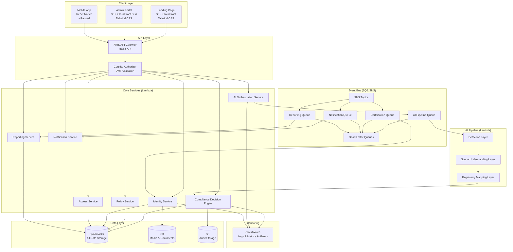
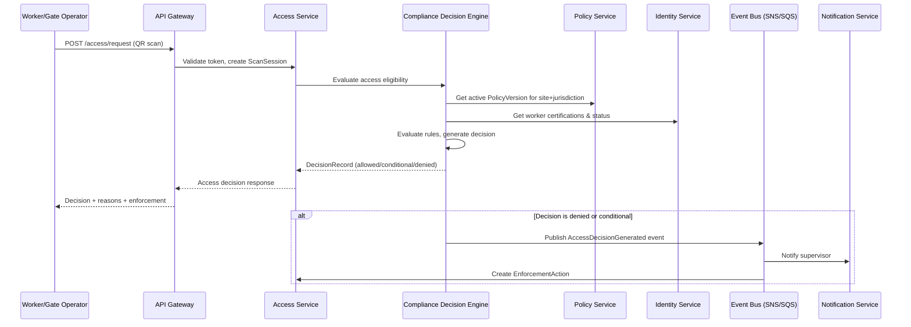
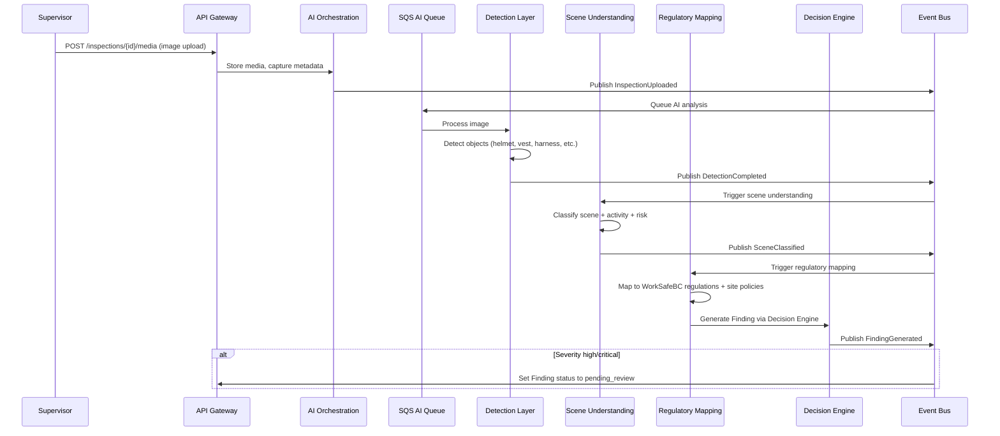
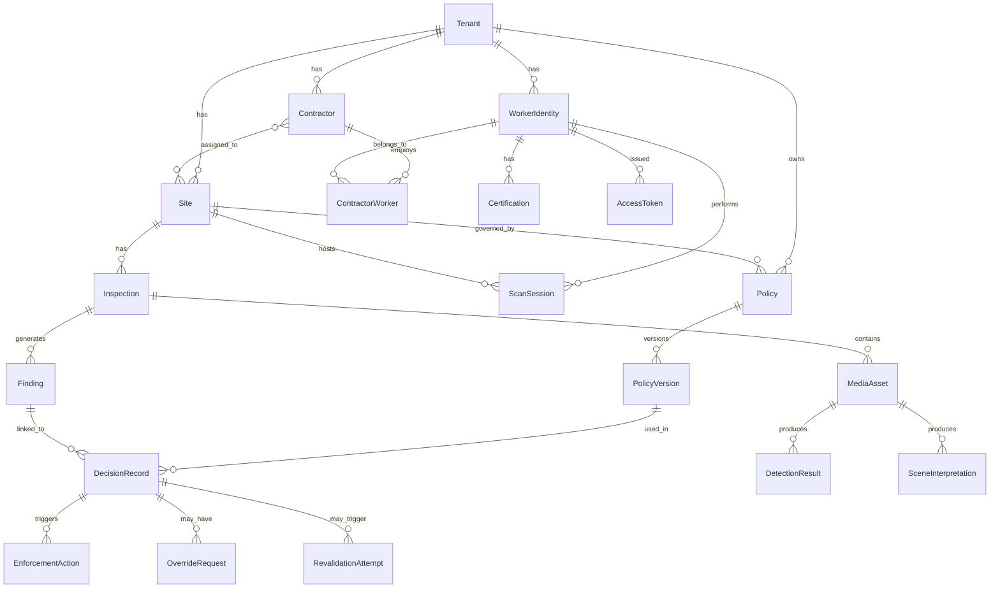
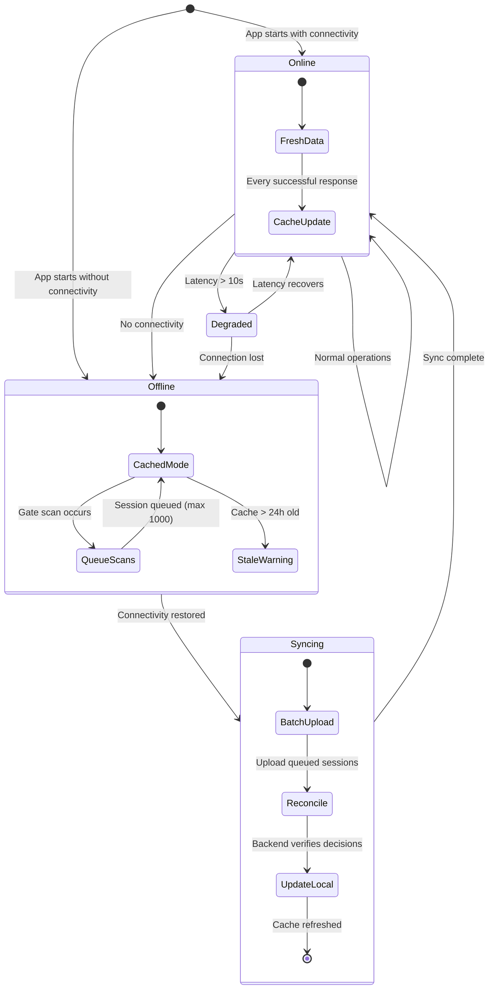
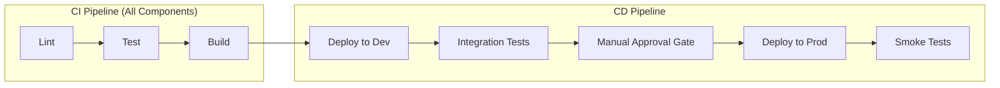
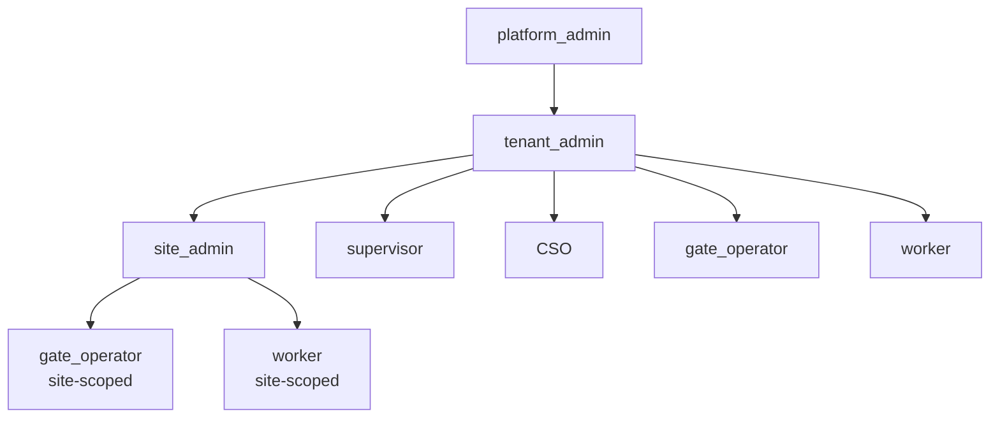
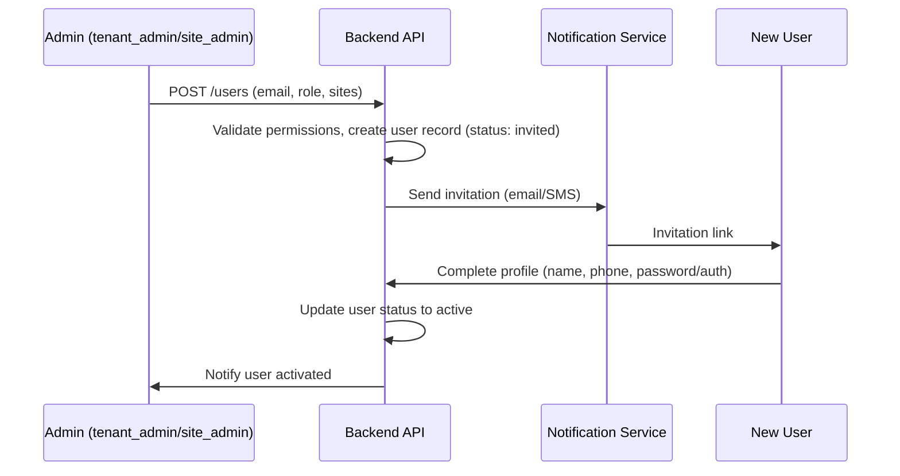
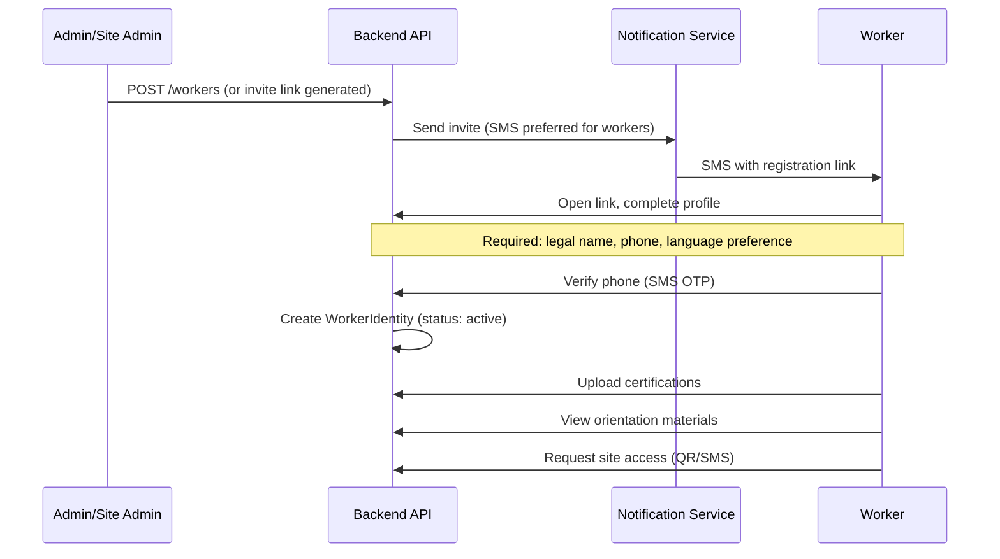

# Design Document: AI Construction Compliance Platform

## Overview

The AI Construction Compliance Platform is a serverless, event-driven regulatory reasoning engine for construction operations in British Columbia. The system centralizes all compliance and access decisions through a single Compliance Decision Engine, ensuring consistency, explainability, and auditability across worker identity management, site access control, AI-assisted safety observation, and enforcement workflows.

### Architecture Principles

1. **Single Decision Authority**: All compliance decisions flow through the Compliance Decision Engine — no module decides independently.
2. **Event-Driven Processing**: Asynchronous workflows (AI analysis, expiration checks, notifications) use SQS/SNS, keeping API responses fast.
3. **Immutable Audit Trail**: Decision records and policy versions are append-only; overrides create new linked records.
4. **Offline-First Mobile**: Workers and gate operators can function with degraded connectivity using local caching and queued sync.
5. **Policy Version Awareness**: Every evaluation references a specific PolicyVersion snapshot, enabling historical replay.
6. **Serverless Cost Efficiency**: AWS Lambda + API Gateway + managed services minimize idle costs for an MVP.

### Key Design Decisions

| Decision | Rationale |
|----------|-----------|
| AWS Lambda + API Gateway for compute | Pay-per-use, no idle costs, auto-scaling for variable construction site traffic |
| DynamoDB for ALL data storage | Fully serverless, no connection pool management, pay-per-use, no idle costs, scales to zero, Lambda-friendly (no connection limits) |
| SQS/SNS for Event Bus | Native AWS integration, at-least-once delivery, dead-letter queue support |
| React Native for mobile | Single codebase for iOS/Android, large ecosystem, offline-first libraries available |
| S3 + CloudFront for static sites | Cost-efficient hosting, global CDN, no server management |
| Tailwind CSS for UI styling | Utility-first CSS, rapid prototyping, consistent design system, small bundle with purging |
| AWS Cognito for authentication | Managed auth service, supports MFA, user pools per tenant, integrates natively with API Gateway, cost-effective |
| AWS Bedrock for AI analysis | Managed foundation models, no infrastructure to manage, pay-per-token, supports Claude for image analysis and regulatory reasoning |
| Amazon SNS + SES for notifications | SNS for SMS delivery, SES for email, both serverless and pay-per-use, native AWS integration |
| JWT with 60-min lifetime | Stateless auth, short-lived tokens reduce attack surface |
| Append-only decision storage | Regulatory requirement for 7-year retention, tamper-evident audit trail |

## Architecture

### High-Level System Architecture



### Service Communication Patterns



### AI Pipeline Flow



### AI Pipeline Implementation (AWS Bedrock)

The AI pipeline uses **AWS Bedrock** with **Claude 3.5 Sonnet** (or latest available with vision support) for all image analysis and regulatory reasoning. Each pipeline layer sends a specialized prompt to Bedrock and parses the structured JSON response.

| Layer | Bedrock Usage | Input | Output |
|-------|--------------|-------|--------|
| **Detection Layer** | Sends image to Claude with vision + detection prompt | Resized image (max 1024px) + system prompt listing safety-relevant object categories | Structured JSON: list of detected objects with type, confidence, bounding box |
| **Scene Understanding Layer** | Sends detection results + image context to Claude | Detection JSON + image metadata + scene classification prompt | Structured JSON: scene type, activity label, risk context, confidence score |
| **Regulatory Mapping Layer** | Sends scene + detections to Claude with WorkSafeBC regulation context | Scene classification + detections + system prompt pre-loaded with BC construction safety regulations | Structured JSON: regulatory clause mappings, violation flags, risk assessment, recommended actions |

**Prompt Engineering**:
- Each layer has a specialized system prompt with BC construction safety context
- System prompts include WorkSafeBC OHS Regulation references relevant to the layer's task
- Response format is enforced via prompt instructions requesting structured JSON output

**Cost Control**:
- Images resized to max 1024px (longest edge) before sending to Bedrock to reduce token usage
- Pipeline stages are sequential (not parallel) to avoid unnecessary Bedrock calls if early stages find nothing
- Results are cached in DynamoDB (DetectionResults, SceneInterpretations tables) — no re-analysis of the same image

**Model Configuration**:
- Model ID: `anthropic.claude-3-5-sonnet-20241022-v2:0` (or latest available)
- Max tokens per response: 4096
- Temperature: 0.1 (low variance for consistent regulatory analysis)

## Project Structure

The project uses a **monorepo** structure with separate folders for each deployable component. Each folder is independently buildable and deployable.

### Monorepo Layout

```
site-macaron/
├── packages/
│   ├── backend/                    # AWS Lambda services + CDK infrastructure
│   │   ├── src/
│   │   │   ├── services/
│   │   │   │   ├── decision-engine/    # Compliance Decision Engine Lambda
│   │   │   │   │   ├── handler.ts
│   │   │   │   │   ├── evaluator.ts
│   │   │   │   │   ├── explainability.ts
│   │   │   │   │   └── types.ts
│   │   │   │   ├── policy/             # Policy Service Lambda
│   │   │   │   │   ├── handler.ts
│   │   │   │   │   ├── version-manager.ts
│   │   │   │   │   └── types.ts
│   │   │   │   ├── identity/           # Identity Service Lambda
│   │   │   │   │   ├── handler.ts
│   │   │   │   │   ├── certification.ts
│   │   │   │   │   ├── worker.ts
│   │   │   │   │   └── types.ts
│   │   │   │   ├── access/             # Access Service Lambda
│   │   │   │   │   ├── handler.ts
│   │   │   │   │   ├── token-manager.ts
│   │   │   │   │   ├── scan-session.ts
│   │   │   │   │   └── types.ts
│   │   │   │   ├── ai-orchestration/   # AI Orchestration Lambda
│   │   │   │   │   ├── handler.ts
│   │   │   │   │   ├── pipeline.ts
│   │   │   │   │   └── types.ts
│   │   │   │   ├── detection/          # Detection Layer Lambda
│   │   │   │   │   ├── handler.ts
│   │   │   │   │   ├── detector.ts
│   │   │   │   │   └── types.ts
│   │   │   │   ├── scene-understanding/ # Scene Understanding Lambda
│   │   │   │   │   ├── handler.ts
│   │   │   │   │   ├── classifier.ts
│   │   │   │   │   └── types.ts
│   │   │   │   ├── regulatory-mapping/ # Regulatory Mapping Lambda
│   │   │   │   │   ├── handler.ts
│   │   │   │   │   ├── mapper.ts
│   │   │   │   │   ├── worksafe-bc-rules.ts
│   │   │   │   │   └── types.ts
│   │   │   │   ├── reporting/          # Reporting Service Lambda
│   │   │   │   │   ├── handler.ts
│   │   │   │   │   ├── summary-generator.ts
│   │   │   │   │   ├── pdf-export.ts
│   │   │   │   │   ├── csv-export.ts
│   │   │   │   │   └── types.ts
│   │   │   │   ├── notification/       # Notification Service Lambda
│   │   │   │   │   ├── handler.ts
│   │   │   │   │   ├── channels/
│   │   │   │   │   │   ├── email.ts    # Amazon SES (transactional emails)
│   │   │   │   │   │   ├── sms.ts      # Amazon SNS (direct SMS publishing)
│   │   │   │   │   │   └── push.ts     # SNS Mobile Push (future mobile app)
│   │   │   │   │   ├── templates.ts    # Notification templates (hardcoded for MVP)
│   │   │   │   │   └── types.ts
│   │   │   │   ├── sync/              # Sync Service Lambda
│   │   │   │   │   ├── handler.ts
│   │   │   │   │   ├── reconciler.ts
│   │   │   │   │   └── types.ts
│   │   │   │   └── contractors/        # Contractors Service Lambda
│   │   │   │       ├── handler.ts
│   │   │   │       ├── contractor.ts
│   │   │   │       └── types.ts
│   │   │   ├── shared/                 # Shared utilities across services
│   │   │   │   ├── dynamo-client.ts
│   │   │   │   ├── event-publisher.ts
│   │   │   │   ├── auth-middleware.ts
│   │   │   │   ├── rbac.ts
│   │   │   │   ├── error-handler.ts
│   │   │   │   ├── logger.ts
│   │   │   │   ├── validators.ts
│   │   │   │   └── types/
│   │   │   │       ├── events.ts
│   │   │   │       ├── decisions.ts
│   │   │   │       └── common.ts
│   │   │   └── scheduled/             # Scheduled Lambda functions
│   │   │       ├── cert-expiry-checker.ts
│   │   │       └── daily-summary-trigger.ts
│   │   ├── infra/                      # AWS CDK infrastructure
│   │   │   ├── bin/
│   │   │   │   └── app.ts
│   │   │   ├── lib/
│   │   │   │   ├── api-stack.ts        # API Gateway + Lambda
│   │   │   │   ├── data-stack.ts       # DynamoDB tables
│   │   │   │   ├── events-stack.ts     # SQS/SNS queues + topics
│   │   │   │   ├── storage-stack.ts    # S3 buckets
│   │   │   │   ├── monitoring-stack.ts # CloudWatch alarms + dashboards
│   │   │   │   └── auth-stack.ts       # AWS Cognito User Pools + Authorizer
│   │   │   └── cdk.json
│   │   ├── tests/
│   │   │   ├── unit/
│   │   │   │   ├── decision-engine.test.ts
│   │   │   │   ├── policy-service.test.ts
│   │   │   │   ├── identity-service.test.ts
│   │   │   │   ├── access-service.test.ts
│   │   │   │   └── ...
│   │   │   ├── properties/            # Property-based tests (fast-check)
│   │   │   │   ├── decision-properties.test.ts
│   │   │   │   ├── policy-properties.test.ts
│   │   │   │   ├── certification-properties.test.ts
│   │   │   │   ├── access-properties.test.ts
│   │   │   │   └── ...
│   │   │   └── integration/
│   │   │       ├── access-flow.test.ts
│   │   │       ├── ai-pipeline.test.ts
│   │   │       └── event-bus.test.ts
│   │   ├── package.json
│   │   ├── tsconfig.json
│   │   └── esbuild.config.ts
│   │
│   ├── admin-portal/               # React SPA with Tailwind CSS
│   │   ├── src/
│   │   │   ├── app/
│   │   │   │   ├── App.tsx
│   │   │   │   ├── router.tsx
│   │   │   │   └── providers.tsx
│   │   │   ├── pages/
│   │   │   │   ├── dashboard/
│   │   │   │   │   ├── DashboardPage.tsx
│   │   │   │   │   ├── RisksSummary.tsx
│   │   │   │   │   ├── BlockedAccess.tsx
│   │   │   │   │   ├── ExpiringCerts.tsx
│   │   │   │   │   └── RecentActivity.tsx
│   │   │   │   ├── workers/
│   │   │   │   │   ├── WorkerDirectory.tsx
│   │   │   │   │   ├── WorkerProfile.tsx
│   │   │   │   │   ├── WorkerOnboarding.tsx
│   │   │   │   │   └── BulkImport.tsx
│   │   │   │   ├── certifications/
│   │   │   │   │   ├── CertOverview.tsx
│   │   │   │   │   ├── CertCatalog.tsx
│   │   │   │   │   ├── PendingValidations.tsx
│   │   │   │   │   └── ExpiringSoon.tsx
│   │   │   │   ├── site-access/
│   │   │   │   │   ├── CheckIn.tsx
│   │   │   │   │   ├── LiveAccess.tsx
│   │   │   │   │   ├── Rejections.tsx
│   │   │   │   │   ├── AccessRules.tsx
│   │   │   │   │   └── VisitLog.tsx
│   │   │   │   ├── sites/
│   │   │   │   │   ├── SiteList.tsx
│   │   │   │   │   ├── SiteProfile.tsx
│   │   │   │   │   └── SiteConfig.tsx
│   │   │   │   ├── contractors/
│   │   │   │   │   ├── ContractorList.tsx
│   │   │   │   │   ├── ContractorProfile.tsx
│   │   │   │   │   └── ComplianceRisks.tsx
│   │   │   │   ├── safety-ai/
│   │   │   │   │   ├── UploadEvidence.tsx
│   │   │   │   │   ├── Findings.tsx
│   │   │   │   │   ├── PendingReview.tsx
│   │   │   │   │   ├── ViolationsByRule.tsx
│   │   │   │   │   ├── CorrectiveActions.tsx
│   │   │   │   │   └── PdfReports.tsx
│   │   │   │   ├── reports/
│   │   │   │   │   ├── ComplianceSummary.tsx
│   │   │   │   │   ├── WorkerStatus.tsx
│   │   │   │   │   ├── SiteAccessLogs.tsx
│   │   │   │   │   ├── SafetyFindings.tsx
│   │   │   │   │   └── AuditExport.tsx
│   │   │   │   └── admin/
│   │   │   │       ├── UsersRoles.tsx
│   │   │   │       ├── RuleCatalog.tsx
│   │   │   │       ├── SiteRequirements.tsx
│   │   │   │       ├── Integrations.tsx
│   │   │   │       └── TenantConfig.tsx
│   │   │   ├── components/            # Reusable UI components (Tailwind)
│   │   │   │   ├── layout/
│   │   │   │   │   ├── Sidebar.tsx
│   │   │   │   │   ├── Header.tsx
│   │   │   │   │   ├── PageContainer.tsx
│   │   │   │   │   └── Breadcrumbs.tsx
│   │   │   │   ├── ui/
│   │   │   │   │   ├── Button.tsx
│   │   │   │   │   ├── Card.tsx
│   │   │   │   │   ├── Table.tsx
│   │   │   │   │   ├── Modal.tsx
│   │   │   │   │   ├── Badge.tsx
│   │   │   │   │   ├── Input.tsx
│   │   │   │   │   ├── Select.tsx
│   │   │   │   │   └── ...
│   │   │   │   ├── data/
│   │   │   │   │   ├── DataTable.tsx
│   │   │   │   │   ├── Pagination.tsx
│   │   │   │   │   ├── Filters.tsx
│   │   │   │   │   └── SearchBar.tsx
│   │   │   │   └── charts/
│   │   │   │       ├── BarChart.tsx
│   │   │   │       ├── TrendLine.tsx
│   │   │   │       └── StatusBadge.tsx
│   │   │   ├── hooks/
│   │   │   │   ├── useAuth.ts
│   │   │   │   ├── useApi.ts
│   │   │   │   ├── useRBAC.ts
│   │   │   │   └── useRealtime.ts
│   │   │   ├── services/
│   │   │   │   ├── api-client.ts
│   │   │   │   ├── auth-service.ts
│   │   │   │   └── websocket.ts
│   │   │   ├── store/                 # State management
│   │   │   │   ├── auth-store.ts
│   │   │   │   ├── workers-store.ts
│   │   │   │   └── notifications-store.ts
│   │   │   └── utils/
│   │   │       ├── formatters.ts
│   │   │       ├── validators.ts
│   │   │       └── constants.ts
│   │   ├── public/
│   │   ├── tests/
│   │   ├── tailwind.config.ts
│   │   ├── vite.config.ts
│   │   ├── package.json
│   │   └── tsconfig.json
│   │
│   ├── landing-page/               # Static site with Tailwind CSS
│   │   ├── src/
│   │   │   ├── pages/
│   │   │   │   └── index.tsx
│   │   │   ├── components/
│   │   │   │   ├── Hero.tsx
│   │   │   │   ├── Features.tsx
│   │   │   │   ├── Pricing.tsx
│   │   │   │   ├── Testimonials.tsx
│   │   │   │   ├── ContactForm.tsx
│   │   │   │   └── Footer.tsx
│   │   │   └── styles/
│   │   │       └── globals.css
│   │   ├── public/
│   │   ├── tailwind.config.ts
│   │   ├── vite.config.ts
│   │   ├── package.json
│   │   └── tsconfig.json
│   │
│   └── mobile/                     # React Native app (⏸ PAUSED)
│       ├── src/
│       │   ├── screens/
│       │   │   ├── StatusScreen.tsx
│       │   │   ├── ScanScreen.tsx
│       │   │   ├── CertUploadScreen.tsx
│       │   │   └── HistoryScreen.tsx
│       │   ├── services/
│       │   │   ├── offline-store.ts
│       │   │   ├── sync-manager.ts
│       │   │   └── api-client.ts
│       │   └── components/
│       ├── package.json
│       └── tsconfig.json
│
├── .github/
│   └── workflows/
│       ├── backend.yml
│       ├── admin-portal.yml
│       └── landing-page.yml
│
├── package.json                    # Root workspace config
├── pnpm-workspace.yaml             # pnpm workspace definition
├── tsconfig.base.json              # Shared TypeScript config
└── .eslintrc.js                    # Shared ESLint config
```

### Implementation Details

#### Backend (`packages/backend/`)

**Language & Runtime**: TypeScript on Node.js 20 (AWS Lambda)

**Key Libraries**:
- `@aws-sdk/client-dynamodb` + `@aws-sdk/lib-dynamodb` — DynamoDB document client
- `@aws-sdk/client-s3` + `@aws-sdk/s3-request-presigner` — S3 operations + signed URLs
- `@aws-sdk/client-sqs` + `@aws-sdk/client-sns` — Event bus publishing
- `@aws-sdk/client-cognito-identity-provider` — Cognito user management
- `@aws-sdk/client-bedrock-runtime` — AI model invocation (Claude via Bedrock)
- `@aws-sdk/client-ses` — Transactional email delivery
- `aws-cdk-lib` — Infrastructure as Code
- `zod` — Runtime input validation and schema definition
- `uuid` — ID generation
- `jsonwebtoken` — JWT creation and verification
- `pdfkit` or `@react-pdf/renderer` — PDF report generation
- `fast-check` — Property-based testing

**Build**: esbuild bundles each Lambda handler independently (tree-shaking, minification)

**Shared Layer**: `src/shared/` contains DynamoDB client initialization, event publishing helpers, auth middleware, RBAC enforcement, error formatting, and logging. Shared code is bundled into each Lambda (no Lambda Layers for simplicity).

**Service Pattern**: Each service follows the same structure:
```
handler.ts    → Lambda entry point, request parsing, response formatting
*.ts          → Business logic (pure functions where possible)
types.ts      → TypeScript interfaces for the service domain
```

#### Admin Portal (`packages/admin-portal/`)

**Framework**: React 18 + TypeScript
**Styling**: Tailwind CSS (utility-first, purged in production build)
**Build Tool**: Vite (fast HMR in dev, optimized production builds)
**Routing**: React Router v6 (file-based routing matching navigation tree)
**State Management**: Zustand (lightweight, no boilerplate)
**Data Fetching**: TanStack Query (React Query) for server state, caching, and auto-refresh
**Charts**: Recharts (lightweight, Tailwind-compatible)
**Tables**: TanStack Table for sortable/filterable data tables with pagination
**Forms**: React Hook Form + Zod for validation
**Icons**: Lucide React

**Key Patterns**:
- Role-based route guards (useRBAC hook checks permissions before rendering)
- Auto-refresh dashboard data every 5 minutes via React Query refetchInterval
- Optimistic updates for finding review actions
- Sidebar navigation with collapsible sections matching the navigation tree
- Responsive: 1024px+ full layout, 768px+ tablet-friendly collapse

#### Landing Page (`packages/landing-page/`)

**Framework**: React (or Astro for static generation) + TypeScript
**Styling**: Tailwind CSS
**Build Tool**: Vite
**SEO**: Static HTML generation, Open Graph meta tags, structured data
**Form**: Contact form submits to `POST /leads` API endpoint
**Hosting**: S3 + CloudFront (static files only)

#### Mobile App (`packages/mobile/`) — PAUSED

**Framework**: React Native + TypeScript
**Offline Storage**: WatermelonDB or MMKV for local persistence
**Sync**: Custom sync manager using `POST /sync/sessions` and `POST /sync/media`
**QR Scanning**: react-native-camera or expo-camera
**Push Notifications**: Firebase Cloud Messaging (FCM) + Apple Push Notification Service (APNS)

> Implementation is deferred. Folder structure is retained as a placeholder for when mobile development resumes.

### Package Manager & Workspace

**Package Manager**: pnpm (fast, disk-efficient, strict dependency resolution)

**Workspace Configuration** (`pnpm-workspace.yaml`):
```yaml
packages:
  - 'packages/*'
```

**Shared Dependencies**: TypeScript, ESLint, and Prettier configs are defined at the root and inherited by each package.

**Scripts** (root `package.json`):
```json
{
  "scripts": {
    "dev:portal": "pnpm --filter admin-portal dev",
    "dev:landing": "pnpm --filter landing-page dev",
    "build:backend": "pnpm --filter backend build",
    "build:portal": "pnpm --filter admin-portal build",
    "build:landing": "pnpm --filter landing-page build",
    "test": "pnpm -r test",
    "test:properties": "pnpm --filter backend test:properties",
    "lint": "pnpm -r lint",
    "deploy:dev": "pnpm --filter backend deploy:dev",
    "deploy:prod": "pnpm --filter backend deploy:prod"
  }
}
```

## Components and Interfaces

### Service Decomposition

> **Note: The Mobile Application (iOS/Android) is paused for the MVP. The Sync Service and offline-related endpoints remain in the API design to support future mobile development, but mobile app implementation is deferred.**

| Service | Responsibility | Lambda Memory | Timeout |
|---------|---------------|---------------|---------|
| Compliance Decision Engine | Centralized decision evaluation, explainability payload generation | 512 MB | 29s (API), 900s (async) |
| Policy Service | Policy CRUD, version management, effective policy resolution | 256 MB | 29s |
| Identity Service | Worker profiles, certification management, validation status | 256 MB | 29s |
| Access Service | Token generation, scan sessions, access request orchestration | 256 MB | 29s |
| AI Orchestration Service | Pipeline coordination, media management | 512 MB | 900s |
| Detection Layer | Object detection in images (via Bedrock — Claude with vision) | 1024 MB | 900s |
| Scene Understanding Layer | Scene classification from detections (via Bedrock — Claude with vision) | 512 MB | 900s |
| Regulatory Mapping Layer | Map scenes to regulations and policies (via Bedrock — Claude with regulatory context) | 512 MB | 900s |
| Reporting Service | Summary generation, report export (PDF/CSV) | 512 MB | 900s |
| Notification Service | Push notifications (SNS Mobile Push), SMS (SNS), email (SES) dispatch | 256 MB | 60s |
| Sync Service | Offline data reconciliation, batch processing | 512 MB | 900s |

### API Interface Design

#### Identity & Certification API

```
POST   /workers                          → Create worker identity
GET    /workers/{id}                     → Get worker profile
PATCH  /workers/{id}                     → Update worker profile
GET    /workers/{id}/status              → Get worker status page data
POST   /workers/{id}/certifications      → Upload certification
GET    /workers/{id}/certifications      → List certifications
PATCH  /workers/{id}/certifications/{certId} → Update certification status
```

#### Policy & Site API

```
POST   /sites                            → Create site
GET    /sites/{id}                       → Get site details
PATCH  /sites/{id}                       → Update site
GET    /sites/{id}/effective-policies    → Get active policies for site
POST   /policies                         → Create policy
GET    /policies/{id}                    → Get policy with versions
POST   /policies/{id}/versions           → Publish new version
GET    /policies/{id}/versions/{versionId} → Get specific version
```

#### Access & Eligibility API

**QR Code Flow**:
- Each worker has a **static QR code** (stored as `qrIdentityReference` in the Workers table)
- The QR encodes the worker's identity reference (not a token)
- When scanned at a gate, the system:
  1. Decodes the QR to get the worker identity reference
  2. Generates a short-lived AccessToken (10 min TTL)
  3. Evaluates eligibility via the Compliance Decision Engine
  4. Returns the decision
- The QR itself does NOT grant access — it only identifies the worker
- QR codes can be printed on badges or displayed on the worker's phone

```
POST   /access/request                   → Submit access request (QR/SMS)
POST   /access/scan                      → Record scan session
GET    /access/decisions/{id}            → Get decision with explainability
POST   /access/tokens                    → Generate access token
DELETE /access/tokens/{id}               → Revoke access token
POST   /access/revalidate               → Submit revalidation attempt
POST   /access/override                  → Request override
PATCH  /access/override/{id}            → Approve/reject override
```

#### AI & Findings API

```
POST   /inspections                      → Create inspection
POST   /inspections/{id}/media           → Upload media (signed URL)
POST   /inspections/{id}/analyze         → Trigger AI analysis
GET    /findings                          → List findings (filtered)
GET    /findings/{id}                    → Get finding detail
POST   /findings/{id}/review             → Confirm or dismiss finding
```

#### Reporting API

```
GET    /sites/{id}/daily-summary         → Get daily compliance summary
POST   /reports                          → Request report generation
GET    /reports/{id}                     → Get generated report
GET    /reports/{id}/export              → Export report (PDF/CSV)
GET    /workers/{id}/compliance-summary  → Worker compliance summary
```

#### Contractors API

```
POST   /contractors                      → Create contractor
GET    /contractors                      → List contractors (filtered)
GET    /contractors/{id}                 → Get contractor profile
PATCH  /contractors/{id}                 → Update contractor
GET    /contractors/{id}/workers         → List contractor's workers
POST   /contractors/{id}/workers         → Assign worker to contractor
DELETE /contractors/{id}/workers/{workerId} → Remove worker from contractor
GET    /contractors/{id}/compliance      → Get contractor compliance status
```

#### Sync API

```
POST   /sync/sessions                    → Batch sync offline scan sessions
POST   /sync/media                       → Batch sync offline media uploads
GET    /sync/status                      → Get sync status for device
```

#### Lead Capture API (Landing Page)

```
POST   /leads                            → Submit lead capture form
```

### Internal Service Interfaces

#### Compliance Decision Engine Interface

```typescript
interface DecisionRequest {
  decision_type: 'site_access' | 'certification_compliance' | 'ai_finding' | 'corrective_action';
  subject_type: 'worker' | 'inspection' | 'finding';
  subject_id: string;
  site_id?: string;
  context: Record<string, unknown>;
}

interface DecisionResponse {
  decision_id: string;
  decision: 'allowed' | 'conditional' | 'denied' | 'manual_review_required';
  decision_type: string;
  reasons: string[];  // max 5, each max 500 chars
  rules_applied: string[];
  policy_version_used: string;
  jurisdiction: string;
  timestamp: string;  // ISO 8601 UTC
  enforcement?: EnforcementPayload;
  explainability: ExplainabilityPayload;
}

interface ExplainabilityPayload {
  decision: string;
  decision_type: string;
  timestamp: string;
  reasons: string[];
  rule_references: RuleReference[];
  evidence_references: EvidenceReference[];
  policy_version_references: string[];
  explanation_level: 'audit_grade';
}
```

#### Event Bus Message Schema

```typescript
interface PlatformEvent {
  event_id: string;
  event_type: string;
  source_service: string;
  tenant_id: string;
  timestamp: string;  // ISO 8601 UTC
  payload: Record<string, unknown>;
  correlation_id: string;
  version: string;
}
```

### Event Catalog

| Event | Publisher | Consumers | Trigger |
|-------|-----------|-----------|---------|
| WorkerCreated | Identity Service | Notification Service | Worker registration |
| WorkerUpdated | Identity Service | Decision Engine | Profile change |
| CertificationUploaded | Identity Service | Notification Service | Cert upload |
| CertificationValidated | Identity Service | Decision Engine | Admin validates cert |
| CertificationExpired | Scheduled Lambda | Decision Engine, Notification | Daily expiry check |
| SitePolicyPublished | Policy Service | Decision Engine | New policy version |
| AccessRequested | Access Service | — | QR/SMS scan |
| AccessDecisionGenerated | Decision Engine | Enforcement, Notification | Decision produced |
| InspectionUploaded | AI Orchestration | Detection Layer | Image uploaded |
| DetectionCompleted | Detection Layer | Scene Understanding | Detection done |
| SceneClassified | Scene Understanding | Regulatory Mapping | Scene classified |
| FindingGenerated | Regulatory Mapping | Notification, Reporting | Finding created |
| FindingReviewed | Admin Portal | Enforcement, Reporting | Finding confirmed/dismissed |
| DailyComplianceSummaryRequested | Scheduled Lambda | Reporting Service | Daily schedule |
| DailyComplianceSummaryGenerated | Reporting Service | Notification Service | Summary ready |


## Data Models

### Entity Relationship Diagram



### DynamoDB Table Design

The platform uses DynamoDB exclusively for all data storage, leveraging a multi-table design for clarity. This approach eliminates connection pool management, provides true pay-per-use pricing, scales to zero during idle periods, and avoids Lambda connection limit issues inherent to relational databases.

> **Note on Requirement 18 (Backend)**: The original requirement referenced RDS PostgreSQL for transactional data storage. The implementation uses DynamoDB instead, which satisfies the "transactional data storage" requirement with a different technology choice that better aligns with the fully serverless architecture (no idle costs, no connection pools, native Lambda integration).

#### Table Overview

| Table Name | Partition Key (PK) | Sort Key (SK) | Purpose | GSIs |
|---|---|---|---|---|
| Tenants | TENANT#{tenantId} | METADATA | Tenant info | — |
| Workers | TENANT#{tenantId} | WORKER#{workerId} | Worker identities | GSI1: phone → worker lookup |
| Certifications | WORKER#{workerId} | CERT#{certId} | Worker certs | GSI1: expiryDate for expiration scans |
| Contractors | TENANT#{tenantId} | CONTRACTOR#{contractorId} | Contractor profiles | GSI1: tenantId#status → filter by status |
| ContractorWorkers | CONTRACTOR#{contractorId} | WORKER#{workerId} | Contractor-worker assignments | GSI1: WORKER#{workerId} → find contractor for worker |
| Sites | TENANT#{tenantId} | SITE#{siteId} | Site info | — |
| Policies | TENANT#{tenantId} | POLICY#{policyId} | Policies | GSI1: ownerType+ownerId |
| PolicyVersions | POLICY#{policyId} | VERSION#{versionNumber} | Policy versions | GSI1: status+effectiveFrom for active lookup |
| DecisionRecords | TENANT#{tenantId} | DECISION#{decisionId} | Decisions (append-only) | GSI1: subjectId+createdAt, GSI2: siteId+createdAt |
| AccessTokens | TOKEN#{tokenHash} | METADATA | Short-lived tokens | TTL: expiresAt |
| ScanSessions | SITE#{siteId} | SCAN#{timestamp}#{sessionId} | Scan records | GSI1: workerId+scannedAt |
| EnforcementActions | DECISION#{decisionId} | ACTION#{actionId} | Enforcement | GSI1: status+createdAt for unresolved queries |
| OverrideRequests | DECISION#{decisionId} | OVERRIDE#{overrideId} | Overrides | GSI1: status for pending queries |
| RevalidationAttempts | DECISION#{decisionId} | REVAL#{attemptId} | Revalidation | — |
| Inspections | SITE#{siteId} | INSPECTION#{inspectionId} | Inspections | GSI1: tenantId+createdAt |
| MediaAssets | INSPECTION#{inspectionId} | MEDIA#{assetId} | Media refs | — |
| DetectionResults | MEDIA#{assetId} | DETECTION#{resultId} | AI detections | — |
| SceneInterpretations | MEDIA#{assetId} | SCENE#{interpretationId} | Scene analysis | — |
| Findings | TENANT#{tenantId} | FINDING#{findingId} | AI findings | GSI1: status+severity, GSI2: inspectionId |
| DailyComplianceSummaries | SITE#{siteId} | SUMMARY#{date} | Daily reports | GSI1: tenantId+date |
| AuditTrail | TENANT#{tenantId} | AUDIT#{timestamp}#{auditId} | Audit log | GSI1: userId+createdAt |
| LeadCaptures | LEAD#{leadId} | METADATA | Landing page leads | GSI1: email for dedup |
| Users | TENANT#{tenantId} | USER#{userId} | Admin/operational users | GSI1: email, GSI2: role+status |
| Sessions | SESSION#{sessionId} | METADATA | JWT sessions | TTL: 60 min |
| DeviceCache | DEVICE#{deviceId} | CACHE#{key} | Offline cache | TTL: 72 hours |
| OfflineQueue | DEVICE#{deviceId} | QUEUED#{timestamp} | Offline scans | TTL: 72 hours |
| RateLimits | RESOURCE#{key} | WINDOW#{start} | Rate limiting | TTL: 1 hour |

#### Core Tables — Item Structures

**Tenants Table**
- PK: `TENANT#{tenantId}`, SK: `METADATA`
- Attributes: `id`, `name`, `status` (active|inactive), `createdAt`, `updatedAt`

**Workers Table**
- PK: `TENANT#{tenantId}`, SK: `WORKER#{workerId}`
- Attributes: `id`, `tenantId`, `legalName` (max 150 chars), `preferredName` (max 100 chars), `phone` (E.164, max 15 digits), `languagePreference` (en|es|pa), `status` (active|inactive|suspended), `identityVerificationStatus` (pending|verified), `qrIdentityReference`, `createdAt`, `updatedAt`
- GSI1 PK: `phone` → enables lookup by phone number

**Certifications Table**
- PK: `WORKER#{workerId}`, SK: `CERT#{certId}`
- Attributes: `id`, `workerId`, `tenantId`, `certificationType` (whmis_2015|fall_protection|site_ready_bc|first_aid), `issuer`, `issueDate`, `expiryDate`, `validationStatus` (pending|validated|rejected|expired), `documentAssetId`, `extractedMetadata` (map), `createdAt`, `updatedAt`
- GSI1 PK: `tenantId`, SK: `expiryDate` → enables expiration scans across tenant

**Sites Table**
- PK: `TENANT#{tenantId}`, SK: `SITE#{siteId}`
- Attributes: `id`, `tenantId`, `name` (max 200 chars), `location` (map: address, lat, lng), `jurisdiction` (default: BC), `projectPhase`, `timezone` (default: America/Vancouver), `status` (active|inactive), `createdAt`, `updatedAt`

**Contractors Table**
- PK: `TENANT#{tenantId}`, SK: `CONTRACTOR#{contractorId}`
- Attributes: `id`, `tenantId`, `name` (max 200 chars), `contactEmail` (max 320 chars), `contactPhone` (E.164), `status` (active|suspended|inactive), `clearanceStatus` (cleared|conditional|blocked), `assignedSites` (list of site IDs), `requiredCertifications` (list), `documents` (list of S3 references), `performanceNotes` (max 2000 chars), `createdAt`, `updatedAt`
- GSI1 PK: `tenantId#status` → enables filtering contractors by status within a tenant

**ContractorWorkers Table**
- PK: `CONTRACTOR#{contractorId}`, SK: `WORKER#{workerId}`
- Attributes: `contractorId`, `workerId`, `assignedAt`, `status` (active|inactive)
- GSI1 PK: `WORKER#{workerId}` → enables lookup of which contractor a worker belongs to

**Policies Table**
- PK: `TENANT#{tenantId}`, SK: `POLICY#{policyId}`
- Attributes: `id`, `tenantId`, `ownerType` (platform|tenant|site|project), `ownerId`, `policyType`, `jurisdiction` (default: BC), `status` (active|inactive), `createdAt`, `updatedAt`
- GSI1 PK: `ownerType#ownerId` → enables lookup by owner

**PolicyVersions Table**
- PK: `POLICY#{policyId}`, SK: `VERSION#{versionNumber}`
- Attributes: `id`, `policyId`, `versionNumber`, `effectiveFrom`, `effectiveTo`, `publishedAt`, `publishedBy`, `changeSummary` (max 1000 chars), `ruleSnapshot` (map), `schemaVersion` (default: 1.0), `status` (draft|active|retired), `isImmutable`, `createdAt`
- GSI1 PK: `policyId#status`, SK: `effectiveFrom` → enables active version lookup by date

**DecisionRecords Table** (append-only, never updated)
- PK: `TENANT#{tenantId}`, SK: `DECISION#{decisionId}`
- Attributes: `id`, `tenantId`, `decisionType` (site_access|certification_compliance|ai_finding|corrective_action), `subjectType` (worker|inspection|finding), `subjectId`, `siteId`, `decisionResult` (allowed|conditional|denied|manual_review_required), `reasons` (list, max 5 items, each max 500 chars), `rulesApplied` (list), `policyVersionId`, `ruleSnapshot` (map), `jurisdiction`, `explainabilityPayload` (map), `evidenceReferences` (list), `createdAt`
- GSI1 PK: `subjectId`, SK: `createdAt` → enables subject history lookup
- GSI2 PK: `siteId`, SK: `createdAt` → enables site decision history

**AccessTokens Table**
- PK: `TOKEN#{tokenHash}`, SK: `METADATA`
- Attributes: `id`, `workerIdentityId`, `tokenType` (qr_session|sms_magic_link|gate_pass), `tokenHash`, `issuedAt`, `expiresAt`, `revokedAt`, `deviceBinding`, `nonce`, `status` (active|expired|revoked|used)
- TTL attribute: `expiresAt` → auto-deletes expired tokens

**ScanSessions Table**
- PK: `SITE#{siteId}`, SK: `SCAN#{timestamp}#{sessionId}`
- Attributes: `id`, `workerIdentityId`, `siteId`, `tokenId`, `decisionId`, `scannedAt`, `scannerType`, `deviceId`, `networkStatus` (online|offline|degraded), `result`, `replayRiskFlag`, `syncedAt`
- GSI1 PK: `workerIdentityId`, SK: `scannedAt` → enables worker scan history

**EnforcementActions Table**
- PK: `DECISION#{decisionId}`, SK: `ACTION#{actionId}`
- Attributes: `id`, `decisionRecordId`, `actionType` (deny_entry|notify_supervisor|request_updated_certification|require_manual_review_at_gate|trigger_override_workflow|create_corrective_action_task|require_rescan|escalate_to_cso), `subjectType`, `subjectId`, `siteId`, `status` (pending|in_progress|resolved|dismissed), `assignedTo`, `dueAt`, `executedAt`, `escalatedAt`, `resolutionNotes`, `createdAt`
- GSI1 PK: `status`, SK: `createdAt` → enables unresolved action queries

**OverrideRequests Table**
- PK: `DECISION#{decisionId}`, SK: `OVERRIDE#{overrideId}`
- Attributes: `id`, `decisionRecordId`, `requestedBy`, `reasonCode`, `freeformReason`, `evidenceAssetId`, `status` (pending|approved|rejected), `approvedBy`, `approvedAt`, `expiresAt` (max 90 days from approval), `createdAt`
- GSI1 PK: `status` → enables pending override queries

**RevalidationAttempts Table**
- PK: `DECISION#{decisionId}`, SK: `REVAL#{attemptId}`
- Attributes: `id`, `originalDecisionId`, `triggeredBy`, `triggerType`, `context` (map), `newDecisionId`, `createdAt`

#### AI Pipeline Tables — Item Structures

**Inspections Table**
- PK: `SITE#{siteId}`, SK: `INSPECTION#{inspectionId}`
- Attributes: `id`, `tenantId`, `siteId`, `uploadedBy`, `capturedAt`, `metadata` (map: trade, projectPhase, notes), `status` (uploaded|processing|completed|failed), `createdAt`
- GSI1 PK: `tenantId`, SK: `createdAt` → enables tenant-wide inspection listing

**MediaAssets Table**
- PK: `INSPECTION#{inspectionId}`, SK: `MEDIA#{assetId}`
- Attributes: `id`, `inspectionId`, `mediaType` (jpeg|png), `storageUrl`, `fileSizeBytes`, `resolutionWidth`, `resolutionHeight`, `metadata` (map), `createdAt`

**DetectionResults Table**
- PK: `MEDIA#{assetId}`, SK: `DETECTION#{resultId}`
- Attributes: `id`, `mediaAssetId`, `modelVersion`, `output` (list of maps: type, confidence, boundingBox), `processingTimeMs`, `createdAt`

**SceneInterpretations Table**
- PK: `MEDIA#{assetId}`, SK: `SCENE#{interpretationId}`
- Attributes: `id`, `mediaAssetId`, `detectionResultId`, `modelVersion`, `sceneType`, `sceneDescription` (max 200 chars), `activityLabel`, `riskContext` (map), `confidence` (0.00–1.00), `createdAt`

**Findings Table**
- PK: `TENANT#{tenantId}`, SK: `FINDING#{findingId}`
- Attributes: `id`, `tenantId`, `inspectionId`, `mediaAssetId`, `findingType`, `severity` (critical|high|medium|low), `status` (generated|pending_review|confirmed|dismissed|corrected), `decisionRecordId`, `regulatoryBasis` (map), `sitePolicyBasis` (map), `suggestedAction` (max 500 chars), `aiAnalysis` (map: observationSummary, regulatoryReferences, riskAssessment, recommendedActions, complianceScore), `reviewedBy`, `reviewedAt`, `dismissalReason`, `createdAt`, `updatedAt`
- GSI1 PK: `status#severity`, SK: `createdAt` → enables filtered finding queries
- GSI2 PK: `inspectionId`, SK: `createdAt` → enables inspection-scoped finding lookup

#### Reporting, Audit & Operational Tables — Item Structures

**DailyComplianceSummaries Table**
- PK: `SITE#{siteId}`, SK: `SUMMARY#{date}`
- Attributes: `id`, `tenantId`, `siteId`, `reportingPeriodStart`, `reportingPeriodEnd`, `accessDecisions` (map: allowed, conditional, denied counts), `findings` (map: generated, confirmed, dismissed counts), `unresolvedActions` (map), `certificationStatus` (map), `activePolicyVersions` (list), `aiNarrative` (map: summaryText, keyObservations, regulatoryHighlights, riskTrend, recommendedFocusAreas), `generatedAt`
- GSI1 PK: `tenantId`, SK: `date` → enables tenant-wide daily summary listing

**AuditTrail Table**
- PK: `TENANT#{tenantId}`, SK: `AUDIT#{timestamp}#{auditId}`
- Attributes: `id`, `tenantId`, `actingUserId`, `targetResourceType`, `targetResourceId`, `action`, `details` (map), `ipAddress`, `createdAt`
- GSI1 PK: `actingUserId`, SK: `createdAt` → enables user activity lookup

**LeadCaptures Table**
- PK: `LEAD#{leadId}`, SK: `METADATA`
- Attributes: `id`, `companyName` (max 200 chars), `contactName` (max 150 chars), `email` (max 320 chars), `phone` (E.164), `message` (max 1000 chars), `createdAt`
- GSI1 PK: `email` → enables deduplication check

**Users Table**
- PK: `TENANT#{tenantId}`, SK: `USER#{userId}`
- Attributes: `id`, `tenantId`, `email` (max 320 chars), `phone`, `displayName` (max 150 chars), `role` (platform_admin|tenant_admin|site_admin|supervisor|cso|gate_operator), `status` (invited|active|suspended|deactivated), `assignedSites` (list of site IDs), `invitedBy`, `invitedAt`, `activatedAt`, `lastLoginAt`, `createdAt`, `updatedAt`
- GSI1 PK: `email` → enables email-based lookup
- GSI2 PK: `tenantId#role`, SK: `status` → enables role-filtered queries

**Sessions Table**
- PK: `SESSION#{sessionId}`, SK: `METADATA`
- Attributes: `sessionId`, `userId`, `tenantId`, `createdAt`, `expiresAt`, `revoked`
- TTL attribute: `expiresAt` (60 minutes)

**DeviceCache Table**
- PK: `DEVICE#{deviceId}`, SK: `CACHE#{key}`
- Attributes: `deviceId`, `cacheKey`, `data` (map), `cachedAt`, `expiresAt`
- TTL attribute: `expiresAt` (72 hours)

**OfflineQueue Table**
- PK: `DEVICE#{deviceId}`, SK: `QUEUED#{timestamp}`
- Attributes: `deviceId`, `sessionData` (map), `queuedAt`, `expiresAt`
- TTL attribute: `expiresAt` (72 hours)

**RateLimits Table**
- PK: `RESOURCE#{key}`, SK: `WINDOW#{start}`
- Attributes: `resourceKey`, `windowStart`, `requestCount`, `expiresAt`
- TTL attribute: `expiresAt` (1 hour)

### Offline Sync Strategy



#### Offline Data Limits

| Data Type | Local Limit | Retention |
|-----------|-------------|-----------|
| Queued scan sessions | 1,000 sessions | 72 hours |
| Cached eligibility data | Per-worker status | 72 hours (stale after 24h) |
| Pending photo uploads | 500 photos | Until sync |
| Cached policy rules | Active site policies | 72 hours |

#### Sync Reconciliation Rules

1. Queued sessions are uploaded in chronological order via `POST /sync/sessions`
2. Backend re-evaluates each session against the policy version active at scan time
3. If cached decision differs from backend decision, the backend decision takes precedence
4. Sessions flagged as stale (>24h cache) are marked for backend verification
5. Conflicts are logged in audit trail with both cached and verified outcomes


## Environments

The platform operates across two distinct environments with separate AWS resources to ensure development activities never impact production users.

### Development Environment (dev)

- **Purpose**: Development, testing, and staging of new features
- **AWS Resources**:
  - DynamoDB tables: On-demand capacity, `dev-` prefixed table names (e.g., `dev-Workers`, `dev-DecisionRecords`)
  - Lambda concurrency limit: 10 concurrent executions per service
  - S3 buckets: Prefixed with `dev-` (e.g., `dev-media-assets`, `dev-audit-storage`)
  - SQS queues: Prefixed with `dev-` (e.g., `dev-ai-pipeline-queue`)
  - API Gateway: Separate stage (`dev`) with lower throttling limits
  - CloudFront: Separate distributions for dev admin portal and landing page
- **Isolation**: Separate AWS account (preferred) or at minimum separate resource naming with `dev-` prefix and environment tags (`Environment: dev`)
- **Cost optimization**: On-demand DynamoDB capacity (scales to zero when idle), shorter data retention (30 days for audit trail vs 90 days in prod)

### Production Environment (prod)

- **Purpose**: Live user traffic, real compliance operations
- **AWS Resources**:
  - DynamoDB tables: On-demand capacity (or provisioned with auto-scaling for predictable workloads), production table names (e.g., `Workers`, `DecisionRecords`)
  - Lambda concurrency limit: 100 concurrent executions per service
  - S3 buckets: Production naming (e.g., `media-assets`, `audit-storage`) with versioning enabled
  - SQS queues: Production naming with dead-letter queues and CloudWatch alarms
  - API Gateway: Production stage with appropriate throttling (1000 req/s burst, 500 req/s sustained)
  - CloudFront: Production distributions with custom domains and SSL certificates
- **Isolation**: Dedicated AWS account with production-grade IAM policies
- **Data retention**: Full regulatory retention (7 years for decision records, 90 days for audit trail minimum)

### Environment Configuration Strategy

| Configuration Source | Purpose | Examples |
|---------------------|---------|----------|
| Environment Variables | Runtime config per Lambda | `ENVIRONMENT=dev\|prod`, `TABLE_PREFIX`, `SQS_QUEUE_URL` |
| AWS SSM Parameter Store | Shared secrets and config | API keys, feature flags, DynamoDB table names |
| AWS Secrets Manager | Sensitive credentials | JWT signing key, third-party API secrets |
| CDK/SAM context | Infrastructure parameters | Concurrency limits, bucket names, capacity mode |

**Environment variable naming convention**:
```
/{environment}/ai-compliance/{service}/{parameter}
```
Example: `/prod/ai-compliance/decision-engine/table-name`

### Resource Separation Summary

| Resource | Dev | Prod |
|----------|-----|------|
| DynamoDB Tables | `dev-Workers`, `dev-DecisionRecords`, etc. (on-demand) | `Workers`, `DecisionRecords`, etc. (on-demand or provisioned with auto-scaling) |
| SQS Queues | `dev-ai-pipeline`, `dev-cert-expiry`, etc. | `ai-pipeline`, `cert-expiry`, etc. |
| S3 Buckets | `dev-compliance-media`, `dev-compliance-audit` | `compliance-media`, `compliance-audit` |
| API Gateway | `dev` stage | `prod` stage |
| CloudFront | Dev distributions (no custom domain) | Prod distributions (custom domains + SSL) |
| CloudWatch | `dev/` log group prefix | `prod/` log group prefix |

---

## CI/CD Pipelines

### Pipeline Architecture

The platform uses GitHub Actions for CI/CD with separate pipeline configurations for each deployable component. All pipelines enforce quality gates before deployment.



### Pipeline Stages

| Stage | Tools | Purpose |
|-------|-------|---------|
| Lint | ESLint, Prettier, tsc --noEmit | Code quality, formatting, type checking |
| Test | Jest + fast-check | Unit tests + property-based tests (min 100 iterations) |
| Build | esbuild/webpack (Lambda), Vite (SPA) | Compile and bundle artifacts |
| Deploy Dev | AWS CDK / SAM deploy | Deploy to development environment |
| Integration Test | Jest + supertest | End-to-end API and event flow tests against dev |
| Manual Approval | GitHub Actions environment protection | Human gate before production |
| Deploy Prod | AWS CDK / SAM deploy | Deploy to production environment |
| Smoke Test | Custom health checks | Verify production deployment health |

### Component-Specific Pipelines

#### Backend (Lambda + API Gateway)

```yaml
# .github/workflows/backend.yml
trigger: push to main, PR to main (paths: backend/**)
steps:
  - lint (eslint, prettier)
  - type-check (tsc --noEmit)
  - unit-test (jest + fast-check, min 100 iterations per property)
  - build (esbuild, bundle each Lambda)
  - cdk synth (validate infrastructure)
  - deploy-dev (cdk deploy --context env=dev)
  - integration-test (against dev API)
  - manual-approval (required for prod)
  - deploy-prod (cdk deploy --context env=prod)
  - smoke-test (health endpoints, basic flow)
```

**Infrastructure as Code**: AWS CDK (TypeScript) defines all backend resources:
- Lambda functions with environment-specific memory/concurrency
- API Gateway with stages
- DynamoDB tables with capacity configuration and GSIs
- SQS queues with DLQ configuration
- S3 buckets with lifecycle policies
- IAM roles and policies
- CloudWatch alarms and dashboards

#### Admin Portal (SPA — React + Tailwind CSS)

```yaml
# .github/workflows/admin-portal.yml
trigger: push to main, PR to main (paths: admin-portal/**)
steps:
  - lint (eslint, prettier)
  - type-check (tsc --noEmit)
  - unit-test (jest/vitest)
  - build (vite build with Tailwind CSS purge, output to dist/)
  - deploy-dev (aws s3 sync dist/ s3://dev-admin-portal/)
  - invalidate-dev-cloudfront (aws cloudfront create-invalidation)
  - manual-approval
  - deploy-prod (aws s3 sync dist/ s3://admin-portal/)
  - invalidate-prod-cloudfront (aws cloudfront create-invalidation)
```

#### Landing Page (Static Site — Tailwind CSS)

```yaml
# .github/workflows/landing-page.yml
trigger: push to main, PR to main (paths: landing-page/**)
steps:
  - lint (eslint, prettier)
  - build (vite build with Tailwind CSS purge)
  - lighthouse-check (score >= 90)
  - deploy-dev (aws s3 sync dist/ s3://dev-landing-page/)
  - invalidate-dev-cloudfront
  - manual-approval
  - deploy-prod (aws s3 sync dist/ s3://landing-page/)
  - invalidate-prod-cloudfront
```

#### Mobile App (React Native) — PAUSED

> Mobile app CI/CD pipeline is deferred. The pipeline definition below is retained for reference when mobile development resumes.

<!--
```yaml
# .github/workflows/mobile.yml — PAUSED
trigger: push to main, PR to main (paths: mobile/**)
steps:
  - lint (eslint, prettier)
  - type-check (tsc --noEmit)
  - unit-test (jest)
  - build-ios (eas build --platform ios)
  - build-android (eas build --platform android)
  - manual-approval
  - submit-ios (eas submit --platform ios)
  - submit-android (eas submit --platform android)
```
-->

### Rollback Strategy

| Component | Rollback Method | Time to Rollback |
|-----------|----------------|------------------|
| Backend (Lambda) | CDK rollback or redeploy previous version | < 5 minutes |
| Admin Portal | S3 sync previous build artifact + CloudFront invalidation | < 3 minutes |
| Landing Page | S3 sync previous build artifact + CloudFront invalidation | < 3 minutes |
| DynamoDB schema changes | Forward-only (additive attribute changes); rollback via compensating writes or table restore from backup | Varies |

### Pipeline Security

- AWS credentials via GitHub OIDC (no long-lived keys)
- Environment secrets stored in GitHub Secrets (mapped to SSM at deploy time)
- Dependency scanning (npm audit, Snyk) in CI
- Container/artifact signing for production deployments
- Branch protection: require PR review + passing CI before merge to main

---

## Role-Based Access Control (RBAC)

### Permission Matrix

| Permission / Action | platform_admin | tenant_admin | site_admin | supervisor | CSO | gate_operator | worker |
|---|:---:|:---:|:---:|:---:|:---:|:---:|:---:|
| Create tenants | ✓ | | | | | | |
| Manage tenant settings | ✓ | ✓ | | | | | |
| Create/manage sites | ✓ | ✓ | ✓ | | | | |
| Create/manage users | ✓ | ✓ | | | | | |
| Assign roles | ✓ | ✓ | | | | | |
| Create/publish policies | ✓ | ✓ | | | | | |
| View dashboard | ✓ | ✓ | ✓ | ✓ | ✓ | | |
| Manage workers | ✓ | ✓ | ✓ | ✓ | | | |
| Validate certifications | ✓ | ✓ | ✓ | | | | |
| Upload inspections | ✓ | ✓ | ✓ | ✓ | ✓ | | |
| Review findings | ✓ | ✓ | ✓ | ✓ | ✓ | | |
| Approve overrides | ✓ | ✓ | ✓ | | ✓ | | |
| View reports | ✓ | ✓ | ✓ | ✓ | ✓ | | |
| Generate reports | ✓ | ✓ | ✓ | | ✓ | | |
| Operate gate (scan) | ✓ | ✓ | ✓ | | | ✓ | |
| View own status | | | | | | | ✓ |
| Upload own certifications | | | | | | | ✓ |
| Request access (QR/SMS) | | | | | | | ✓ |
| View orientation materials | | | | | | | ✓ |

### Role Hierarchy and User Creation Rules



**User creation permissions**:
- **platform_admin**: Can create tenant_admin users and manage all tenants
- **tenant_admin**: Can create users with roles: site_admin, supervisor, CSO, gate_operator, worker — all scoped to their tenant
- **site_admin**: Can create workers and gate_operators for their assigned sites only
- **supervisor, CSO, gate_operator, worker**: Cannot create other users

### Role Scope Rules

| Role | Data Scope | Portal Access |
|------|-----------|---------------|
| platform_admin | All tenants, all sites | Full admin portal |
| tenant_admin | Own tenant, all sites within tenant | Full admin portal (tenant-scoped) |
| site_admin | Own tenant, assigned sites only | Admin portal (site-scoped) |
| supervisor | Own tenant, assigned sites only | Admin portal (limited modules) |
| CSO | Own tenant, all sites within tenant | Admin portal (safety-focused modules) |
| gate_operator | Own tenant, assigned site gate only | Gate scan interface only |
| worker | Own profile only | Mobile app only |

### Worker Access Constraints

Workers have the most restricted access in the system:
- **Can access**: Own status page, own certification uploads, access requests (QR/SMS), orientation materials
- **Cannot access**: Admin portal, reports, policy management, other workers' data, site management, finding review, enforcement actions
- **Interface**: Mobile app only (no web portal access)
- **Data visibility**: Own identity, own certifications, own access history, own enforcement actions directed at them

---

## Admin Portal Navigation

The Admin Portal is built as a React SPA styled with **Tailwind CSS**, providing a utility-first design system for rapid development and consistent UI across all modules. The portal uses a sidebar navigation pattern with the following structure:

### Navigation Tree

```
Portal
├── Dashboard Ejecutivo
│   ├── Resumen general
│   ├── Riesgos abiertos
│   ├── Accesos bloqueados
│   ├── Certificaciones por vencer
│   └── Actividad reciente
│
├── Workers
│   ├── Directorio de workers
│   ├── Perfil de worker
│   │   ├── Datos personales
│   │   ├── Certificaciones
│   │   ├── Historial de sitios
│   │   ├── Incidentes / observaciones
│   │   └── QR / SMS pass
│   ├── Onboarding
│   ├── Importación masiva
│   └── Estados (active, pending, blocked, expired)
│
├── Certifications
│   ├── Vista general
│   ├── Catálogo de certificaciones
│   ├── Validaciones pendientes
│   ├── Expiring soon
│   └── Reglas por site / contractor
│
├── Site Access
│   ├── Check-in / scan QR
│   ├── Accesos en tiempo real
│   ├── Rechazos y causas
│   ├── Reglas de acceso por site
│   └── Visit log / audit trail
│
├── Sites
│   ├── Lista de sitios
│   ├── Perfil del sitio
│   │   ├── Requisitos de acceso
│   │   ├── Workers activos hoy
│   │   ├── Contractors asignados
│   │   ├── Hallazgos de seguridad
│   │   └── Reportes
│   └── Configuración del sitio
│
├── Contractors
│   ├── Lista de contractors
│   ├── Perfil del contractor
│   │   ├── Workers vinculados
│   │   ├── Clearance / standing
│   │   ├── Certificaciones requeridas
│   │   ├── Performance / observations
│   │   └── Documentos
│   └── Riesgos de cumplimiento
│
├── Safety AI
│   ├── Ingresar evidencia
│   ├── Hallazgos
│   ├── Casos por revisar
│   ├── Violaciones por regla
│   ├── Corrective actions
│   └── Reportes PDF
│
├── Reports
│   ├── Compliance summary
│   ├── Worker status
│   ├── Site access logs
│   ├── Safety findings
│   └── Audit export
│
└── Admin
    ├── Usuarios / roles
    ├── Catálogo de reglas
    ├── Requisitos por site
    ├── Integraciones
    └── Configuración del tenant
```

### Module Descriptions

#### Dashboard Ejecutivo
Executive overview providing at-a-glance compliance health. Displays open risks, blocked access events, certifications nearing expiry, and recent activity feed. Serves as the landing page after login for admin/operational roles.

#### Workers
Complete worker lifecycle management. Includes a searchable directory, detailed worker profiles (personal data, certifications, site history, incidents, and access passes), onboarding workflows, bulk import via CSV, and status filtering (active, pending, blocked, expired).

#### Certifications
Centralized certification management across all workers. Provides an overview dashboard, a configurable catalog of certification types, a queue for pending validations, expiring-soon alerts, and rule configuration per site or contractor.

#### Site Access
Real-time access control monitoring. Supports QR check-in scanning, live access feed, rejection tracking with root causes, per-site access rule configuration, and a complete visit log with audit trail.

#### Sites
Site configuration and monitoring. Lists all sites with detailed profiles including access requirements, active workers today, assigned contractors, safety findings, and site-specific reports. Includes site configuration management.

#### Contractors
Contractor relationship management. Lists all contractors with detailed profiles showing linked workers, clearance/standing status, required certifications, performance observations, and uploaded documents. Includes a compliance risk view highlighting contractors with issues.

#### Safety AI
AI-powered safety observation workflow. Allows uploading evidence (photos), viewing AI-generated findings, reviewing pending cases, filtering violations by rule, managing corrective actions, and generating PDF reports.

#### Reports
Comprehensive reporting module. Generates compliance summaries, worker status reports, site access logs, safety finding reports, and audit exports. Supports PDF and CSV export formats.

#### Admin
System administration. Manages users and roles, the rule catalog, per-site requirements, third-party integrations, and tenant-level configuration.

### Navigation Visibility by Role

| Module | platform_admin | tenant_admin | site_admin | supervisor | CSO | gate_operator |
|--------|:-:|:-:|:-:|:-:|:-:|:-:|
| Dashboard Ejecutivo | ✓ | ✓ | ✓ | ✓ | ✓ | |
| Workers | ✓ | ✓ | ✓ | ✓ | | |
| Certifications | ✓ | ✓ | ✓ | | | |
| Site Access | ✓ | ✓ | ✓ | | | ✓ |
| Sites | ✓ | ✓ | ✓ | | | |
| Contractors | ✓ | ✓ | ✓ | | | |
| Safety AI | ✓ | ✓ | ✓ | ✓ | ✓ | |
| Reports | ✓ | ✓ | ✓ | ✓ | ✓ | |
| Admin | ✓ | ✓ | | | | |

### Dashboard Refresh Strategy

| Dashboard View | Auto-refresh interval | Data source |
|----------------|----------------------|-------------|
| Dashboard Ejecutivo | Every 5 minutes | Reporting Service aggregation queries |
| Site Access (real-time) | Every 30 seconds | Access Service live feed |
| Safety AI (hallazgos) | Every 5 minutes | Findings filtered by status |
| All other modules | On navigation / manual refresh | Respective service APIs |

---

## AI-Enriched Reports

Every report generated by the platform includes AI-generated analysis alongside raw compliance data. The AI analysis provides regulatory context specific to British Columbia (WorkSafeBC) regulations.

### AI Analysis Content Per Finding

Each Finding item includes an `aiAnalysis` map attribute containing:

```typescript
interface AIAnalysis {
  observation_summary: string;       // What the AI observed (max 500 chars)
  regulatory_references: {           // WorkSafeBC specific clauses
    regulation_id: string;           // e.g., "OHS Regulation 11.2"
    clause_text: string;             // Relevant clause excerpt (max 300 chars)
    applicability_note: string;      // Why this clause applies (max 200 chars)
  }[];
  risk_assessment: {
    risk_level: 'critical' | 'high' | 'medium' | 'low';
    risk_description: string;        // BC-specific risk context (max 300 chars)
    potential_consequences: string;  // What could happen if unaddressed (max 200 chars)
  };
  recommended_actions: string[];     // Corrective actions (max 5, each max 200 chars)
  compliance_score: number;          // 0.0 to 1.0 per observation
}
```

### AI Analysis Storage

- The AI commentary is stored as part of the Finding item in the `aiAnalysis` map attribute
- Generated by the Regulatory Mapping Layer during pipeline processing
- Immutable once generated (new analysis creates a new Finding version)

### Report Types with AI Integration

| Report Type | AI Content Included |
|-------------|-------------------|
| Daily Compliance Summary | AI-generated narrative summary of the day's observations, aggregated risk assessment |
| Inspection Finding Summary | Full AI analysis per finding (observation, regulations, risk, actions) |
| Access Decision Log | AI commentary on patterns (e.g., "3 workers denied for expired fall protection — common expiry cluster") |
| Certification Compliance Summary | AI-generated risk narrative for expiring/expired certifications |

### Daily Compliance Summary — AI Narrative

The Daily Compliance Summary includes an AI-generated narrative section:

```typescript
interface DailyAINarrative {
  summary_text: string;              // 2-3 paragraph narrative of the day (max 1500 chars)
  key_observations: string[];        // Top 5 observations (max 200 chars each)
  regulatory_highlights: string[];   // Relevant WorkSafeBC references triggered today
  risk_trend: 'improving' | 'stable' | 'deteriorating';
  recommended_focus_areas: string[]; // Suggested priorities for tomorrow (max 3)
}
```

### Export Format (PDF/CSV)

- **PDF Export**: Each finding section includes the AI analysis text, regulatory references, and compliance score alongside the raw detection data and images
- **CSV Export**: AI analysis fields are included as separate columns: `ai_observation`, `ai_regulatory_refs`, `ai_risk_level`, `ai_recommended_actions`, `ai_compliance_score`
- Both formats include the daily AI narrative summary as a header/preamble section

### Data Model Note

The AI analysis fields (`aiAnalysis` map on Findings, `aiNarrative` map on DailyComplianceSummaries) are defined as part of the DynamoDB item structures in the Data Models section above. These are stored as nested map attributes within their respective table items.

---

## User Profile Management

### User Creation Flows

#### Admin-Created Users (tenant_admin, site_admin)



#### Worker Onboarding Flow



**Worker onboarding requirements**:
1. Created by admin or self-registration via invite link
2. Must complete: profile info (legal name, preferred name), language preference, phone verification (SMS OTP)
3. Immediate access to: orientation materials, certification upload, status page, access requests
4. Cannot access: admin portal, reports, policy management, other workers' data

### Profile Types and Access Levels

| Profile Type | Roles | Interface | Capabilities |
|-------------|-------|-----------|--------------|
| **Admin profiles** | platform_admin, tenant_admin | Full admin portal (web) | User management, policy management, all reports, system configuration, audit trail |
| **Operational profiles** | site_admin, supervisor, CSO | Admin portal (scoped) | Site-scoped management, finding review, enforcement actions, reports for assigned sites |
| **Field profiles** | gate_operator | Gate scan interface (web/tablet) | Gate operations only: scan QR, view access decisions, flag issues |
| **Worker profiles** | worker | Mobile app only | Own status, cert upload, orientation, access requests |

### User Data Model

The Users table is defined in the DynamoDB Table Design section above (see **Users Table** under Reporting, Audit & Operational Tables). Key access patterns:
- Lookup by tenant + user ID (primary key)
- Lookup by email (GSI1)
- Filter by role and status within a tenant (GSI2)

### Invitation and Authentication

- **Invitation delivery**: Email for admin/operational profiles, SMS for field/worker profiles
- **Authentication provider**: AWS Cognito User Pool (single pool per tenant with custom attributes for tenant isolation)
- **Cognito handles**: User registration, login, MFA (TOTP), password reset, JWT token issuance
- **API Gateway authorization**: Cognito Authorizer validates JWTs natively (no custom Lambda authorizer needed for token validation)
- **Custom Cognito attributes**: `custom:tenant_id`, `custom:role`, `custom:assigned_sites`
- **Authentication methods**:
  - Admin/operational profiles: Email + password + MFA (TOTP via Cognito)
  - Field profiles (gate_operator): Email + password or device-bound session
  - Worker profiles: Phone + SMS OTP (Cognito supports this natively as passwordless auth)
- **Session management**: Cognito issues JWT with 60-minute lifetime, refresh via Cognito refresh token
- **Invitation expiry**: 7 days for admin profiles, 30 days for worker invitations

---

## Correctness Properties

*A property is a characteristic or behavior that should hold true across all valid executions of a system — essentially, a formal statement about what the system should do. Properties serve as the bridge between human-readable specifications and machine-verifiable correctness guarantees.*

### Property 1: Decision output structural validity

*For any* valid set of inputs (worker identity, certifications, site requirements, jurisdiction, active policy version), the Compliance Decision Engine SHALL produce an output containing: a decision result that is exactly one of {allowed, conditional, denied, manual_review_required}, a non-empty policy_version_used reference, at least one reason per rule applied where each reason is at most 500 characters, a valid UTC timestamp, and a jurisdiction identifier.

**Validates: Requirements 1.2, 1.3, 1.4, 1.5**

### Property 2: Decision error on incomplete inputs

*For any* access evaluation request where one or more required inputs (worker identity, certifications, site requirements, jurisdiction) are missing or empty, the Compliance Decision Engine SHALL return an error response that names exactly the set of missing inputs — no more, no less.

**Validates: Requirements 1.6**

### Property 3: Policy version sequential numbering

*For any* policy, the sequence of PolicyVersion records SHALL have strictly monotonically increasing version numbers. That is, for any two versions V_a and V_b of the same policy where V_b was created after V_a, V_b.version_number = V_a.version_number + 1.

**Validates: Requirements 2.1**

### Property 4: Policy version date range non-overlap

*For any* two active PolicyVersions belonging to the same policy and owner, their effective date ranges [effective_from, effective_to] SHALL NOT overlap. If a new version is submitted with an overlapping range, the system SHALL reject it.

**Validates: Requirements 2.2**

### Property 5: Decision replay determinism

*For any* DecisionRecord, replaying the evaluation using the original inputs and the PolicyVersion that was active at the original evaluation time SHALL produce the same decision result as the original recorded outcome.

**Validates: Requirements 2.6**

### Property 6: Policy version immutability after use in decisions

*For any* PolicyVersion that has been referenced by at least one DecisionRecord, any attempt to modify that PolicyVersion SHALL be rejected. The version is immutable once used.

**Validates: Requirements 2.7**

### Property 7: Certification status state machine

*For any* certification, status transitions SHALL only follow the valid state machine: pending→validated, pending→rejected, rejected→pending (on re-upload), and any_status→expired (on expiry date). All other transitions SHALL be rejected.

**Validates: Requirements 3.5**

### Property 8: Certification date validation

*For any* certification submission, if the expiry_date is less than or equal to the issue_date, the system SHALL reject the certification. If expiry_date is strictly after issue_date, the date validation SHALL pass.

**Validates: Requirements 3.9**

### Property 9: Access denial correctness

*For any* worker with a valid identity who does not satisfy all current site policy requirements (missing or expired certifications), the Compliance Decision Engine SHALL deny access AND the denial reasons SHALL specifically identify each unmet requirement by name.

**Validates: Requirements 4.2, 4.3**

### Property 10: Access token lifecycle

*For any* generated AccessToken, the time-to-live (expires_at - issued_at) SHALL be at most 10 minutes. Furthermore, for any access attempt using a token where the current time exceeds expires_at, the system SHALL reject the attempt.

**Validates: Requirements 4.5, 4.7**

### Property 11: QR replay detection

*For any* AccessToken that has already been used in a ScanSession, if the same token is presented again within its TTL window OR from a device different from the original scan's device_binding, the system SHALL set replay_risk_flag to true and deny access.

**Validates: Requirements 4.9**

### Property 12: Finding initial status assignment by severity

*For any* AI-generated Finding, if the severity is high or critical then the initial status SHALL be pending_review; if the severity is low or medium then the initial status SHALL be generated.

**Validates: Requirements 9.2, 9.3**

### Property 13: Finding dismissal reason minimum length

*For any* Finding dismissal attempt, if the provided reason is fewer than 10 characters, the dismissal SHALL be rejected. If the reason is 10 or more characters, the dismissal SHALL be accepted (assuming the Finding is in a dismissable state).

**Validates: Requirements 9.5**

### Property 14: Unreviewed findings cannot trigger enforcement

*For any* Finding with status pending_review or generated, no EnforcementAction SHALL exist that is linked to that Finding. EnforcementActions are only created after a Finding is confirmed.

**Validates: Requirements 9.6**

### Property 15: Explainability payload completeness

*For any* finalized DecisionRecord, the explainability payload SHALL contain: decision result, decision type, timestamp, at least one human-readable reason (max 500 chars each, max 5 total), at least one machine-readable rule reference, at least one evidence reference linking to a certification/policy/media asset, and at least one policy version reference.

**Validates: Requirements 12.1, 12.3**

### Property 16: Explainability visibility filtering by role

*For any* explainability payload retrieval request, the returned fields SHALL be filtered by the requesting user's role: workers see only reasons and required actions; supervisors see reasons and rule references; admins see the full payload. No role SHALL see fields above its visibility level.

**Validates: Requirements 12.4**

### Property 17: Explainability blocks on incomplete evidence

*For any* decision where the system cannot assemble a complete explainability payload (missing evidence references or unavailable policy versions), the decision SHALL NOT be finalized. The system SHALL return an error specifying which fields could not be populated.

**Validates: Requirements 12.6**

### Property 18: Daily summary count accuracy

*For any* site and reporting period, the Daily Compliance Summary counts (access allowed/conditional/denied, findings generated/confirmed/dismissed) SHALL equal the actual count of corresponding records in the database for that site and period.

**Validates: Requirements 13.2**

### Property 19: Tenant data isolation

*For any* two tenants A and B, and for any API request authenticated as a user of tenant A, the response SHALL never contain data belonging to tenant B. This holds across all resource types (workers, sites, policies, decisions, findings).

**Validates: Requirements 14.1**

### Property 20: Worker data round-trip

*For any* valid worker creation input (legal_name ≤ 150 chars, preferred_name ≤ 100 chars, phone in E.164 ≤ 15 digits, language in {en, es, pa}), creating and then retrieving the worker SHALL return identical field values.

**Validates: Requirements 3.1**


## Error Handling

### Error Response Format

All API errors follow a consistent structure:

```json
{
  "error": {
    "code": "CERT_UPLOAD_INVALID_FORMAT",
    "message": "Certification document must be PDF, JPEG, or PNG format. Received: application/zip",
    "request_id": "req_abc123",
    "timestamp": "2026-05-19T08:03:12Z",
    "details": {
      "field": "document",
      "constraint": "accepted_formats",
      "accepted": ["application/pdf", "image/jpeg", "image/png"]
    }
  }
}
```

### Error Categories and Handling Strategy

| Category | HTTP Status | Retry | Example |
|----------|-------------|-------|---------|
| Validation Error | 400 | No | Missing required field, invalid format |
| Authentication Error | 401 | No | Expired JWT, invalid token |
| Authorization Error | 403 | No | Cross-tenant access, insufficient role |
| Not Found | 404 | No | Resource doesn't exist for tenant |
| Conflict | 409 | No | Overlapping policy version, duplicate QR scan |
| Rate Limited | 429 | Yes (backoff) | Too many requests |
| Service Unavailable | 503 | Yes (backoff) | Decision Engine down, DynamoDB throttled |
| Timeout | 504 | Yes (once) | Lambda cold start exceeded 10s |

### Service-Specific Error Handling

#### Compliance Decision Engine

- **Incomplete inputs**: Return 400 with list of missing input names (Req 1.6)
- **No active policy version**: Return denial decision with reason "no applicable policy version available" (Req 1.7)
- **Cannot assemble explainability payload**: Block finalization, return 500 with missing fields (Req 12.6)
- **Engine unavailable during access request**: Access Service returns denial with "system temporarily unable to evaluate" (Req 4.10)

#### Policy Service

- **Overlapping date range**: Return 409 with conflicting version ID and its date range (Req 2.2)
- **Immutable version modification**: Return 409 with "version immutable due to prior use in decisions" (Req 2.7)
- **No version for requested date**: Return 404 with "no active policy version for requested date" (Req 2.8)

#### Identity Service

- **File too large (>10MB)**: Return 400 with size limit and actual size (Req 3.4)
- **Invalid format**: Return 400 with accepted formats list (Req 3.4)
- **Invalid date range (expiry ≤ issue)**: Return 400 with "expiry date must be after issue date" (Req 3.9)
- **Invalid status transition**: Return 409 with current status and allowed transitions (Req 3.5)

#### Access Service

- **Expired token**: Return 401 with "access token expired" (Req 4.7)
- **Replay detected**: Return 403 with "replay risk detected", flag session (Req 4.9)
- **Max revalidation attempts (3 per 24h)**: Return 429 with "maximum revalidation attempts reached" (Req 10.4)

#### AI Pipeline

- **Image invalid (format/size/resolution)**: Return 400 with specific rejection reason (Req 6.7)
- **Pipeline stage failure**: Halt subsequent stages, record failure with stage name, publish no downstream events (Req 11.6)
- **Scene unclassifiable (confidence < 0.5)**: Return "unclassified" with best candidate (Req 7.5)
- **No regulatory mapping found**: Return output with no violation flag (Req 8.6)
- **Policy/jurisdiction unavailable for mapping**: Reject mapping, return error with unavailable resource (Req 8.7)

#### Event Bus

- **Delivery not acknowledged within 10s**: Retry up to 3 times with exponential backoff (Req 11.7)
- **3 retries exhausted**: Move to dead-letter queue, publish CloudWatch alarm (Req 18.14)
- **Duplicate event received**: Process idempotently (same outcome as single processing) (Req 11.4)

#### Backend Infrastructure

- **Lambda timeout (>29s for API)**: Return 504, offload to SQS for background completion (Req 18.10)
- **DynamoDB throttled**: Return 503, implement exponential backoff with jitter (Req 18.11)
- **Cold start exceeds 10s total**: Return response within 10s inclusive of cold start (Req 18.13)

### Circuit Breaker Pattern

For external dependencies (AI models, notification services), implement circuit breaker:

1. **Closed**: Normal operation, track failure rate
2. **Open**: After 5 consecutive failures, reject requests immediately for 30s
3. **Half-Open**: After cooldown, allow 1 request through to test recovery

### Offline Error Handling (Mobile)

| Scenario | Behavior |
|----------|----------|
| Network request fails | Display cached data with last-sync timestamp (Req 5.5, 19.9) |
| Offline queue full (1000 sessions) | Notify operator, reject new scans (Req 15.5) |
| Cached data > 24h old | Flag as stale, show warning to operator (Req 15.3) |
| Upload fails | Retain locally, retry 3x with exponential backoff (Req 19.11) |
| Sync fails on reconnection | Retry sync, preserve queue integrity |

## Testing Strategy

### Testing Approach

The platform uses a dual testing approach combining property-based tests for universal correctness guarantees with example-based tests for specific scenarios and integration verification.

### Property-Based Testing

**Library**: [fast-check](https://github.com/dubzzz/fast-check) (TypeScript/JavaScript)

**Configuration**:
- Minimum 100 iterations per property test
- Each property test references its design document property number
- Tag format: `Feature: ai-construction-compliance-platform, Property {N}: {title}`

**Properties to implement** (from Correctness Properties section):

| Property | Target Service | Key Generators |
|----------|---------------|----------------|
| 1: Decision output structural validity | Decision Engine | Random workers, certs, policies, sites |
| 2: Decision error on incomplete inputs | Decision Engine | Random subsets of required inputs |
| 3: Policy version sequential numbering | Policy Service | Random sequences of policy updates |
| 4: Policy version date range non-overlap | Policy Service | Random date ranges |
| 5: Decision replay determinism | Decision Engine | Random decisions with known inputs |
| 6: Policy version immutability | Policy Service | Versions with/without decision references |
| 7: Certification status state machine | Identity Service | Random transition sequences |
| 8: Certification date validation | Identity Service | Random date pairs |
| 9: Access denial correctness | Decision Engine | Workers with incomplete certs vs policy |
| 10: Access token lifecycle | Access Service | Random tokens with time advancement |
| 11: QR replay detection | Access Service | Repeated/multi-device token usage |
| 12: Finding initial status by severity | AI Pipeline | Random findings with various severities |
| 13: Finding dismissal reason length | Finding Review | Random strings of various lengths |
| 14: Unreviewed findings no enforcement | Enforcement | Findings in various states |
| 15: Explainability payload completeness | Decision Engine | Random decisions with evidence |
| 16: Explainability visibility by role | Decision Engine | Random payloads × all roles |
| 17: Explainability blocks incomplete | Decision Engine | Decisions with missing evidence |
| 18: Daily summary count accuracy | Reporting | Random sets of daily records |
| 19: Tenant data isolation | All services | Multi-tenant scenarios |
| 20: Worker data round-trip | Identity Service | Random valid worker data |

### Unit Testing (Example-Based)

Focus areas for example-based unit tests:

- **Landing Page**: Form validation, responsive layout, submission flow (Tailwind CSS component tests)
- **Admin Portal**: Dashboard data display, RBAC navigation visibility, session timeout, portal navigation (Tailwind CSS component tests)
- **Worker Status Page**: Content rendering, language switching, offline fallback display
- **AI Pipeline**: Specific detection scenarios, known scene classifications
- **Notification Service**: Message formatting, channel routing
- **Contractors**: CRUD operations, worker assignment/removal, compliance status calculation

### Integration Testing

- **Event Bus**: End-to-end event delivery and consumer processing
- **AI Pipeline**: Full pipeline execution (upload → detection → scene → mapping → finding)
- **Offline Sync**: Queue → reconnect → reconcile → verify flow
- **Access Flow**: QR scan → token → decision → enforcement → notification
- **Certification Expiry**: Scheduled check → event → eligibility recalculation
- **Report Generation**: Request → aggregate → export (PDF/CSV)

### Security Testing

- Tenant isolation verification across all endpoints
- JWT token expiration and revocation
- Signed URL expiration (15 min max)
- RBAC enforcement for all role combinations
- QR replay attack prevention
- Input validation (SQL injection, XSS, path traversal)
- PII encryption at rest verification

### Infrastructure Testing

- Lambda concurrency limits
- DynamoDB throttling behavior and retry logic
- Dead-letter queue processing
- CloudWatch alarm triggering
- S3 + CloudFront static site deployment
- API Gateway throttling

