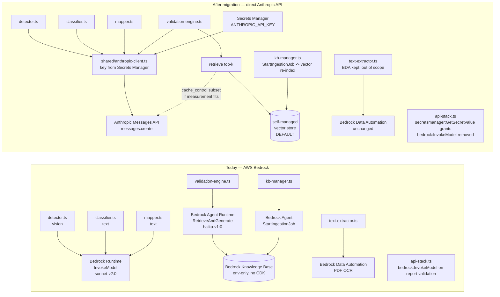
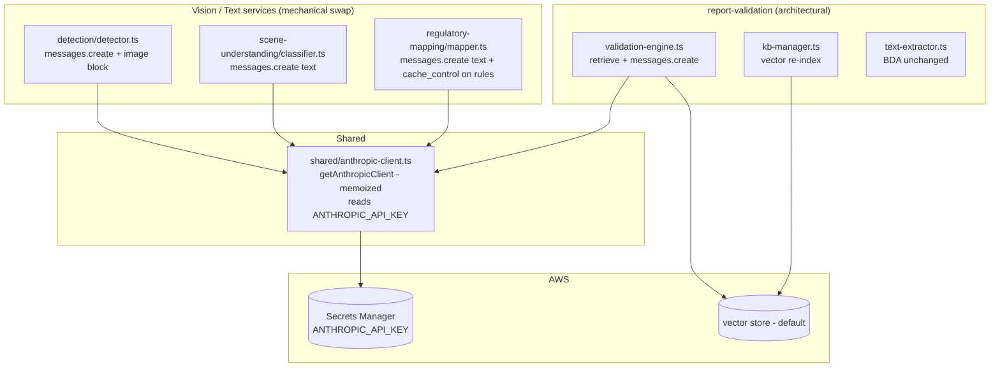

# Design Document

> **⚠️ IMPLEMENTATION DEVIATION (2026-09-04): provider is Ollama Cloud, not Anthropic.**
> This spec was authored against the direct Anthropic Claude API. During
> implementation the platform owner chose **Ollama Cloud** instead (billed by
> plan/Free-tier, not per token). The migration was implemented accordingly:
> - Shared client: `src/shared/ollama-client.ts` (`getOllamaClient()`, memoized,
>   key from `OLLAMA_API_KEY` env or `OLLAMA_API_KEY_SECRET_ARN` via Secrets
>   Manager). Host `https://ollama.com`, Bearer auth.
> - Text services (scene-understanding, regulatory-mapping, report-validation
>   generation) use **`gpt-oss:120b-cloud`**; the vision service (detection)
>   uses **`qwen3.5:cloud`** (gpt-oss is text-only).
> - Transport is `client.chat(...)`; images ride as `images: [base64]`.
> - report-validation RAG: Bedrock `RetrieveAndGenerate` is replaced by an
>   explicit `retrieveTopK` step (`src/services/report-validation/retrieval.ts`,
>   default keyword backend over the WorkSafeBC clause corpus) + one Ollama
>   `chat` generation. The vector-store/prompt-cache decision (Task 4) remains
>   the documented extension point.
> - CDK secret is `${prefix}ollama-api-key`; the `bedrock:InvokeModel` grant is
>   removed; BDA OCR in `text-extractor.ts` is kept, out of scope.
> Every mention of "Anthropic", `@anthropic-ai/sdk`, `messages.create`, or a
> `claude-*` model id below should be read as its Ollama equivalent.


## Overview

This document describes the technical design for migrating **every AI inference touchpoint** in the platform off AWS Bedrock and onto the **direct Anthropic Claude API** (`@anthropic-ai/sdk`, `https://api.anthropic.com/v1/messages`), authenticated with the platform owner's own `ANTHROPIC_API_KEY`. It is the follow-up spec scoped by Requirement 12 of `production-readiness-audit` ("scope now, implement separately"), and it is grounded in the two committed investigation artifacts in this spec directory: `bedrock-inventory.md` (Task 13.1 — the precise `file:line` touchpoint inventory) and `corpus-token-measurement.md` (Task 13.2 — the RAG-replacement sizing analysis).

The design rests on a single organizing insight from the inventory: the migration splits cleanly into **two very different classes of change**.

1. **Mechanical, same-shape transport swaps (low risk).** Three services — `detection/detector.ts` (vision), `scene-understanding/classifier.ts` (text), and `regulatory-mapping/mapper.ts` (text) — already build a request body that is *almost exactly* the Anthropic Messages API shape (they even use Anthropic's native image content block). Their Bedrock `InvokeModel` call is replaced by an `@anthropic-ai/sdk` `messages.create` call, dropping one Bedrock-only field and un-prefixing the model id. Every prompt, threshold, parser, and output contract is preserved verbatim.
2. **One genuinely architectural change (higher risk).** `report-validation/validation-engine.ts` uses Bedrock's `RetrieveAndGenerate`, which *bundles retrieval over a Knowledge Base with generation* in one call. The Anthropic Messages API performs **generation only** — there is no drop-in equivalent. This forces a real design decision (self-managed vector store vs. prompt-cached subset), gated on a live operator token measurement.

Around those two classes sit the supporting plumbing: a shared Anthropic SDK client bootstrap, the first non-AWS secret in Secrets Manager, IAM/CDK cleanup, a no-regression accuracy harness, and the pre-emptive re-targeting of the not-yet-started `worksafebc-pdf-compliance-agent` spec.

### Key Design Decisions

1. **Treat vision/text swaps as mechanical and text-preserving.** The only intended change to detection/scene/regulatory is the transport (Bedrock client → Anthropic SDK) and the model-identifier *form* (`anthropic.claude-3-5-sonnet-20241022-v2:0` → `claude-3-5-sonnet-20241022`). Prompts, `max_tokens`, `temperature`, confidence thresholds, category sets, parsers (`parseBedrockResponse`/`filterDetections`, `parseBedrockSceneResponse`/`normalizeClassification`, `parseBedrockRegulatoryResponse`/`normalizeAllMappings`), and output records are **untouched**. This keeps the accuracy-regression surface as small as possible (Requirement 1).
2. **Default the RAG replacement to a self-managed vector store, gate the prompt-cache alternative on a real measurement.** Per `corpus-token-measurement.md` §4, the provisional full-corpus size (~2.5M–6M+ tokens, dominated by the BC Building Code) is far beyond Claude's 200K window, so "prompt-cache the whole corpus" is almost certainly infeasible. The design defaults to a lightweight self-managed vector store, and only adopts the prompt-cached-subset alternative if the operator measurement (Requirement 6) confirms the intended subset fits under ~150–180K tokens with headroom **and** the product agrees to narrow retrieval (Requirement 2).
3. **One shared Anthropic client module, reused by every migrated service.** Rather than instantiate `new Anthropic()` five times, a single `shared/anthropic-client.ts` module resolves the key from Secrets Manager (cached across warm invocations) and exposes a memoized client. This is the only place the key is read, which makes the "no key in code/logs, read only from Secrets Manager" invariants (Requirement 3) enforceable in one spot.
4. **The concrete Bedrock infra removal is a single IAM statement.** The inventory (§5A) confirmed there is **no** CDK-provisioned Knowledge Base, data source, S3 Vectors bucket, or BDA project — those resolve to code-level env fallbacks. So the only Bedrock infra to remove is the misplaced `bedrock:InvokeModel` grant on the report-validation Lambda (`api-stack.ts` ~1113-1119). New CDK work is additive: a Secrets Manager secret + `secretsmanager:GetSecretValue` grants + env injection. `cdk diff` must confirm nothing else Bedrock-related is removed.
5. **Preserve `model_version` from the Anthropic response.** Every finding today records `model_version` from `responseBody.model ?? <config>.modelId`. Post-migration this is sourced identically from `msg.model ?? <anthropic config id>`, keeping the field's presence and semantics on detection, scene, and regulatory records (Requirement 4.4).
6. **No silent accuracy regression.** A before/after comparison harness runs each service against a fixed sample set on both the Bedrock and Anthropic paths and compares structured outputs; a material divergence beyond an agreed tolerance is a blocking defect (Requirement 4).
7. **Keep BDA out of the Claude-migration scope (documented, not silent).** `text-extractor.ts`'s BDA OCR is a document-processing service, not a Claude inference call, and has no Anthropic equivalent. The design *records* the decision to keep it as-is (Requirement 2.6 option a), rather than assuming it's removed.
8. **Re-target `worksafebc-pdf-compliance-agent` at the design stage.** It is 0/56, unstarted, and explicitly designed on Bedrock KB/`RetrieveAndGenerate`/BDA. Its `design.md` is updated to mirror the chosen RAG approach *before* any implementation task begins (Requirement 5).

---

## Architecture

### Before / After Diagram

This extends the parent spec's §Requirement 12 flowchart to cover all five touchpoints (the parent showed only detection/classifier/validation), the newly-discovered `regulatory-mapping` touchpoint, the BDA OCR decision, and the secrets plumbing.



The dashed edge on the "After" side captures the Requirement 6 decision gate: the **solid** path (retrieve top-k from the vector store, then one `messages.create`) is the default; the **dashed** path (prompt-cached subset injected directly, no vector store) is only taken if the operator token measurement confirms the subset fits.

### Component View



---

## Components and Interfaces

The migration touches the following components. Each is listed as **component → responsibility → interface/signature**, with an emphasis on which exported interfaces are preserved (so callers are unaffected) versus which internals change.

- **`shared/anthropic-client.ts`** → single Anthropic client bootstrap; the one place the API key is read and the one place an `Anthropic` client is constructed → `getAnthropicClient(): Promise<Anthropic>` (memoized across warm invocations; resolves the key from the `ANTHROPIC_API_KEY` env var, or from `ANTHROPIC_API_KEY_SECRET_ARN` via Secrets Manager when only the ARN is set).
- **`detection/detector.ts` — `invokeBedrockDetection(...)`** → performs the vision inference call; internal transport swapped from Bedrock `InvokeModel` to Anthropic `messages.create` → the **exported function signature is unchanged**, so callers are unaffected; `parseBedrockResponse` / `filterDetections` remain unchanged.
- **`scene-understanding/classifier.ts`** → text scene classification; same treatment — internal transport swap to `messages.create`, **existing exported interface preserved**; the no-object short-circuit and `parseBedrockSceneResponse` / `normalizeClassification` remain unchanged.
- **`regulatory-mapping/mapper.ts`** → text regulatory mapping; same treatment — internal transport swap to `messages.create`, **existing exported interface preserved**; `buildRegulatoryMappingPrompt` / `parseBedrockRegulatoryResponse` / `normalizeAllMappings` remain unchanged.
- **`report-validation/validation-engine.ts`** → report compliance validation; introduces a new internal `retrieveTopK(query, { k })` for retrieval plus a single generation `messages.create` (replacing Bedrock `RetrieveAndGenerate`) → the **exported validate interface is preserved**; `parseValidationResponse` / `calculateComplianceScore` remain unchanged.
- **`report-validation/kb-manager.ts`** → corpus ingestion/sync; under the vector-store default, `triggerKBSync()` changes from Bedrock `StartIngestionJob` to an embed/re-index operation against the vector store → the S3 presigned-upload flow (`generateKBPresignedUploadUrl`) and the DynamoDB metadata interface are **retained**.
- **`report-validation/text-extractor.ts`** → PDF/`.docx` text extraction via BDA OCR → **unchanged BDA interface** (explicitly out of scope for the Claude migration).
- **Model-config objects** → carry the per-service model parameters → `ANTHROPIC_MODEL_CONFIG` / `SCENE_ANTHROPIC_MODEL_CONFIG` / `REGULATORY_ANTHROPIC_MODEL_CONFIG` / `VALIDATION_ANTHROPIC_MODEL_CONFIG`, each with fields `modelId` (un-prefixed, e.g. `claude-3-5-sonnet-20241022`), `maxTokens`, `temperature`.
- **CDK (`infra/lib/api-stack.ts`)** → provisions and grants access to the API-key secret → a new `secretsmanager.Secret` construct plus `secret.grantRead(fn)` applied to the detection, scene-understanding, regulatory-mapping, and report-validation Lambdas.

---

## Data Models

The migration is deliberately data-model-preserving. The only data-shape-adjacent change is the *source* of the `model_version` field; the persisted domain models are otherwise untouched.

- **`model_version` field (detection / scene / regulatory records)** → shape unchanged; the value's new source is `msg.model ?? <config>.modelId` (previously `responseBody.model ?? <config>.modelId`). The field remains a populated string with identical semantics.
- **Anthropic `messages.create` request/response shapes** → the request body is `{ model, max_tokens, temperature, system, messages }`, where `messages` carry content blocks (a `{ type: 'text', text }` block; and, for detection only, the native image block `{ type: 'image', source: { type: 'base64', media_type, data } }`). The response is `{ model, content: Array<{ type: 'text', text }> }`, from which the text block is extracted to feed the existing parsers.
- **Self-managed vector-store record (default RAG approach)** → each stored chunk is `{ chunk_id, category, source_document_id, embedding: number[], source_text }`, where `category` is one of `worksafebc` | `bc-building-code` | `safety-standards` | `canada-general`. The existing `kb-context-documents` DynamoDB metadata and its `sync_status` field are **retained unchanged**.
- **No change to persisted domain models** → the Finding, DetectionRecord, SceneInterpretationRecord, and ValidationResult domain models are **unchanged** beyond the `model_version` field's new source described above. No fields are added, removed, or reshaped.

---

## Per-Touchpoint Migration Design

All three vision/text services follow the same recipe (`bedrock-inventory.md` §§1–3, §8 table rows 1–3):

- Replace `new BedrockRuntimeClient({})` + `new InvokeModelCommand({...})` + `bedrockClient.send(command)` with `getAnthropicClient()` + `client.messages.create({...})`.
- **Drop** `anthropic_version: 'bedrock-2023-05-31'` (the Anthropic SDK sets its own `anthropic-version` header).
- Use the **un-prefixed** model id `claude-3-5-sonnet-20241022` in place of `anthropic.claude-3-5-sonnet-20241022-v2:0`.
- Map `system`, `max_tokens`, `temperature` **1:1** from the existing `*_BEDROCK_MODEL_CONFIG`.
- Read the response text from `msg.content` (find the `{ type: 'text' }` block → `.text`) instead of `JSON.parse(new TextDecoder().decode(response.body))` then `.content.find(...)`.
- Source `model_version` from `msg.model ?? <config>.modelId`.
- Keep every prompt builder and parser **unchanged**.

### 1. detection/detector.ts — vision (image + prompt)

The Bedrock request already uses Anthropic's native image content block, so the content array is reused **verbatim**. This is the concrete before→after for the vision call (`invokeBedrockDetection`, `detector.ts:~235-297`):

**Before (Bedrock):**

```ts
import { BedrockRuntimeClient, InvokeModelCommand } from '@aws-sdk/client-bedrock-runtime';
const bedrockClient = new BedrockRuntimeClient({});

const requestBody = {
  anthropic_version: 'bedrock-2023-05-31',              // Bedrock-only
  max_tokens: BEDROCK_MODEL_CONFIG.maxTokens,
  temperature: BEDROCK_MODEL_CONFIG.temperature,
  system: systemPrompt,
  messages: [
    {
      role: 'user',
      content: [
        { type: 'image', source: { type: 'base64', media_type: mediaType, data: imageBase64 } },
        { type: 'text', text: 'Analyze this construction site image and detect all safety-relevant objects. Return the results as structured JSON.' },
      ],
    },
  ],
};

const command = new InvokeModelCommand({
  modelId: BEDROCK_MODEL_CONFIG.modelId,               // anthropic.claude-3-5-sonnet-20241022-v2:0
  contentType: 'application/json',
  accept: 'application/json',
  body: JSON.stringify(requestBody),
});
const response = await bedrockClient.send(command);
const responseBody = JSON.parse(new TextDecoder().decode(response.body));
const textContent = responseBody.content?.find((b: { type: string }) => b.type === 'text');
if (!textContent?.text) throw new Error('No text content in Bedrock response');
const parsed = parseBedrockResponse(textContent.text);
const detections = filterDetections(parsed.detections);
const modelVersion = responseBody.model ?? BEDROCK_MODEL_CONFIG.modelId;
```

**After (direct Anthropic):**

```ts
import { getAnthropicClient } from '../../shared/anthropic-client.js';

const client = await getAnthropicClient();

const msg = await client.messages.create({
  model: ANTHROPIC_MODEL_CONFIG.modelId,               // 'claude-3-5-sonnet-20241022'  (no anthropic_version)
  max_tokens: ANTHROPIC_MODEL_CONFIG.maxTokens,        // 4096, unchanged
  temperature: ANTHROPIC_MODEL_CONFIG.temperature,     // 0.1, unchanged
  system: systemPrompt,                                // buildDetectionPrompt() unchanged
  messages: [
    {
      role: 'user',
      content: [
        // native Anthropic image block — reused verbatim
        { type: 'image', source: { type: 'base64', media_type: mediaType, data: imageBase64 } },
        { type: 'text', text: 'Analyze this construction site image and detect all safety-relevant objects. Return the results as structured JSON.' },
      ],
    },
  ],
});

const textBlock = msg.content.find((b) => b.type === 'text');
if (!textBlock || textBlock.type !== 'text') throw new Error('No text content in Anthropic response');
const parsed = parseBedrockResponse(textBlock.text);   // parser unchanged
const detections = filterDetections(parsed.detections); // filter unchanged
const modelVersion = msg.model ?? ANTHROPIC_MODEL_CONFIG.modelId;   // Requirement 4.4
```

> Notes: `media_type` values remain the same (`image/jpeg`, `image/png`), the S3 fetch + resize (`fetchImageFromS3`, `calculateResizeDimensions`, `MAX_IMAGE_DIMENSION`) are untouched, and the config object is renamed in spirit only (`BEDROCK_MODEL_CONFIG` → an `ANTHROPIC_MODEL_CONFIG` with `modelId: 'claude-3-5-sonnet-20241022'`; the numeric fields carry over). The `msg.content[i].type === 'text'` narrowing keeps the SDK's discriminated-union type checking happy.

### 2. scene-understanding/classifier.ts — text-only

Text-only, no image. The **no-object short-circuit** (skip the model call entirely when no construction-relevant objects are present, `classifier.ts:~405`) is preserved exactly — the migration only changes the call *inside* the branch that actually invokes the model. Concrete before→after for the one text call:

**Before (Bedrock):**

```ts
const requestBody = {
  anthropic_version: 'bedrock-2023-05-31',
  max_tokens: SCENE_BEDROCK_MODEL_CONFIG.maxTokens,
  temperature: SCENE_BEDROCK_MODEL_CONFIG.temperature,
  system: systemPrompt,                                // buildSceneClassificationPrompt()
  messages: [{ role: 'user', content: [{ type: 'text', text: userMessage }] }],
};
const command = new InvokeModelCommand({ modelId: SCENE_BEDROCK_MODEL_CONFIG.modelId, contentType: 'application/json', accept: 'application/json', body: JSON.stringify(requestBody) });
const bedrockResponse = await bedrockClient.send(command);
const responseBody = JSON.parse(new TextDecoder().decode(bedrockResponse.body));
const textContent = responseBody.content?.find((b: { type: string }) => b.type === 'text');
if (!textContent?.text) throw new Error('No text content in Bedrock response');
const parsed = parseBedrockSceneResponse(textContent.text);
const modelVersion = responseBody.model ?? SCENE_BEDROCK_MODEL_CONFIG.modelId;
```

**After (direct Anthropic):**

```ts
const client = await getAnthropicClient();
const msg = await client.messages.create({
  model: SCENE_ANTHROPIC_MODEL_CONFIG.modelId,         // 'claude-3-5-sonnet-20241022'
  max_tokens: SCENE_ANTHROPIC_MODEL_CONFIG.maxTokens,
  temperature: SCENE_ANTHROPIC_MODEL_CONFIG.temperature,
  system: systemPrompt,                                // unchanged
  messages: [{ role: 'user', content: userMessage }],  // plain string content for text-only
});
const textBlock = msg.content.find((b) => b.type === 'text');
if (!textBlock || textBlock.type !== 'text') throw new Error('No text content in Anthropic response');
const parsed = parseBedrockSceneResponse(textBlock.text);          // unchanged
const modelVersion = msg.model ?? SCENE_ANTHROPIC_MODEL_CONFIG.modelId;
```

> `normalizeClassification` (0.5 confidence threshold, construction-object rules) is unchanged. For text-only calls the `content` may be a plain string (as above) or a single `{ type: 'text' }` block — both are equivalent; a plain string is preferred for clarity.

### 3. regulatory-mapping/mapper.ts — text-only (+ optional prompt cache)

Same recipe as scene (`invokeBedrockMapping`, `mapper.ts:~384-439`): drop `anthropic_version`, un-prefix the model id (`REGULATORY_BEDROCK_MODEL_CONFIG` → `REGULATORY_ANTHROPIC_MODEL_CONFIG`, `claude-3-5-sonnet-20241022`), keep `buildRegulatoryMappingPrompt(sceneType)`, `parseBedrockRegulatoryResponse`, and `normalizeAllMappings` unchanged, and source `model_version` from `msg.model`. The failure-record fallback at `mapper.ts:~652` (`model_version: REGULATORY_*_CONFIG.modelId`) uses the new Anthropic id.

**Optional prompt caching (Requirement 1.7):** the WorkSafeBC static rule summaries assembled from `worksafe-bc-rules.ts` (`buildRegulatoryContext`) are a good candidate for `cache_control`. Because `system` may be either a string or an array of content blocks, the static block can carry `cache_control`:

```ts
system: [
  { type: 'text', text: STATIC_WORKSAFE_BC_CONTEXT, cache_control: { type: 'ephemeral' } }, // large, stable
  { type: 'text', text: dynamicSceneInstructions },                                          // small, per-request
],
```

This is a **transport-only optimization**: it MUST NOT change the assembled prompt content or the service's output. It is optional and independent of the large-corpus RAG decision below.

---

## report-validation RAG Replacement Design

`validation-engine.ts` today issues one `RetrieveAndGenerateCommand` (`validation-engine.ts:128-141`) that bundles retrieval over the **whole** Knowledge Base with generation using the hardcoded ARN `arn:aws:bedrock:us-west-2::foundation-model/anthropic.claude-3-5-haiku-20241022-v1:0`. The Anthropic Messages API does not retrieve, so retrieval must be reimplemented (Requirement 2.1).

### Default: self-managed vector store

Per `corpus-token-measurement.md` §4.2, the default RAG replacement is a lightweight self-managed vector store:

1. **Ingest once:** embed each corpus document's chunks (the same PDF/`.docx` corpus uploaded via `kb-manager.ts`) and store the vectors + source text in the vector store, keyed by category prefix (`worksafebc/`, `bc-building-code/`, `safety-standards/`, `canada-general/`).
2. **Per validation:** embed the report/query, retrieve **top-k** relevant clauses across the corpus, and inject those clauses into a single `messages.create` call.
3. **Generate:** one Anthropic call with `claude-3-5-haiku-20241022` (un-prefixed, region-agnostic — the `us-west-2` pin in the ARN disappears).

**Before (Bedrock RetrieveAndGenerate):**

```ts
const command = new RetrieveAndGenerateCommand({
  input: { text: prompt },                                       // buildComplianceAnalysisPrompt(extractedText)
  retrieveAndGenerateConfiguration: {
    type: 'KNOWLEDGE_BASE',
    knowledgeBaseConfiguration: {
      knowledgeBaseId: KNOWLEDGE_BASE_ID,
      modelArn: 'arn:aws:bedrock:us-west-2::foundation-model/anthropic.claude-3-5-haiku-20241022-v1:0',
    },
  },
});
const response = await bedrockAgentClient.send(command);
if (!response.output?.text) throw new Error('No text content in RetrieveAndGenerate response');
return response.output.text;   // -> parseValidationResponse(...) + calculateComplianceScore(...)
```

**After (retrieve + generate):**

```ts
const client = await getAnthropicClient();
const clauses = await retrieveTopK(prompt, { k: TOP_K });          // NEW: self-managed vector store
const msg = await client.messages.create({
  model: VALIDATION_ANTHROPIC_MODEL_CONFIG.modelId,               // 'claude-3-5-haiku-20241022'
  max_tokens: VALIDATION_ANTHROPIC_MODEL_CONFIG.maxTokens,
  temperature: VALIDATION_ANTHROPIC_MODEL_CONFIG.temperature,
  system: buildRetrievalSystemPrompt(clauses),                    // top-k clauses injected as context
  messages: [{ role: 'user', content: prompt }],                  // buildComplianceAnalysisPrompt(extractedText) unchanged
});
const textBlock = msg.content.find((b) => b.type === 'text');
if (!textBlock || textBlock.type !== 'text') throw new Error('No text content in Anthropic response');
return textBlock.text;   // -> parseValidationResponse(...) + calculateComplianceScore(...) UNCHANGED
```

`parseValidationResponse` and `calculateComplianceScore` operate on the returned text **unchanged** (Requirement 2.4) — finding structure, summary, and the deterministic compliance score are unaffected.

### Alternative (gated): prompt-cached subset

If the operator token measurement (Requirement 6) confirms the subset actually needed per validation (most likely the WorkSafeBC OHSR portion) fits comfortably under ~150–180K tokens *together with* the report text, prompt, and output headroom **and** the product agrees to narrow retrieval from "whole KB" to that subset, the design instead loads that static subset with `cache_control: { type: 'ephemeral' }` and drops the vector store entirely:

```ts
system: [
  { type: 'text', text: STATIC_OHSR_SUBSET, cache_control: { type: 'ephemeral' } },
  { type: 'text', text: 'You are a WorkSafeBC compliance validator. Use only the regulation text above.' },
],
```

This alternative is architecturally simpler (no vector-store infrastructure) but requires **both** the measurement to pass the §4.2 threshold and a product decision to scope retrieval down.

### kb-manager.ts fate (Requirement 2.5)

- **Under the vector-store default:** replace the Bedrock `StartIngestionJobCommand` in `triggerKBSync()` with an **embedding/re-index job** against the vector store. The S3 presigned-upload flow (`generateKBPresignedUploadUrl`) and the DynamoDB `kb-context-documents` metadata/`sync_status` handling are **retained** — only the "sync into Bedrock KB" step is swapped for "embed + upsert into the vector store."
- **Under the prompt-cached-subset alternative:** the module is **removed** (the KB disappears; the static subset is bundled from a curated source instead).

### text-extractor.ts / BDA decision (Requirement 2.6)

**Decision: keep BDA as an out-of-scope document-processing dependency (option a).** BDA (`InvokeDataAutomationAsync` / `GetDataAutomationStatusCommand`, `text-extractor.ts:173,261`) is a PDF-OCR service, not a Claude inference call, and has no Anthropic equivalent. It is left unchanged so the migration stays scoped to actual Claude calls. This is a **recorded, explicit** decision (not a silent assumption). A future option (b) — routing scanned pages through Claude vision — is noted as out of scope for this spec. The `.docx` path (`JSZip` XML parsing) is already Bedrock-free and unaffected.

---

## Anthropic SDK Client Bootstrap

A single shared module — `packages/backend/src/shared/anthropic-client.ts` — is the **only** place the API key is read and the **only** place an `Anthropic` client is constructed. Every migrated service imports `getAnthropicClient()`.

```ts
// packages/backend/src/shared/anthropic-client.ts
import Anthropic from '@anthropic-ai/sdk';
import { SecretsManagerClient, GetSecretValueCommand } from '@aws-sdk/client-secrets-manager';

let cachedClient: Anthropic | undefined;   // memoized across warm Lambda invocations

export async function getAnthropicClient(): Promise<Anthropic> {
  if (cachedClient) return cachedClient;
  const apiKey = await resolveApiKey();
  cachedClient = new Anthropic({ apiKey });
  return cachedClient;
}

async function resolveApiKey(): Promise<string> {
  // Option A (preferred): CDK resolves the secret into the Lambda env at deploy time.
  if (process.env.ANTHROPIC_API_KEY) return process.env.ANTHROPIC_API_KEY;
  // Option B: read at runtime from Secrets Manager by ARN/name.
  const secretId = process.env.ANTHROPIC_API_KEY_SECRET_ARN;
  if (!secretId) throw new Error('ANTHROPIC_API_KEY not configured');
  const sm = new SecretsManagerClient({});
  const out = await sm.send(new GetSecretValueCommand({ SecretId: secretId }));
  if (!out.SecretString) throw new Error('ANTHROPIC_API_KEY secret has no value');
  return out.SecretString;
}
```

Design rules for this module:

- The key value is **never logged** and never included in error messages (errors reference the secret by ARN/name only).
- The client is memoized per warm container to avoid re-reading the secret on every invocation.
- Both injection strategies from Requirement 3.2 are supported: **(A)** CDK resolves the secret into `ANTHROPIC_API_KEY` at deploy time (extending `sharedEnv`), or **(B)** each Lambda reads it from Secrets Manager at runtime via `ANTHROPIC_API_KEY_SECRET_ARN`. The CDK section below provisions the grants that make either viable.

---

## CDK Changes

All CDK changes are in `packages/backend/infra/lib/api-stack.ts`. This is the **first non-AWS secret** in the codebase (the README's "Variables de Entorno" table is otherwise all AWS-native), so it introduces the first `aws-cdk-lib/aws-secretsmanager` usage here.

### 1. New Secrets Manager secret

```ts
import * as secretsmanager from 'aws-cdk-lib/aws-secretsmanager';

// The secret VALUE is set out-of-band (console/CLI), never in code or committed.
const anthropicApiKey = new secretsmanager.Secret(this, 'AnthropicApiKey', {
  secretName: `${prefix}anthropic-api-key`,
  description: 'Anthropic Claude API key for direct Messages API access',
});
```

### 2. Grants to the four migrated Lambdas

`secretsmanager:GetSecretValue` (via `secret.grantRead(fn)`) is granted to each Lambda that performs a migrated Anthropic call (Requirement 3.1):

```ts
for (const fn of [
  this.detectionLayerFn,      // detection/detector.ts (vision)
  this.sceneUnderstandingFn,  // scene-understanding/classifier.ts (text)
  this.regulatoryMappingFn,   // regulatory-mapping/mapper.ts (text)
  this.reportValidationFn,    // report-validation/validation-engine.ts (RAG)
]) {
  anthropicApiKey.grantRead(fn);
}
```

> Note: today `detectionLayerFn`, `sceneUnderstandingFn`, and `regulatoryMappingFn` have **no Bedrock grant at all** (inventory §5A) — they receive only `sharedEnv`, DynamoDB, media-bucket read, and SQS grants. Adding the secret grant is purely additive for them.

### 3. Env injection

Following the existing "CDK injects configuration into Lambdas" convention (Requirement 3.2), either extend `sharedEnv` (strategy A) or inject the secret ARN per-Lambda (strategy B):

```ts
// Strategy A — resolve into env at deploy time (extends sharedEnv, api-stack.ts ~112-121):
const sharedEnv: Record<string, string> = {
  /* ...existing AWS-native values... */
  ANTHROPIC_API_KEY: anthropicApiKey.secretValue.unsafePlainText(), // resolved at deploy, not committed
};

// Strategy B — pass the ARN, read at runtime (preferred to avoid materializing the value into env):
// fn.addEnvironment('ANTHROPIC_API_KEY_SECRET_ARN', anthropicApiKey.secretArn);
```

Strategy B is preferred because it keeps the raw key out of the Lambda environment entirely (the value is fetched at runtime by `anthropic-client.ts`), which strengthens the "no key in code/logs" invariant. The choice is recorded here; either satisfies Requirement 3.2.

### 4. Remove the misplaced Bedrock grant

Delete the `bedrock:InvokeModel` policy statement on `reportValidationFn` (`api-stack.ts` ~1112-1119). Per the inventory it is attached to the wrong Lambda for the RAG path (which used `RetrieveAndGenerate`, never granted) and is unused by the vision/text services (Requirement 3.3):

```ts
// REMOVE:
// this.reportValidationFn.addToRolePolicy(new PolicyStatement({
//   actions: ['bedrock:InvokeModel'],
//   resources: ['*'],
// }));
```

### 5. `cdk diff` confirmation

Run `cdk diff` and confirm the **only** Bedrock-related infrastructure removed is that single `bedrock:InvokeModel` statement. The inventory (§5A.2) established there is no CDK-provisioned Knowledge Base, data source, S3 Vectors bucket, or BDA project to remove — those resolve to code-level env fallbacks — so `cdk diff` MUST NOT show any KB/S3-Vectors/BDA resource deletions (there are none). If it does, that is an unexpected finding to investigate before proceeding (Requirement 3.4).

### 6. Vector store CDK (only if the default is chosen)

If the self-managed vector store approach (Requirement 2/6) is finalized, provision its resources as **new, additive** infrastructure, distinct from the removed Bedrock grant (Requirement 3.5): the vector store itself (e.g. an RDS/Aurora Postgres with pgvector, or an equivalent managed index), plus the access grants for `reportValidationFn` (and `kb-manager`'s re-index path). The concrete resource choice is deferred to implementation once the RAG approach is locked by the operator measurement; the design records only that these are *added*, not that they replace a removed Bedrock resource.

---

## Error Handling

Error handling is intentionally **behavior-preserving**: each migrated service keeps its existing failure semantics, now triggered by Anthropic SDK errors instead of Bedrock errors.

- **Anthropic API errors (429/rate-limit, 5xx, timeouts)** → each migrated service preserves its EXISTING failure behavior, now raised by the Anthropic SDK rather than the Bedrock client:
  - **detection / scene / regulatory** → write a failure record carrying `model_version` (sourced from `<config>.modelId` on the failure path) plus the error message, and halt the pipeline stage — exactly as they do today for Bedrock errors.
  - **report-validation** → surface a validation failure, matching its current behavior when the generation call fails.
- **Secrets Manager retrieval failure** → `getAnthropicClient()` throws a clear error that references the secret **by ARN/name only**; the key value is never included in the error, and the failure is distinguishable from a missing-configuration error.
- **Invariant — key never leaks** → on any path (success, API error, timeout, or secret-retrieval failure), the `ANTHROPIC_API_KEY` value SHALL NOT appear in logs or error messages. Errors reference the secret by ARN/name only. This mirrors Correctness Property 3.

---

## Testing Strategy

### Before/After accuracy comparison harness (Requirement 4)

A dedicated harness proves the provider swap is a transport change, not an accuracy regression. It is the load-bearing test for the whole migration.

- **Fixed sample sets (Requirement 4.1):**
  - Detection + scene: a fixed set of representative construction-site photos (varied PPE presence, hazards, scene types), committed as test fixtures.
  - report-validation: a fixed set of sample reports (varied compliance postures), committed as fixtures.
- **Dual-path run (Requirement 4.2):** run each service against the fixed set on **both** the pre-migration (Bedrock) and post-migration (Anthropic) paths, capturing the structured outputs: detections + confidences, scene classifications, regulatory mappings (findings + severity), and compliance findings + scores. Because the pre-migration path needs Bedrock access, this comparison is an operator-run step against an environment with both providers available (the Bedrock code is captured as a snapshot/golden output before removal, so the "before" side can be replayed).
- **Divergence rule (Requirement 4.3):** define an agreed tolerance up front; a material divergence — dropped detections, changed classifications, or compliance scores shifted beyond tolerance — is a **blocking defect** to investigate and resolve before the migration is considered complete. It is never accepted silently. Because these models are non-deterministic at `temperature: 0.1`, the tolerance distinguishes expected minor variance from genuine regression (e.g. compare detection *sets* and score *bands*, not exact byte equality).
- **`model_version` preserved (Requirement 4.4):** assert every finding still carries a populated `model_version`, now sourced from `msg.model` (falling back to the configured Anthropic id).

### Unit tests

- **Client bootstrap:** `getAnthropicClient()` memoizes; reads env when present; falls back to Secrets Manager when only the ARN is set; throws a clear (secret-value-free) error when neither is configured; never includes the key value in errors or logs.
- **Per-service request shaping:** for detection/scene/regulatory, unit tests assert the `messages.create` argument built from a fixture omits `anthropic_version`, uses the un-prefixed model id, carries the 1:1 `system`/`max_tokens`/`temperature`, and (detection) reuses the native image block unchanged. The existing parsers are exercised against captured Anthropic-shaped responses to confirm `msg.content[].text` extraction feeds them identically.
- **RAG replacement:** `retrieveTopK` returns k clauses; the generation call injects them; `parseValidationResponse`/`calculateComplianceScore` produce identical structure/scores from the same returned text as before.

### Property-based tests

- **Output-contract invariance:** for a generated space of mocked Anthropic responses (varied `content` block orderings, model ids), the migrated extraction path yields the same parsed structure the Bedrock path did for the equivalent body — i.e. the swap is contract-preserving. **Validates: Requirements 1.5, 2.4, 4.2.**
- **model_version always populated:** for any response with or without a `model` field, the persisted record's `model_version` is a non-empty string (from `msg.model` or the config fallback). **Validates: Requirement 4.4.**

> Any new property beyond the two named above must be added to this design's Correctness Properties section (below) with Product Owner input before implementation.

### Re-targeting verification (Requirement 5)

Confirm `.kiro/specs/worksafebc-pdf-compliance-agent/design.md` no longer references Bedrock KB / `RetrieveAndGenerate` / BDA for Claude inference, mirrors the chosen RAG approach, inherits the BDA decision, and that the update lands before any of its 56 implementation tasks begins.

---

## Correctness Properties

*A property is a characteristic or behavior that should hold true across all valid executions of a system — essentially, a formal statement about what the system should do. Properties serve as the bridge between human-readable specifications and machine-verifiable correctness guarantees.*

### Property 1: Output-contract preservation across the provider swap

*For any* logical request to a migrated service (detection, scene, regulatory, validation), the structured output parsed from the Anthropic response SHALL be contract-equivalent to what the Bedrock path produced for the same request — same fields, same shapes, same downstream parser behavior — with the transport and model-id form being the only intended differences.

**Validates: Requirements 1.5, 1.6, 2.4**

### Property 2: model_version always populated

*For any* Anthropic response (with or without a `model` field), the persisted detection, scene, and regulatory finding record SHALL carry a non-empty `model_version`, sourced from `msg.model` with the configured Anthropic model id as fallback.

**Validates: Requirements 4.4**

### Property 3: No ANTHROPIC_API_KEY in code or logs

*For any* execution path or error condition, the `ANTHROPIC_API_KEY` value SHALL NOT appear in source, committed files, log output, or error messages; errors SHALL reference the secret by ARN/name only.

**Validates: Requirements 3.1**

### Property 4: Secret read only from Secrets Manager

*For any* migrated Lambda invocation, the API key SHALL be obtained solely from AWS Secrets Manager — either resolved into the Lambda environment by CDK at deploy time or fetched at runtime via `secretsmanager:GetSecretValue` — and from no other source (no hardcoding, no committed config).

**Validates: Requirements 3.1, 3.2**

### Property 5: No Bedrock inference calls remain on migrated paths

*For any* migrated path (detection, scene, regulatory, validation), the code SHALL issue no Bedrock `InvokeModel`, `RetrieveAndGenerate`, or `StartIngestionJob` calls; the only Bedrock dependency that MAY remain is the explicitly-scoped-out BDA OCR in `text-extractor.ts`.

**Validates: Requirements 1.1, 1.2, 1.3, 2.1, 2.6**

### Property 6: Only the misplaced Bedrock grant is removed from infrastructure

*For any* `cdk diff` of this migration, exactly one Bedrock IAM statement (`bedrock:InvokeModel` on the report-validation Lambda) SHALL be shown removed, and no Knowledge Base / S3 Vectors / BDA resource deletions SHALL appear (there are none to remove).

**Validates: Requirements 3.3, 3.4**
