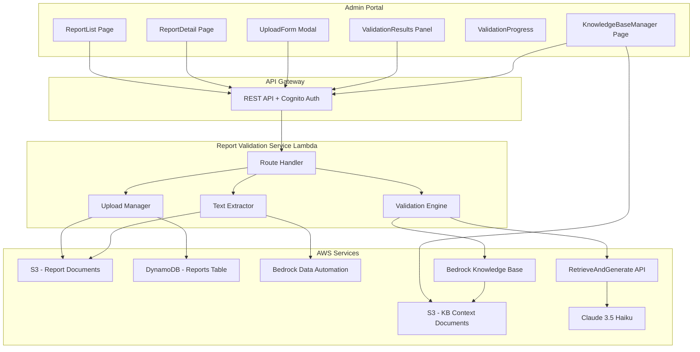
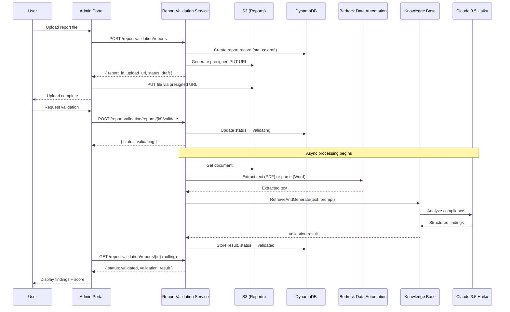

# Technical Design: AI Report Validation

## Overview

This feature adds an AI-powered report validation module to ClearSite that enables users to upload construction reports (Word/PDF), request compliance validation against British Columbia construction laws via a RAG pipeline, receive structured feedback, iterate on improvements, and submit finalized reports.

The system uses AWS Bedrock Knowledge Bases (S3 Vectors) for cost-effective retrieval, Bedrock Data Automation (BDA) for structured text extraction from PDFs, and Claude 3.5 Haiku via RetrieveAndGenerate for compliance analysis. A dedicated Lambda service (`report-validation-service`) handles all backend logic, following the same patterns as existing services (auth middleware, RBAC enforcement, DynamoDB, S3 presigned URLs).

### Key Design Decisions

1. **Dedicated Lambda service** — A new `report-validation-service` Lambda handles all report validation routes, keeping concerns separate from the existing `reporting-service` which handles daily summaries and exports.
2. **Two S3 buckets** — One for user-uploaded report documents (versioned), one for Knowledge Base context documents (regulatory PDFs). Both are tenant-isolated via key prefixes.
3. **Asynchronous validation with polling** — Validation is initiated synchronously (status → "validating"), but processing happens asynchronously. The frontend polls for completion rather than using WebSockets, keeping infrastructure simple and within budget.
4. **BDA for PDFs, direct parsing for Word** — BDA handles PDF extraction (including OCR for scanned documents). Word documents (.docx) are parsed server-side using a lightweight XML parser since BDA is optimized for PDFs.
5. **Compliance score is deterministic** — The score formula (100 minus severity-weighted deductions) is computed server-side from findings, not by the LLM, ensuring reproducibility.
6. **Version history is append-only** — Each document version and its validation result are permanently stored. New versions create new records rather than overwriting.
7. **Presigned URL upload pattern** — Same two-step upload pattern used by certifications: POST metadata → receive presigned URL → PUT file to S3.
8. **Frontend feature module** — All report validation UI lives under `src/features/report-validation/` following the collocated feature pattern established by certifications.

## Architecture



### Validation Flow Sequence



## Components and Interfaces

### Backend: New Service

| File | Responsibility |
|------|----------------|
| `src/services/report-validation/handler.ts` | Route handler for all `/report-validation/*` endpoints |
| `src/services/report-validation/types.ts` | TypeScript types and Zod schemas |
| `src/services/report-validation/upload-manager.ts` | S3 presigned URL generation, file metadata, version management |
| `src/services/report-validation/text-extractor.ts` | BDA invocation for PDFs, XML parsing for .docx |
| `src/services/report-validation/validation-engine.ts` | RAG pipeline orchestration, prompt construction, result parsing |
| `src/services/report-validation/score-calculator.ts` | Deterministic compliance score computation |
| `src/services/report-validation/kb-manager.ts` | Knowledge Base context document CRUD and sync triggers |

### Backend: API Routes

| Method | Path | Auth | Permission | Description |
|--------|------|------|------------|-------------|
| POST | `/report-validation/reports` | Cognito | `reports:upload` | Create report + get presigned upload URL |
| GET | `/report-validation/reports` | Cognito | `reports:read` | List reports (paginated, filtered) |
| GET | `/report-validation/reports/{id}` | Cognito | `reports:read` | Get report detail with latest validation |
| POST | `/report-validation/reports/{id}/validate` | Cognito | `reports:upload` | Initiate AI validation |
| POST | `/report-validation/reports/{id}/versions` | Cognito | `reports:upload` | Upload new version of validated report |
| POST | `/report-validation/reports/{id}/submit` | Cognito | `reports:upload` | Submit report |
| GET | `/report-validation/reports/{id}/history` | Cognito | `reports:read` | Get version + validation history |
| POST | `/report-validation/kb/documents` | Cognito | `kb:manage` | Upload KB context document |
| GET | `/report-validation/kb/documents` | Cognito | `kb:manage` | List KB context documents |
| DELETE | `/report-validation/kb/documents/{id}` | Cognito | `kb:manage` | Delete KB context document |

### Backend: New RBAC Permissions

```typescript
// Added to Permission type in src/shared/rbac.ts
| 'reports:upload'      // Upload reports and request validation
| 'kb:manage'           // Manage Knowledge Base context documents

// Permission assignments:
// reports:upload → tenant_admin, site_admin, supervisor, cso
// kb:manage → tenant_admin (only)
```

### Frontend: New Feature Module

| Component | Path | Responsibility |
|-----------|------|----------------|
| `ReportListPage` | `src/features/report-validation/ReportListPage.tsx` | Paginated report list with filters and status badges |
| `ReportDetailPage` | `src/features/report-validation/ReportDetailPage.tsx` | Report detail view with actions based on status |
| `ReportUploadForm` | `src/features/report-validation/ReportUploadForm.tsx` | Modal form for initial upload and new versions |
| `ValidationResultsPanel` | `src/features/report-validation/ValidationResultsPanel.tsx` | Displays findings grouped by severity with score |
| `ValidationProgress` | `src/features/report-validation/ValidationProgress.tsx` | Animated step-progress indicator during validation |
| `ComplianceScoreBadge` | `src/features/report-validation/ComplianceScoreBadge.tsx` | Color-coded score display (green/yellow/red) |
| `FindingCard` | `src/features/report-validation/FindingCard.tsx` | Individual finding with expandable details |
| `VersionHistoryPanel` | `src/features/report-validation/VersionHistoryPanel.tsx` | Reverse-chronological version list |
| `DisclaimerModal` | `src/features/report-validation/DisclaimerModal.tsx` | AI disclaimer acknowledgment modal |
| `SubmitConfirmDialog` | `src/features/report-validation/SubmitConfirmDialog.tsx` | Confirmation for unvalidated submission |
| `KnowledgeBaseManager` | `src/features/report-validation/KnowledgeBaseManager.tsx` | KB context document upload/list/delete UI |

### Frontend: Hooks

| Hook | Responsibility |
|------|----------------|
| `useReports` | Fetches paginated report list with filters |
| `useReport` | Fetches single report detail |
| `useCreateReport` | POST report metadata + triggers S3 upload |
| `useValidateReport` | POST validation request + starts polling |
| `useSubmitReport` | POST report submission |
| `useUploadVersion` | POST new version + triggers S3 upload |
| `useReportHistory` | GET version/validation history |
| `useValidationPolling` | Polls report status while "validating" |
| `useKBDocuments` | CRUD for Knowledge Base context documents |
| `useDisclaimerAck` | Session-level disclaimer acknowledgment state |

### Interface: Validation Engine

```typescript
interface ValidationEngineInput {
  report_id: string;
  version: number;
  extracted_text: string;
  tenant_id: string;
}

interface ValidationEngineOutput {
  findings: ComplianceFinding[];
  summary: string;
  score: number;
  completed_at: string;
}
```

### Interface: Text Extractor

```typescript
interface TextExtractionResult {
  text: string;
  page_count: number;
  extraction_method: 'bda' | 'docx_parser';
  character_count: number;
}
```

## Data Models

### DynamoDB: Reports Table

**Table Name:** `{env}-reports`
**Partition Key:** `tenant_id` (String)
**Sort Key:** `report_id` (String)
**GSI-1:** `owner_id-index` — PK: `owner_id`, SK: `created_at`
**GSI-2:** `status-index` — PK: `tenant_id#status`, SK: `created_at`

```typescript
interface ReportRecord {
  // Keys
  tenant_id: string;
  report_id: string;              // ULID

  // Core fields
  owner_id: string;               // Cognito sub
  title: string;                  // Derived from filename (max 255 chars)
  status: ReportStatus;           // draft | validating | validated | submitted
  current_version: number;        // Starts at 1

  // Submission
  submitted_at?: string;          // ISO 8601 UTC
  submitted_by?: string;

  // Metadata
  created_at: string;             // ISO 8601 UTC
  updated_at: string;             // ISO 8601 UTC

  // Status transition log (last 20 transitions stored inline)
  status_history: StatusTransition[];
}

interface StatusTransition {
  from_status: ReportStatus;
  to_status: ReportStatus;
  triggered_by: string;           // user_id
  timestamp: string;              // ISO 8601 UTC
}

type ReportStatus = 'draft' | 'validating' | 'validated' | 'submitted';
```

### DynamoDB: Report Versions Table

**Table Name:** `{env}-report-versions`
**Partition Key:** `report_id` (String)
**Sort Key:** `version` (Number)

```typescript
interface ReportVersionRecord {
  // Keys
  report_id: string;
  version: number;

  // Document info
  file_name: string;              // Original filename (max 255 chars)
  file_size: number;              // Bytes
  mime_type: string;              // application/pdf | application/vnd.openxmlformats-officedocument.wordprocessingml.document | application/msword
  page_count?: number;            // For PDFs
  s3_key: string;                 // S3 object key

  // Extraction
  extracted_text_key?: string;    // S3 key for stored extracted text
  extraction_status: 'pending' | 'completed' | 'failed';
  character_count?: number;

  // Metadata
  uploaded_by: string;
  uploaded_at: string;            // ISO 8601 UTC
}
```

### DynamoDB: Validation Results Table

**Table Name:** `{env}-validation-results`
**Partition Key:** `report_id` (String)
**Sort Key:** `version` (Number)

```typescript
interface ValidationResultRecord {
  // Keys
  report_id: string;
  version: number;

  // Result
  validation_id: string;          // ULID
  status: 'processing' | 'completed' | 'failed' | 'timed_out';
  score?: number;                 // 0-100
  summary?: string;               // Max 2000 chars
  findings: ComplianceFinding[];  // Max 50

  // Timing
  requested_at: string;           // ISO 8601 UTC
  completed_at?: string;          // ISO 8601 UTC
  requested_by: string;

  // Error info (if failed)
  error_message?: string;
}

interface ComplianceFinding {
  finding_id: string;             // ULID
  severity: 'critical' | 'major' | 'minor' | 'informational';
  description: string;            // Max 500 chars
  report_section: string;         // Section heading or page number
  suggested_correction: string;   // Max 500 chars
  regulation_references: RegulationReference[];
}

interface RegulationReference {
  title: string;                  // e.g., "WorkSafeBC OHS Regulation Part 11.2"
  section: string;                // e.g., "11.2(1)(a)"
  url?: string;                   // Link to regulation text
}
```

### DynamoDB: KB Context Documents Table

**Table Name:** `{env}-kb-context-documents`
**Partition Key:** `tenant_id` (String)
**Sort Key:** `document_id` (String)

```typescript
interface KBContextDocumentRecord {
  // Keys
  tenant_id: string;
  document_id: string;            // ULID

  // Document info
  file_name: string;              // Max 255 chars
  file_size: number;              // Bytes
  mime_type: string;
  category: KBDocumentCategory;
  s3_key: string;

  // Sync status
  sync_status: 'pending' | 'indexed' | 'error';
  sync_error?: string;

  // Metadata
  uploaded_by: string;
  uploaded_at: string;            // ISO 8601 UTC
}

type KBDocumentCategory =
  | 'worksafebc'
  | 'bc-building-code'
  | 'safety-standards'
  | 'canada-general';
```

### S3 Bucket Structure

```
# Report Documents Bucket: {env}-report-documents
{tenant_id}/{report_id}/v{version}/{filename}
{tenant_id}/{report_id}/v{version}/extracted-text.txt

# KB Context Documents Bucket: {env}-kb-context-documents
worksafebc/{document_id}/{filename}
bc-building-code/{document_id}/{filename}
safety-standards/{document_id}/{filename}
canada-general/{document_id}/{filename}
```

### Compliance Score Calculation

```typescript
function calculateComplianceScore(findings: ComplianceFinding[]): number {
  const deductions: Record<ComplianceFinding['severity'], number> = {
    critical: 15,
    major: 8,
    minor: 3,
    informational: 0,
  };

  const totalDeduction = findings.reduce(
    (sum, finding) => sum + deductions[finding.severity],
    0
  );

  return Math.max(0, 100 - totalDeduction);
}
```

### Frontend Types

```typescript
// src/features/report-validation/types.ts

export type ReportStatus = 'draft' | 'validating' | 'validated' | 'submitted';
export type FindingSeverity = 'critical' | 'major' | 'minor' | 'informational';
export type KBDocumentCategory = 'worksafebc' | 'bc-building-code' | 'safety-standards' | 'canada-general';
export type KBSyncStatus = 'pending' | 'indexed' | 'error';

export interface Report {
  report_id: string;
  tenant_id: string;
  owner_id: string;
  title: string;
  status: ReportStatus;
  current_version: number;
  created_at: string;
  updated_at: string;
  submitted_at?: string;
  latest_score?: number;
  latest_validation_date?: string;
}

export interface ReportVersion {
  report_id: string;
  version: number;
  file_name: string;
  file_size: number;
  mime_type: string;
  page_count?: number;
  uploaded_at: string;
}

export interface ValidationResult {
  validation_id: string;
  report_id: string;
  version: number;
  status: 'processing' | 'completed' | 'failed' | 'timed_out';
  score?: number;
  summary?: string;
  findings: ComplianceFinding[];
  requested_at: string;
  completed_at?: string;
}

export interface ComplianceFinding {
  finding_id: string;
  severity: FindingSeverity;
  description: string;
  report_section: string;
  suggested_correction: string;
  regulation_references: RegulationReference[];
}

export interface RegulationReference {
  title: string;
  section: string;
  url?: string;
}

export interface KBContextDocument {
  document_id: string;
  file_name: string;
  file_size: number;
  category: KBDocumentCategory;
  sync_status: KBSyncStatus;
  uploaded_at: string;
}
```

### Zod Validation Schemas (Frontend)

```typescript
// src/features/report-validation/schemas.ts
import { z } from 'zod';

export const ALLOWED_REPORT_MIME_TYPES = [
  'application/pdf',
  'application/vnd.openxmlformats-officedocument.wordprocessingml.document',
  'application/msword',
] as const;

export const MIN_FILE_SIZE = 1024;           // 1 KB
export const MAX_FILE_SIZE = 25 * 1024 * 1024; // 25 MB

export const reportUploadSchema = z.object({
  document: z
    .instanceof(File)
    .refine(
      (f) => ALLOWED_REPORT_MIME_TYPES.includes(f.type as any),
      { message: 'File must be PDF, .docx, or .doc format' }
    )
    .refine(
      (f) => f.size >= MIN_FILE_SIZE,
      { message: 'File must be at least 1 KB' }
    )
    .refine(
      (f) => f.size <= MAX_FILE_SIZE,
      { message: 'File must not exceed 25 MB' }
    ),
});

export const kbDocumentUploadSchema = z.object({
  document: z
    .instanceof(File)
    .refine(
      (f) => ['application/pdf', 'application/vnd.openxmlformats-officedocument.wordprocessingml.document'].includes(f.type),
      { message: 'File must be PDF or .docx format' }
    )
    .refine(
      (f) => f.size <= 50 * 1024 * 1024,
      { message: 'File must not exceed 50 MB' }
    ),
  category: z.enum(['worksafebc', 'bc-building-code', 'safety-standards', 'canada-general']),
});
```

### Status Transition Validation

```typescript
// src/services/report-validation/types.ts

const VALID_TRANSITIONS: Record<ReportStatus, ReportStatus[]> = {
  draft: ['validating', 'submitted'],
  validating: ['validated', 'draft'],  // draft on failure/timeout
  validated: ['draft', 'submitted'],   // draft on new version upload
  submitted: [],                        // terminal state
};

export function isValidTransition(from: ReportStatus, to: ReportStatus): boolean {
  return VALID_TRANSITIONS[from]?.includes(to) ?? false;
}
```

### Available Actions by Status

```typescript
// src/features/report-validation/utils.ts

export type ReportAction = 'request_validation' | 'upload_version' | 'submit';

export function getAvailableActions(status: ReportStatus): ReportAction[] {
  switch (status) {
    case 'draft':
      return ['request_validation', 'submit'];
    case 'validating':
      return [];
    case 'validated':
      return ['upload_version', 'submit'];
    case 'submitted':
      return [];
  }
}
```

### Score Color Classification

```typescript
export type ScoreColor = 'green' | 'yellow' | 'red';

export function getScoreColor(score: number): ScoreColor {
  if (score >= 80) return 'green';
  if (score >= 50) return 'yellow';
  return 'red';
}
```

### Estimated Validation Time

```typescript
export function getEstimatedTimeSeconds(pageCount: number): number {
  if (pageCount <= 5) return 30;
  if (pageCount <= 20) return 60;
  return 90;
}
```

### Findings Grouping

```typescript
const SEVERITY_ORDER: FindingSeverity[] = ['critical', 'major', 'minor', 'informational'];

export function groupFindingsBySeverity(
  findings: ComplianceFinding[]
): { severity: FindingSeverity; findings: ComplianceFinding[] }[] {
  return SEVERITY_ORDER
    .map((severity) => ({
      severity,
      findings: findings.filter((f) => f.severity === severity),
    }))
    .filter((group) => group.findings.length > 0);
}
```

### Report Visibility Scope

```typescript
export type VisibilityScope = 'own' | 'site' | 'tenant';

export function getReportVisibilityScope(role: Role): VisibilityScope {
  switch (role) {
    case Role.TENANT_ADMIN:
    case Role.CSO:
      return 'tenant';
    case Role.SITE_ADMIN:
    case Role.SUPERVISOR:
      return 'site';
    default:
      return 'own';
  }
}
```

### S3 Key Builder for KB Documents

```typescript
export function buildKBDocumentS3Key(category: KBDocumentCategory, documentId: string, fileName: string): string {
  const prefixMap: Record<KBDocumentCategory, string> = {
    worksafebc: 'worksafebc',
    'bc-building-code': 'bc-building-code',
    'safety-standards': 'safety-standards',
    'canada-general': 'canada-general',
  };
  return `${prefixMap[category]}/${documentId}/${fileName}`;
}
```

## Correctness Properties

*A property is a characteristic or behavior that should hold true across all valid executions of a system — essentially, a formal statement about what the system should do. Properties serve as the bridge between human-readable specifications and machine-verifiable correctness guarantees.*

### Property 1: Report file type validation

*For any* file, the report upload validator SHALL accept it if and only if its MIME type is one of [application/pdf, application/vnd.openxmlformats-officedocument.wordprocessingml.document, application/msword]. All other MIME types SHALL be rejected.

**Validates: Requirements 1.1, 1.5, 9.7**

### Property 2: Report file size validation

*For any* file, the report upload validator SHALL accept it if and only if its size is greater than or equal to 1 KB (1024 bytes) AND less than or equal to 25 MB (26,214,400 bytes). Files outside this range SHALL be rejected.

**Validates: Requirements 1.2**

### Property 3: Status transition validity

*For any* pair of ReportStatus values (from, to), `isValidTransition(from, to)` SHALL return true if and only if the pair is one of: (draft, validating), (draft, submitted), (validating, validated), (validating, draft), (validated, draft), (validated, submitted). All other pairs SHALL return false.

**Validates: Requirements 2.2, 2.3**

### Property 4: Available actions determined by status

*For any* ReportStatus value, `getAvailableActions(status)` SHALL return:
- `['request_validation', 'submit']` for "draft"
- `[]` for "validating"
- `['upload_version', 'submit']` for "validated"
- `[]` for "submitted"

**Validates: Requirements 2.4, 3.1, 6.1, 7.1, 7.3, 8.3**

### Property 5: Minimum text extraction threshold

*For any* string, the text sufficiency check SHALL return true if and only if the string contains 50 or more characters. Strings with fewer than 50 characters SHALL be flagged as insufficient.

**Validates: Requirements 3.7, 9.3**

### Property 6: Compliance score calculation

*For any* array of ComplianceFinding objects, `calculateComplianceScore(findings)` SHALL return a value equal to max(0, 100 - (15 × critical_count + 8 × major_count + 3 × minor_count + 0 × informational_count)), and the result SHALL always be in the range [0, 100].

**Validates: Requirements 4.5, 4.6**

### Property 7: Validation result structure completeness

*For any* valid ComplianceFinding object, it SHALL contain non-empty values for: finding_id, severity (one of critical/major/minor/informational), description (≤500 chars), report_section, suggested_correction (≤500 chars), and at least one RegulationReference.

**Validates: Requirements 4.1, 4.3**

### Property 8: Score color classification

*For any* integer score in [0, 100], `getScoreColor(score)` SHALL return "green" if score ≥ 80, "yellow" if 50 ≤ score < 80, and "red" if score < 50.

**Validates: Requirements 5.1**

### Property 9: Findings grouped by severity order

*For any* array of ComplianceFinding objects, `groupFindingsBySeverity(findings)` SHALL produce groups ordered as [critical, major, minor, informational], each group containing exactly the findings with that severity, and the total count across all groups SHALL equal the input array length.

**Validates: Requirements 5.2, 5.4**

### Property 10: Version numbering is sequential

*For any* report with N versions, the version numbers SHALL form the sequence [1, 2, 3, ..., N] with no gaps and no duplicates.

**Validates: Requirements 6.2**

### Property 11: Version history reverse chronological order

*For any* array of ReportVersion objects, when sorted for display, the result SHALL be ordered by `uploaded_at` descending (most recent first).

**Validates: Requirements 6.5**

### Property 12: Report list filtering by status

*For any* array of Report objects and any status filter value, the filtered result SHALL contain only reports whose status matches the filter, and SHALL contain all such reports from the original array.

**Validates: Requirements 8.2**

### Property 13: Role-based report visibility scope

*For any* user role, `getReportVisibilityScope(role)` SHALL return "tenant" for tenant_admin and cso, "site" for site_admin and supervisor, and "own" for all other roles.

**Validates: Requirements 8.5, 8.6, 11.2**

### Property 14: Estimated validation time by page count

*For any* positive integer page count, `getEstimatedTimeSeconds(pageCount)` SHALL return 30 for pages 1-5, 60 for pages 6-20, and 90 for pages 21 or more.

**Validates: Requirements 10.3**

### Property 15: Upload permission by role

*For any* user role, the `reports:upload` permission SHALL be granted if and only if the role is one of [tenant_admin, site_admin, supervisor, cso]. All other roles (including worker, gate_operator) SHALL NOT have this permission.

**Validates: Requirements 11.1**

### Property 16: Submission restricted to report owner

*For any* pair of (requesting_user_id, report_owner_id), the submission authorization check SHALL return true if and only if requesting_user_id equals report_owner_id.

**Validates: Requirements 11.3**

### Property 17: KB document validation

*For any* file, the KB document upload validator SHALL accept it if and only if its MIME type is one of [application/pdf, application/vnd.openxmlformats-officedocument.wordprocessingml.document] AND its size is less than or equal to 50 MB (52,428,800 bytes).

**Validates: Requirements 13.2**

### Property 18: KB document S3 key prefix by category

*For any* KBDocumentCategory value, document ID, and file name, `buildKBDocumentS3Key(category, id, name)` SHALL produce a key starting with the category prefix ("worksafebc/", "bc-building-code/", "safety-standards/", or "canada-general/") followed by the document ID and file name.

**Validates: Requirements 13.4**

## Error Handling

### API Error Responses

| Scenario | HTTP Code | Response | Recovery |
|----------|-----------|----------|----------|
| Invalid file type | 400 | `{ error: "Unsupported file format. Accepted: PDF, .docx, .doc" }` | User re-uploads with correct format |
| File too small/large | 400 | `{ error: "File size must be between 1 KB and 25 MB" }` | User re-uploads correct size |
| Invalid status transition | 409 | `{ error: "Cannot transition from {current} to {target}. Valid: [...]" }` | Frontend refreshes status |
| Report not found | 404 | `{ error: "Report not found" }` | — |
| Insufficient permissions | 403 | `{ error: "Insufficient permissions" }` | — |
| Unauthenticated | 401 | `{ error: "Authentication required" }` | Redirect to login |
| S3 upload failure | 500 | `{ error: "Upload could not be completed. Please try again." }` | User retries |
| BDA extraction failure | 500 | `{ error: "Document could not be processed. Please verify the file is not corrupted." }` | Status reverts to draft |
| Text too short (<50 chars) | 422 | `{ error: "Document does not contain sufficient text for compliance validation" }` | Status reverts to draft |
| RAG pipeline failure | 500 | `{ error: "Validation could not be completed. Please try again." }` | Status reverts to draft |
| Validation timeout (>5 min) | 504 | `{ error: "Validation timed out. Please retry." }` | Status reverts to draft |
| KB sync failure | 500 | Document stored, sync_status set to "error" | Admin can retry sync |

### Frontend Error Handling

| Scenario | Handling |
|----------|----------|
| Upload fails (network) | Show error toast, keep modal open with file attached, allow retry |
| S3 PUT fails | Retry once automatically; on second failure show error toast |
| Validation request fails | Show error toast with message, report stays in "draft" |
| Polling detects timeout | Show timeout message, offer "Retry Validation" button |
| Report list fails to load | Show `ErrorDisplay` with retry button |
| Validation result fails to load | Show error with retry after 10s timeout |
| Submission fails | Show error toast, keep report in current status, allow retry |

### Transactional Guarantees

- **Upload atomicity**: If S3 PUT succeeds but DynamoDB write fails, a cleanup Lambda (triggered by S3 event) removes orphaned objects. The API returns an error and no report record exists.
- **Validation failure recovery**: Any failure during the validation pipeline (BDA, RAG, timeout) reverts status to "draft" via a try/catch wrapper in the validation engine.
- **Version upload atomicity**: New version record is only created after successful S3 PUT confirmation. If DynamoDB write fails, the orphaned S3 object is cleaned up.

## Testing Strategy

### Property-Based Tests (Vitest + fast-check)

The project uses Vitest as its test runner with [fast-check](https://github.com/dubzzz/fast-check) for property-based testing. Each property from the Correctness Properties section maps to a single `fc.assert(fc.property(...))` test with a minimum of 100 iterations.

**Tag format:** `// Feature: ai-report-validation, Property {N}: {title}`

**Properties to implement:**

| Property | Target Function/Module | Test File |
|----------|----------------------|-----------|
| 1 | `reportUploadSchema` MIME validation | `tests/properties/report-validation/file-validation.property.test.ts` |
| 2 | `reportUploadSchema` size validation | `tests/properties/report-validation/file-validation.property.test.ts` |
| 3 | `isValidTransition` | `tests/properties/report-validation/status-machine.property.test.ts` |
| 4 | `getAvailableActions` | `tests/properties/report-validation/status-machine.property.test.ts` |
| 5 | `isTextSufficient` | `tests/properties/report-validation/text-extraction.property.test.ts` |
| 6 | `calculateComplianceScore` | `tests/properties/report-validation/score-calculator.property.test.ts` |
| 7 | `ComplianceFinding` schema validation | `tests/properties/report-validation/validation-result.property.test.ts` |
| 8 | `getScoreColor` | `tests/properties/report-validation/score-calculator.property.test.ts` |
| 9 | `groupFindingsBySeverity` | `tests/properties/report-validation/findings-display.property.test.ts` |
| 10 | Version increment logic | `tests/properties/report-validation/version-management.property.test.ts` |
| 11 | Version history sort | `tests/properties/report-validation/version-management.property.test.ts` |
| 12 | Report list filter | `tests/properties/report-validation/report-list.property.test.ts` |
| 13 | `getReportVisibilityScope` | `tests/properties/report-validation/rbac.property.test.ts` |
| 14 | `getEstimatedTimeSeconds` | `tests/properties/report-validation/validation-progress.property.test.ts` |
| 15 | `reports:upload` permission check | `tests/properties/report-validation/rbac.property.test.ts` |
| 16 | Owner submission check | `tests/properties/report-validation/rbac.property.test.ts` |
| 17 | `kbDocumentUploadSchema` validation | `tests/properties/report-validation/kb-validation.property.test.ts` |
| 18 | `buildKBDocumentS3Key` | `tests/properties/report-validation/kb-validation.property.test.ts` |

### Unit Tests (Vitest)

Example-based tests for specific scenarios and edge cases:

- **Upload flow**: Valid upload returns report_id + presigned URL; invalid MIME returns 400; oversized file returns 400
- **Status transitions**: Each valid transition succeeds; invalid transitions return 409 with helpful message
- **Validation engine**: Successful validation produces complete result; empty findings → score 100; max 50 findings enforced
- **Score edge cases**: All critical findings → score 0 (not negative); single informational → score 100; mixed severities
- **Text extraction**: Password-protected PDF returns specific error; empty document returns insufficient text error
- **Submission**: Draft submission shows confirmation dialog; validated submission proceeds directly; submitted report blocks all actions
- **Disclaimer**: First validation per session shows modal; subsequent validations skip modal; cancel blocks validation
- **KB management**: Only tenant_admin can access; upload triggers sync; delete triggers re-sync

### Integration Tests

End-to-end flows with mocked AWS services:

- **Full upload flow**: POST metadata → presigned URL → PUT to S3 → verify DynamoDB record
- **Full validation flow**: Request validation → BDA extraction → RAG query → result stored → status updated
- **Version cycle**: Upload v1 → validate → upload v2 → validate → verify both versions preserved
- **Submission flow**: Validate → submit → verify terminal state and associated validation result
- **KB document lifecycle**: Upload → verify sync triggered → delete → verify re-sync triggered
- **RBAC enforcement**: Verify each role gets correct access level across all endpoints
- **Timeout handling**: Simulate slow validation → verify timeout at 5 minutes → status reverts

### Test File Structure

```
packages/backend/tests/properties/report-validation/
├── file-validation.property.test.ts       # Properties 1, 2
├── status-machine.property.test.ts        # Properties 3, 4
├── text-extraction.property.test.ts       # Property 5
├── score-calculator.property.test.ts      # Properties 6, 8
├── validation-result.property.test.ts     # Property 7
├── findings-display.property.test.ts      # Property 9
├── version-management.property.test.ts    # Properties 10, 11
├── report-list.property.test.ts           # Property 12
├── rbac.property.test.ts                  # Properties 13, 15, 16
├── validation-progress.property.test.ts   # Property 14
└── kb-validation.property.test.ts         # Properties 17, 18

packages/backend/tests/unit/report-validation/
├── handler.test.ts
├── upload-manager.test.ts
├── validation-engine.test.ts
├── text-extractor.test.ts
├── score-calculator.test.ts
└── kb-manager.test.ts

packages/backend/tests/integration/report-validation/
├── upload-flow.test.ts
├── validation-flow.test.ts
├── version-cycle.test.ts
├── submission-flow.test.ts
└── kb-lifecycle.test.ts

packages/admin-portal/src/features/report-validation/__tests__/
├── ReportListPage.test.tsx
├── ReportDetailPage.test.tsx
├── ReportUploadForm.test.tsx
├── ValidationResultsPanel.test.tsx
├── ValidationProgress.test.tsx
├── DisclaimerModal.test.tsx
├── KnowledgeBaseManager.test.tsx
└── utils.property.test.ts                # Frontend utility properties (8, 9, 14)
```

