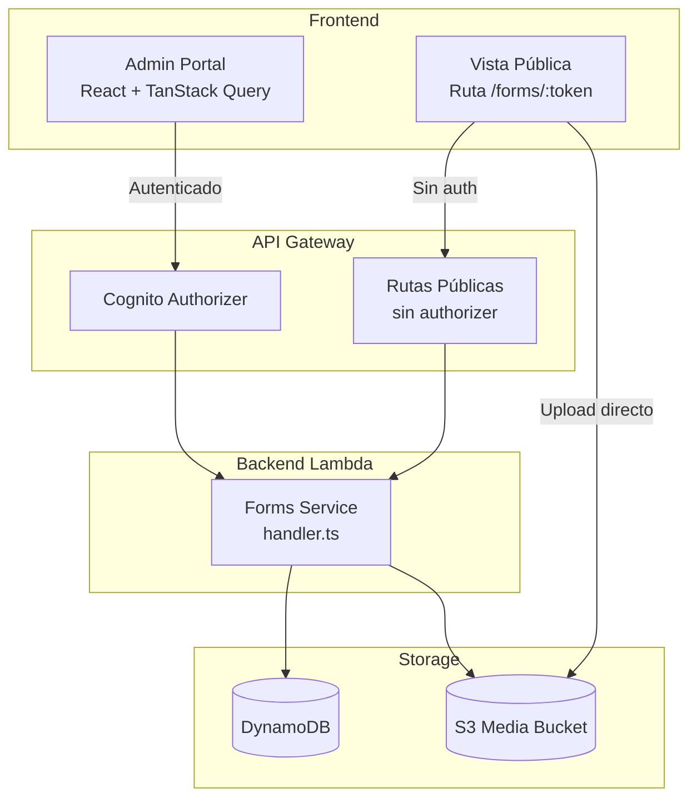
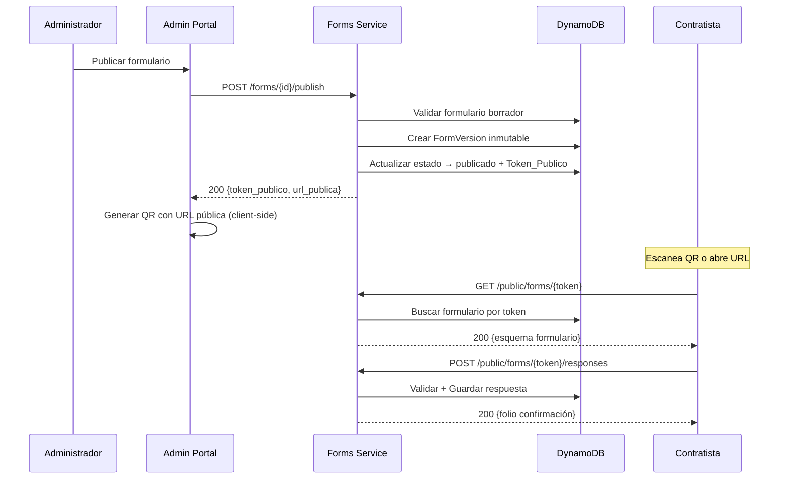
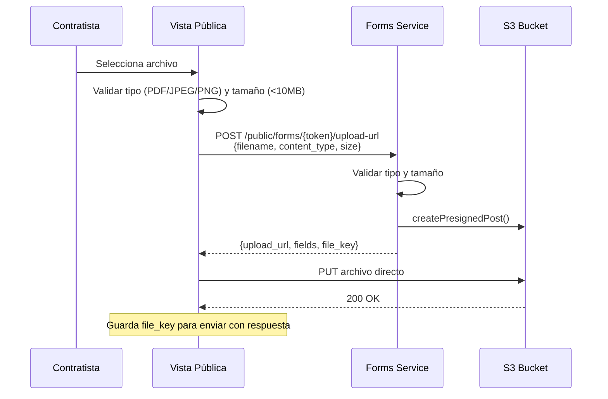

# Documento de Diseño: contractor-forms-qr

## Overview

Este documento describe el diseño técnico del módulo de formularios dinámicos con códigos QR para contratistas. El sistema permite a administradores de empresa crear formularios configurables, publicarlos con un token público UUID v4, generar códigos QR que codifican la URL pública, y recibir respuestas de contratistas sin autenticación desde dispositivos móviles.

La solución se implementa como un nuevo servicio Lambda (`forms-service`) siguiendo los patrones existentes del proyecto: handler con routing por `httpMethod` + `resource`, autenticación via `authenticateRequest` → `enforcePermission`, DynamoDB con prefijo de entorno, y respuestas estructuradas con `createSuccessResponse` / `createErrorResponse`.

### Decisiones Clave de Diseño

1. **Servicio Lambda dedicado**: Un nuevo `forms-service` handler separado del identity-service, dado que el dominio de formularios es independiente y tiene endpoints públicos (sin auth).
2. **Generación QR en cliente**: Se genera el QR en el frontend usando una librería como `qrcode` (npm), evitando un servicio backend adicional. El backend solo provee la URL pública.
3. **Vista Pública como ruta del admin-portal**: Se implementa como una ruta pública (`/forms/:token`) dentro del mismo proyecto React (admin-portal) pero sin layout de autenticación, aprovechando code-splitting para mantener el bundle ligero.
4. **Archivos via S3 presigned URLs**: Upload directo a S3 desde el cliente usando presigned URLs generadas por el backend, evitando pasar archivos por Lambda.
5. **Rate limiting con DynamoDB TTL**: Reutiliza la tabla `RateLimits` existente con TTL para controlar envíos por IP/formulario.
6. **Versionado inmutable**: Cada publicación crea una snapshot inmutable del esquema en una tabla separada `FormVersions`.

---

## Architecture

### Diagrama de Componentes



### Diagrama de Flujo: Publicación y Acceso QR



---

## Components and Interfaces

### 1. Forms Service Lambda Handler

**Ubicación**: `packages/backend/src/services/forms/handler.ts`

Sigue el patrón del `identity/handler.ts`: un handler principal que rutea por `httpMethod` + `resource`.

#### Endpoints Autenticados (Cognito Authorizer)

| Método | Recurso | Descripción | Permiso |
|--------|---------|-------------|---------|
| POST | `/forms` | Crear formulario | `forms:create` |
| GET | `/forms` | Listar formularios del tenant | `forms:read` |
| GET | `/forms/{id}` | Obtener formulario por ID | `forms:read` |
| PATCH | `/forms/{id}` | Editar formulario borrador | `forms:update` |
| POST | `/forms/{id}/publish` | Publicar formulario | `forms:publish` |
| POST | `/forms/{id}/unpublish` | Despublicar formulario | `forms:publish` |
| POST | `/forms/{id}/duplicate` | Duplicar formulario | `forms:create` |
| GET | `/forms/{id}/responses` | Listar respuestas | `forms:read_responses` |
| GET | `/forms/{id}/responses/{responseId}` | Detalle de respuesta | `forms:read_responses` |
| GET | `/forms/{id}/responses/export` | Exportar CSV | `forms:export` |
| GET | `/forms/{id}/audit` | Consultar auditoría | `audit:read` |
| POST | `/forms/{id}/upload-url` | Generar presigned URL para upload | `forms:create` |

#### Endpoints Públicos (Sin Authorizer)

| Método | Recurso | Descripción |
|--------|---------|-------------|
| GET | `/public/forms/{token}` | Obtener esquema de formulario publicado |
| POST | `/public/forms/{token}/responses` | Enviar respuesta |
| POST | `/public/forms/{token}/upload-url` | Obtener presigned URL para archivo |

### 2. Módulos Internos del Servicio

```
packages/backend/src/services/forms/
├── handler.ts          # Router principal
├── types.ts            # Interfaces y enums del dominio
├── form.ts             # CRUD de formularios
├── form-version.ts     # Gestión de versiones
├── form-response.ts    # Envío y consulta de respuestas
├── form-validation.ts  # Validación de campos (compartida cliente/servidor)
├── form-export.ts      # Exportación CSV
├── audit.ts            # Registro de auditoría
├── rate-limiter.ts     # Rate limiting por IP
└── sanitizer.ts        # Sanitización de inputs
```

### 3. Permisos RBAC

Nuevos permisos a agregar en `rbac.ts`:

```typescript
// Nuevos permisos
| 'forms:create'
| 'forms:read'
| 'forms:update'
| 'forms:publish'
| 'forms:read_responses'
| 'forms:export'

// Asignación por rol:
// platform_admin, tenant_admin, site_admin → todos los permisos de forms
// supervisor, cso → forms:read, forms:read_responses
// gate_operator, worker → ninguno
```

### 4. Frontend: Admin Portal

**Nuevas páginas**:
- `features/forms/FormList.tsx` — Lista de formularios con filtros
- `features/forms/FormBuilder.tsx` — Constructor de formularios drag-and-drop
- `features/forms/FormDetail.tsx` — Detalle con QR, estado, versiones
- `features/forms/FormResponses.tsx` — Lista de respuestas con filtros y paginación
- `features/forms/ResponseDetail.tsx` — Detalle de una respuesta

**Hooks TanStack Query**:
- `useFormsQuery` / `useFormQuery` / `useCreateForm` / `useUpdateForm`
- `usePublishForm` / `useUnpublishForm` / `useDuplicateForm`
- `useFormResponses` / `useFormResponseDetail`
- `useExportResponses`

### 5. Frontend: Vista Pública

**Ruta**: `/forms/:token` (dentro del admin-portal, sin layout autenticado)

**Componentes**:
- `features/public-form/PublicFormPage.tsx` — Página principal
- `features/public-form/PublicFormRenderer.tsx` — Renderiza campos dinámicamente
- `features/public-form/PublicFormSuccess.tsx` — Pantalla de confirmación con folio
- `features/public-form/fields/` — Componentes por tipo de campo

**Características**:
- Mobile-first, responsive desde 320px
- Validación en tiempo real (< 500ms)
- Retry automático en caso de error de red
- Sin dependencia de autenticación

---

## Data Models

### Tabla: Forms

**Nombre**: `{prefix}Forms`

| Atributo | Tipo | Descripción |
|----------|------|-------------|
| PK | String | `TENANT#{tenant_id}` |
| SK | String | `FORM#{form_id}` |
| GSI1PK | String | `TOKEN#{token_publico}` (solo si publicado) |
| GSI1SK | String | `FORM#{form_id}` |
| form_id | String | UUID v4 |
| tenant_id | String | ID del tenant |
| name | String | Nombre del formulario (3-200 chars) |
| description | String | Descripción opcional (max 1000 chars) |
| status | String | `borrador` \| `publicado` \| `despublicado` |
| fields | List | Array de objetos FieldConfig |
| token_publico | String | UUID v4 (generado al publicar) |
| current_version | Number | Número de versión activa |
| author_id | String | ID del usuario creador |
| created_at | String | ISO 8601 UTC |
| updated_at | String | ISO 8601 UTC |
| published_at | String | ISO 8601 UTC (nullable) |

**GSI1**: Permite buscar formulario por `token_publico` para acceso público.

#### FieldConfig (objeto embebido)

```typescript
interface FieldConfig {
  field_id: string;          // UUID v4
  type: FieldType;           // texto_corto | texto_largo | numero | fecha | seleccion_simple | seleccion_multiple | checkbox_aceptacion | carga_archivo
  label: string;             // 1-200 chars
  required: boolean;
  order: number;             // 1..N
  placeholder?: string;      // max 200 chars
  help_text?: string;        // max 500 chars
  options?: FieldOption[];   // Para seleccion_simple/multiple (2-50 opciones)
  validation?: FieldValidation;
}

interface FieldOption {
  option_id: string;
  label: string;             // 1-200 chars
}

interface FieldValidation {
  min_value?: number;        // Para numero: -999999999 a 999999999
  max_value?: number;        // Para numero
  min_length?: number;       // Para texto: 0+
  max_length?: number;       // Para texto: hasta 10000
  pattern?: string;          // Regex para texto
  min_date?: string;         // ISO 8601 para fecha
  max_date?: string;         // ISO 8601 para fecha
  allowed_file_types?: string[]; // ['pdf', 'jpeg', 'png']
  max_file_size_mb?: number; // Default 10
}
```

### Tabla: FormVersions

**Nombre**: `{prefix}FormVersions`

| Atributo | Tipo | Descripción |
|----------|------|-------------|
| PK | String | `FORM#{form_id}` |
| SK | String | `VERSION#{version_number}` (zero-padded: `VERSION#0001`) |
| form_id | String | UUID del formulario |
| version_number | Number | Secuencial desde 1 |
| fields_snapshot | List | Copia inmutable del array de FieldConfig |
| created_at | String | ISO 8601 UTC |
| created_by | String | ID del usuario que publicó |

### Tabla: FormResponses

**Nombre**: `{prefix}FormResponses`

| Atributo | Tipo | Descripción |
|----------|------|-------------|
| PK | String | `FORM#{form_id}` |
| SK | String | `RESPONSE#{response_id}` |
| GSI1PK | String | `FORM#{form_id}` |
| GSI1SK | String | `DATE#{submitted_at}` (para ordenar por fecha) |
| response_id | String | UUID v4 |
| form_id | String | UUID del formulario |
| version_number | Number | Versión del formulario al momento del envío |
| folio | String | Alfanumérico 8 chars (ej: `A3K9M2X7`) |
| submitted_at | String | ISO 8601 UTC |
| answers | Map | `{ field_id: value }` |
| file_keys | Map | `{ field_id: s3_key }` (para campos carga_archivo) |
| metadata | Map | `{ origin_type, user_agent, ip_address }` |
| tenant_id | String | ID del tenant (para aislamiento) |

**GSI1**: Permite listar respuestas por formulario ordenadas por fecha.

### Tabla: FormAuditLog

**Nombre**: `{prefix}FormAuditLog`

| Atributo | Tipo | Descripción |
|----------|------|-------------|
| PK | String | `FORM#{form_id}` |
| SK | String | `AUDIT#{timestamp}#{uuid_corto}` |
| GSI1PK | String | `TENANT#{tenant_id}` |
| GSI1SK | String | `AUDIT#{timestamp}` |
| entity_type | String | `formulario` \| `respuesta` \| `qr` |
| entity_id | String | ID de la entidad afectada |
| action | String | `formulario_creado` \| `formulario_editado` \| `formulario_publicado` \| `formulario_despublicado` \| `qr_descargado` \| `respuesta_enviada` |
| actor_id | String | ID del usuario o response_id para contratistas |
| timestamp | String | ISO 8601 UTC |
| ip_address | String | IP de origen |
| metadata | Map | Datos adicionales de contexto |
| tenant_id | String | ID del tenant |
| expiresAt | Number | TTL epoch (365 días desde creación) |

### Uso de Tabla RateLimits (existente)

| Atributo | Valor |
|----------|-------|
| PK | `RATELIMIT#FORM#{form_id}` |
| SK | `IP#{ip_address}` |
| count | Number (incrementado atómicamente) |
| window_start | String ISO 8601 |
| expiresAt | Number (epoch, 5 minutos desde window_start) |

---

## Definiciones CDK

### Nuevas Tablas en `data-stack.ts`

```typescript
// --- Forms Table ---
this.formsTable = new dynamodb.Table(this, 'FormsTable', {
  tableName: `${prefix}Forms`,
  partitionKey: { name: 'PK', type: dynamodb.AttributeType.STRING },
  sortKey: { name: 'SK', type: dynamodb.AttributeType.STRING },
  billingMode: dynamodb.BillingMode.PAY_PER_REQUEST,
  removalPolicy: environment === 'prod' ? cdk.RemovalPolicy.RETAIN : cdk.RemovalPolicy.DESTROY,
  pointInTimeRecovery: environment === 'prod',
});

this.formsTable.addGlobalSecondaryIndex({
  indexName: 'GSI1',
  partitionKey: { name: 'GSI1PK', type: dynamodb.AttributeType.STRING },
  sortKey: { name: 'GSI1SK', type: dynamodb.AttributeType.STRING },
  projectionType: dynamodb.ProjectionType.ALL,
});

// --- FormVersions Table ---
this.formVersionsTable = new dynamodb.Table(this, 'FormVersionsTable', {
  tableName: `${prefix}FormVersions`,
  partitionKey: { name: 'PK', type: dynamodb.AttributeType.STRING },
  sortKey: { name: 'SK', type: dynamodb.AttributeType.STRING },
  billingMode: dynamodb.BillingMode.PAY_PER_REQUEST,
  removalPolicy: environment === 'prod' ? cdk.RemovalPolicy.RETAIN : cdk.RemovalPolicy.DESTROY,
  pointInTimeRecovery: environment === 'prod',
});

// --- FormResponses Table ---
this.formResponsesTable = new dynamodb.Table(this, 'FormResponsesTable', {
  tableName: `${prefix}FormResponses`,
  partitionKey: { name: 'PK', type: dynamodb.AttributeType.STRING },
  sortKey: { name: 'SK', type: dynamodb.AttributeType.STRING },
  billingMode: dynamodb.BillingMode.PAY_PER_REQUEST,
  removalPolicy: environment === 'prod' ? cdk.RemovalPolicy.RETAIN : cdk.RemovalPolicy.DESTROY,
  pointInTimeRecovery: environment === 'prod',
});

this.formResponsesTable.addGlobalSecondaryIndex({
  indexName: 'GSI1',
  partitionKey: { name: 'GSI1PK', type: dynamodb.AttributeType.STRING },
  sortKey: { name: 'GSI1SK', type: dynamodb.AttributeType.STRING },
  projectionType: dynamodb.ProjectionType.ALL,
});

// --- FormAuditLog Table ---
this.formAuditLogTable = new dynamodb.Table(this, 'FormAuditLogTable', {
  tableName: `${prefix}FormAuditLog`,
  partitionKey: { name: 'PK', type: dynamodb.AttributeType.STRING },
  sortKey: { name: 'SK', type: dynamodb.AttributeType.STRING },
  billingMode: dynamodb.BillingMode.PAY_PER_REQUEST,
  removalPolicy: cdk.RemovalPolicy.RETAIN,
  pointInTimeRecovery: true,
  timeToLiveAttribute: 'expiresAt',
});

this.formAuditLogTable.addGlobalSecondaryIndex({
  indexName: 'GSI1',
  partitionKey: { name: 'GSI1PK', type: dynamodb.AttributeType.STRING },
  sortKey: { name: 'GSI1SK', type: dynamodb.AttributeType.STRING },
  projectionType: dynamodb.ProjectionType.ALL,
});
```

### Nueva Lambda en `api-stack.ts`

```typescript
// 12. Forms Service (256 MB, 29s)
this.formsServiceFn = new lambda.Function(this, 'FormsServiceFn', {
  runtime,
  architecture,
  tracing,
  logRetention,
  functionName: `${prefix}forms-service`,
  description: 'Forms Service — formularios dinámicos, QR y respuestas de contratistas',
  handler: 'handler.handler',
  code: lambda.Code.fromAsset('dist/services/forms'),
  memorySize: 256,
  timeout: cdk.Duration.seconds(29),
  environment: sharedEnv,
  reservedConcurrentExecutions: concurrency.api,
});
```

### Nuevas Rutas API Gateway

```typescript
// ─── API Routes: Forms (Forms Service) ────────────────────────────────────
const formsIntegration = new apigateway.LambdaIntegration(this.formsServiceFn);

const forms = this.api.root.addResource('forms');
forms.addMethod('POST', formsIntegration, authorizedMethodOptions);
forms.addMethod('GET', formsIntegration, authorizedMethodOptions);

const formId = forms.addResource('{id}');
formId.addMethod('GET', formsIntegration, authorizedMethodOptions);
formId.addMethod('PATCH', formsIntegration, authorizedMethodOptions);

const formPublish = formId.addResource('publish');
formPublish.addMethod('POST', formsIntegration, authorizedMethodOptions);

const formUnpublish = formId.addResource('unpublish');
formUnpublish.addMethod('POST', formsIntegration, authorizedMethodOptions);

const formDuplicate = formId.addResource('duplicate');
formDuplicate.addMethod('POST', formsIntegration, authorizedMethodOptions);

const formResponses = formId.addResource('responses');
formResponses.addMethod('GET', formsIntegration, authorizedMethodOptions);

const formResponseId = formResponses.addResource('{responseId}');
formResponseId.addMethod('GET', formsIntegration, authorizedMethodOptions);

const formResponsesExport = formResponses.addResource('export');
formResponsesExport.addMethod('GET', formsIntegration, authorizedMethodOptions);

const formAudit = formId.addResource('audit');
formAudit.addMethod('GET', formsIntegration, authorizedMethodOptions);

const formUploadUrl = formId.addResource('upload-url');
formUploadUrl.addMethod('POST', formsIntegration, authorizedMethodOptions);

// ─── API Routes: Public Forms (No Auth) ───────────────────────────────────
const publicForms = this.api.root.addResource('public').addResource('forms');
const publicFormToken = publicForms.addResource('{token}');
publicFormToken.addMethod('GET', formsIntegration); // Sin authorizer
const publicFormResponses = publicFormToken.addResource('responses');
publicFormResponses.addMethod('POST', formsIntegration); // Sin authorizer
const publicFormUploadUrl = publicFormToken.addResource('upload-url');
publicFormUploadUrl.addMethod('POST', formsIntegration); // Sin authorizer
```

---

## Generación de Código QR

### Enfoque: Generación en Cliente

El código QR se genera en el frontend (Admin Portal) usando la librería `qrcode` (npm). Esto evita:
- Un servicio backend adicional
- Almacenamiento de imágenes QR
- Latencia de generación

### Flujo

1. Backend retorna `token_publico` y `url_publica` al publicar
2. Frontend construye la URL completa: `https://{domain}/forms/{token_publico}`
3. Frontend genera QR usando `qrcode.toDataURL(url, { width: 300 })`
4. El QR se muestra en pantalla y se ofrece descarga como PNG

### Regeneración

Cuando se republica un formulario (nueva versión), el `token_publico` puede mantenerse o regenerarse según la decisión del admin. Si cambia, el frontend regenera el QR automáticamente.

---

## Manejo de Archivos (S3 Presigned URLs)

### Flujo de Upload



### Estructura S3

```
forms/{tenant_id}/{form_id}/responses/{response_id}/{field_id}/{filename}
```

### Configuración Presigned URL

- Expiración: 15 minutos
- Tamaño máximo: 10 MB
- Content-Types permitidos: `application/pdf`, `image/jpeg`, `image/png`
- Condiciones: bucket, key prefix, content-type, content-length-range

---

## Estrategia de Rate Limiting

### Implementación

Usa la tabla `RateLimits` existente con operaciones atómicas de DynamoDB:

```typescript
async function checkRateLimit(formId: string, ipAddress: string): Promise<{allowed: boolean; retryAfterSeconds?: number}> {
  const now = Date.now();
  const windowMs = 5 * 60 * 1000; // 5 minutos
  const maxRequests = 10;
  
  // UpdateItem con ADD atómico + condición
  // PK: RATELIMIT#FORM#{form_id}, SK: IP#{ip_address}
  // Si count >= maxRequests → rechazar
  // Si window expiró → resetear contador
  // TTL automático limpia registros viejos
}
```

### Respuesta al Exceder Límite

```json
{
  "code": "RATE_LIMITED",
  "message": "Demasiados envíos. Intente nuevamente en {minutes} minutos.",
  "details": { "retry_after_seconds": 180 }
}
```

HTTP Status: `429 Too Many Requests`

---

## Sanitización y Seguridad

### Sanitización de Inputs

```typescript
function sanitizeInput(value: string): string {
  // 1. Remover tags HTML
  // 2. Escapar caracteres especiales SQL
  // 3. Remover secuencias de control
  // 4. Normalizar whitespace
  // No rechazar — limpiar y almacenar
}
```

### Protección contra Bots

- Validación de headers (`User-Agent`, `Origin`, `Referer`)
- Detección de patrones: envíos < 2 segundos desde carga de página
- Campo honeypot invisible en el formulario
- Rate limiting por IP (ya descrito)

### Validación Dual (Cliente + Servidor)

La lógica de validación de campos se implementa en un módulo compartible (`form-validation.ts`) que se ejecuta:
1. En el frontend (Vista Pública) para feedback inmediato
2. En el backend (Forms Service) como validación autoritativa

---

## Error Handling

### Errores del Servicio

| Escenario | HTTP Status | Código | Mensaje |
|-----------|-------------|--------|---------|
| Formulario no encontrado | 404 | NOT_FOUND | Formulario no encontrado |
| Token público inválido | 404 | NOT_FOUND | Formulario no disponible |
| Formulario no publicado (acceso público) | 404 | NOT_FOUND | Formulario no disponible |
| Formulario despublicado (acceso público) | 410 | GONE | Este formulario ya no está disponible |
| Validación de campos fallida | 400 | VALIDATION_ERROR | Datos inválidos |
| Nombre duplicado en tenant | 409 | CONFLICT | Ya existe un formulario con ese nombre |
| Formulario no en estado borrador | 422 | UNPROCESSABLE_ENTITY | Solo formularios en borrador pueden ser editados |
| Rate limit excedido | 429 | RATE_LIMITED | Demasiados envíos |
| Archivo excede tamaño | 400 | FILE_TOO_LARGE | El archivo excede 10 MB |
| Tipo de archivo no permitido | 400 | INVALID_FILE_TYPE | Tipo de archivo no permitido |
| Error de auditoría (no se pudo registrar) | 500 | INTERNAL_ERROR | Operación no pudo completarse |
| Permiso insuficiente | 403 | FORBIDDEN | No tiene permisos para esta acción |

### Estrategia de Reintentos

- **Frontend**: Retry automático hasta 3 veces con backoff exponencial para envío de respuestas
- **Backend**: No retry en operaciones de escritura (idempotencia no garantizada)
- **Auditoría**: Si falla el registro de auditoría, se rechaza la operación original (Req 16.5)

---

## Testing Strategy

### Unit Tests (Vitest)

- Validación de campos: cada tipo de campo con casos válidos e inválidos
- Sanitización de inputs: patrones XSS, SQL injection, HTML
- Generación de folio: unicidad y formato
- Lógica de rate limiting: ventanas de tiempo, contadores
- Transiciones de estado: borrador → publicado → despublicado
- Exportación CSV: formato, encoding, multi-versión

### Property-Based Tests (fast-check)

Se usará `fast-check` como librería de property-based testing. Cada test se ejecutará con mínimo 100 iteraciones. Cada property test debe referenciar su propiedad del documento de diseño con el formato:
**Feature: contractor-forms-qr, Property {number}: {property_text}**

### Integration Tests

- Flujo completo: crear → publicar → acceder → responder
- Rate limiting end-to-end
- Upload de archivos con presigned URLs
- Exportación CSV con datos reales
- Fallo de auditoría rechaza operación original
- Concurrencia: despublicar durante envío en progreso

### Tests Frontend

- Componentes de formulario: renderizado correcto por tipo de campo
- Validación en tiempo real: feedback < 500ms
- Vista pública: responsive desde 320px
- QR generation: URL correcta codificada

---

## Correctness Properties

*Una propiedad es una característica o comportamiento que debe mantenerse verdadero en todas las ejecuciones válidas de un sistema — esencialmente, una declaración formal sobre lo que el sistema debe hacer. Las propiedades sirven como puente entre especificaciones legibles por humanos y garantías de corrección verificables por máquina.*

### Property 1: Autorización por rol

*Para cualquier* rol de usuario y cualquier operación de formularios que requiera autorización, la operación debe tener éxito únicamente si el rol del usuario está en el conjunto de roles permitidos para esa operación (tenant_admin y site_admin para crear/editar/publicar/exportar; supervisor y cso adicionalmente para consultar respuestas).

**Validates: Requirements 1.5, 3.7, 4.4, 5.5, 6.7, 7.1, 12.4, 13.4**

### Property 2: Registro de auditoría completo

*Para cualquier* acción exitosa del conjunto {formulario_creado, formulario_editado, formulario_publicado, formulario_despublicado, qr_descargado, respuesta_enviada, formulario_duplicado}, el sistema debe crear un registro de auditoría que contenga: tipo de entidad, identificador de entidad, acción realizada, identificador del actor, timestamp ISO 8601 UTC, dirección IP de origen, e identificador del formulario afectado.

**Validates: Requirements 1.6, 3.4, 5.4, 6.5, 7.4, 11.6, 16.1, 16.2**

### Property 3: Actor de auditoría para contratistas

*Para cualquier* envío de respuesta por un contratista, el registro de auditoría debe registrar como actor_id el identificador de la respuesta creada (no un usuario autenticado).

**Validates: Requirements 16.3**

### Property 4: Validación de metadatos del formulario

*Para cualquier* string como nombre de formulario, el sistema debe aceptarlo si y solo si tiene entre 3 y 200 caracteres y contiene al menos un carácter no-espacio. *Para cualquier* string como descripción, el sistema debe aceptarlo si y solo si tiene máximo 1000 caracteres.

**Validates: Requirements 1.2, 1.3, 1.4, 4.7**

### Property 5: Validación de configuración de campos

*Para cualquier* configuración de campo, el sistema debe aceptarla si y solo si: la etiqueta tiene entre 1 y 200 caracteres, el tipo es uno de los 8 tipos válidos, los campos de selección tienen entre 2 y 50 opciones con etiquetas de 1-200 chars, y las reglas de validación numérica están en rango [-999999999, 999999999]. El sistema debe rechazar configuraciones inválidas indicando cada campo con error y la razón específica.

**Validates: Requirements 2.2, 2.3, 2.5, 2.6, 2.9**

### Property 6: Orden de campos consecutivo sin duplicados

*Para cualquier* formulario después de cualquier operación de reordenamiento de campos, los valores de orden de visualización deben ser enteros consecutivos desde 1 hasta N (donde N es el número total de campos) sin duplicados ni huecos.

**Validates: Requirements 2.7**

### Property 7: Restricción de operaciones por estado

*Para cualquier* formulario, las operaciones de guardado/edición deben ser rechazadas si el formulario no está en estado "borrador", la publicación debe ser rechazada si no está en "borrador", y la despublicación debe ser rechazada si no está en "publicado".

**Validates: Requirements 3.5, 4.6, 6.3, 7.2**

### Property 8: Round-trip de persistencia de formulario

*Para cualquier* formulario en borrador con nombre, descripción y campos válidos, guardar los cambios y luego leer el formulario debe retornar exactamente los mismos datos (nombre, descripción, campos con todas sus propiedades) con una fecha de última modificación actualizada.

**Validates: Requirements 3.1, 4.2, 4.5**

### Property 9: Acceso público denegado para formularios no publicados

*Para cualquier* formulario en estado "borrador" o "despublicado", el acceso mediante la URL pública debe ser rechazado sin revelar el contenido del formulario.

**Validates: Requirements 3.2, 7.3**

### Property 10: Duplicación preserva campos sin estado

*Para cualquier* formulario (en cualquier estado), duplicarlo debe producir un nuevo formulario con: los mismos campos y propiedades (tipo, etiqueta, obligatoriedad, opciones, validaciones, orden), estado "borrador", sin token_publico, sin versiones, sin respuestas, con fechas nuevas y un ID nuevo.

**Validates: Requirements 5.1, 5.3**

### Property 11: Nombre de formulario duplicado

*Para cualquier* nombre de formulario, el nombre del duplicado debe ser el nombre original concatenado con " (copia)", truncando el nombre original si es necesario para que el resultado no exceda 200 caracteres.

**Validates: Requirements 5.2**

### Property 12: Publicación crea versión inmutable con token UUID v4

*Para cualquier* formulario borrador válido, al publicarlo: el estado debe cambiar a "publicado", se debe generar un token_publico que sea un UUID v4 válido, y se debe crear una Version_Formulario inmutable cuyo fields_snapshot sea idéntico a los campos del formulario al momento de la publicación.

**Validates: Requirements 6.4, 6.6**

### Property 13: Acceso público retorna esquema completo

*Para cualquier* formulario publicado, acceder via GET /public/forms/{token} debe retornar: nombre, descripción (si existe), y todos los campos en el orden de visualización configurado con sus propiedades de renderizado (tipo, etiqueta, obligatoriedad, placeholder, help_text, opciones).

**Validates: Requirements 9.1**

### Property 14: Endpoints públicos no requieren autenticación

*Para cualquier* request a los endpoints /public/forms/{token} y /public/forms/{token}/responses, el sistema debe procesar la solicitud sin requerir header de Authorization.

**Validates: Requirements 9.6**

### Property 15: Validación muestra todos los errores simultáneamente

*Para cualquier* formulario con N campos obligatorios y un envío donde todos están vacíos, la respuesta de validación debe contener exactamente N errores, uno por cada campo obligatorio.

**Validates: Requirements 10.1**

### Property 16: Validación numérica reporta límites

*Para cualquier* campo numérico con min/max configurado y un valor fuera de rango, el error de validación debe incluir los valores mínimo y máximo permitidos.

**Validates: Requirements 10.2**

### Property 17: Validación de texto reporta longitud

*Para cualquier* campo de texto con max_length configurado y un string que excede esa longitud, el error de validación debe incluir la longitud máxima permitida.

**Validates: Requirements 10.3**

### Property 18: Validación servidor consistente con cliente

*Para cualquier* conjunto de datos de formulario y esquema de campos, la función de validación del servidor debe producir la misma decisión de aceptar/rechazar y los mismos errores que la función de validación del cliente.

**Validates: Requirements 10.7**

### Property 19: Folio de respuesta alfanumérico de 8 caracteres

*Para cualquier* envío exitoso de respuesta, el folio retornado debe ser exactamente 8 caracteres compuestos únicamente por letras mayúsculas (A-Z) y dígitos (0-9).

**Validates: Requirements 11.3**

### Property 20: Sanitización preserva contenido seguro

*Para cualquier* string de entrada que contenga patrones potencialmente peligrosos (HTML tags, scripts, SQL injection), la función de sanitización debe remover o escapar los patrones peligrosos mientras preserva el contenido textual seguro, y el envío no debe ser rechazado si los datos restantes son válidos.

**Validates: Requirements 11.7, 15.3**

### Property 21: Filtros de respuestas retornan solo coincidencias

*Para cualquier* conjunto de respuestas y criterios de filtro (formulario, rango de fechas, estado), todas las respuestas retornadas deben cumplir todos los criterios de filtro aplicados.

**Validates: Requirements 12.2**

### Property 22: Paginación respeta límite máximo

*Para cualquier* consulta de respuestas o auditoría, cada página debe contener como máximo el límite definido (25 para respuestas, 50 para auditoría) y los resultados deben estar ordenados consistentemente.

**Validates: Requirements 12.5, 16.6**

### Property 23: Exportación CSV estructura correcta

*Para cualquier* formulario con respuestas, el CSV exportado debe: estar codificado en UTF-8 con BOM, tener una fila de encabezados con columnas [folio, fecha_envio, ...campos], tener exactamente una fila por respuesta, y representar campos de selección múltiple con valores separados por punto y coma.

**Validates: Requirements 13.1, 13.2**

### Property 24: CSV multi-versión unifica columnas

*Para cualquier* formulario con múltiples versiones, el CSV exportado debe contener la unión de todas las columnas de todas las versiones, con celdas vacías para respuestas donde el campo no existía en su versión correspondiente.

**Validates: Requirements 13.3**

### Property 25: Versionado secuencial e inmutable

*Para cualquier* formulario publicado, al editar y republicar: el número de versión debe incrementarse secuencialmente, la versión anterior debe permanecer inmutable, y cada respuesta debe estar asociada a la versión vigente al momento de su envío.

**Validates: Requirements 14.1, 14.2, 14.3**

### Property 26: Versiones con respuestas son inmutables

*Para cualquier* Version_Formulario que tiene al menos una Respuesta asociada, cualquier intento de modificación o eliminación debe ser rechazado.

**Validates: Requirements 14.6**

### Property 27: Rate limiting por IP y formulario

*Para cualquier* dirección IP y formulario, los primeros 10 envíos dentro de una ventana de 5 minutos deben ser aceptados (si son válidos), y el envío número 11 dentro de la misma ventana debe ser rechazado con código 429.

**Validates: Requirements 15.1**

### Property 28: Validación de archivos

*Para cualquier* archivo adjunto en un campo carga_archivo, el sistema debe rechazarlo si excede 10 MB o si su tipo no es PDF, JPEG o PNG, retornando un error que indica el tamaño máximo y los tipos permitidos.

**Validates: Requirements 10.4, 11.5, 15.4**

