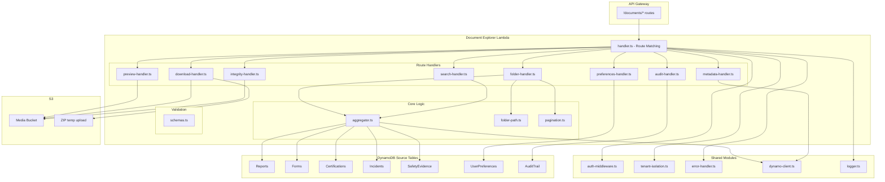

# Design Document: Document Explorer Backend

## Overview

The Document Explorer Backend is a Lambda service that aggregates documents from five existing DynamoDB tables (Reports, Forms, Certifications, Incidents, SafetyEvidence) into a virtual folder structure. It exposes REST endpoints under `/documents/*` for folder navigation, search, metadata retrieval, preview URL generation, batch ZIP download, integrity verification, user preferences, and audit logging.

The service follows the established handler routing pattern (forms, incidents services) with method+resource matching, shared auth middleware, tenant isolation, and Zod request validation. No new DynamoDB tables are created for document storage — all data is queried dynamically from existing sources.

### Key Design Decisions

1. **Single Lambda, multi-route handler**: One Lambda function handles all `/documents/*` routes using method+resource pattern matching, consistent with forms/incidents services.

2. **No aggregation table**: Documents are queried directly from source tables on each request. This avoids data synchronization complexity at the cost of multiple DynamoDB queries per request. Parallel queries and source-level error isolation mitigate latency.

3. **Higher memory and timeout for ZIP**: The Lambda uses 512MB memory and 130s timeout to accommodate batch ZIP creation in `/tmp` storage. Single-document operations complete within standard API Gateway 29s limit.

4. **UserPreferences table reuse**: Organization mode preferences are stored in the existing `UserPreferences` table (PK: `USER#{user_id}`, SK: `PREF#document_explorer`).

5. **Presigned URL delegation**: Preview and download URLs are generated via `@aws-sdk/s3-request-presigner` with appropriate expiration times (15min preview, 60min download).

6. **Graceful degradation**: If any source table query fails, the service returns partial results from available sources and reports unavailable sources in the response.

## Architecture



### File Structure

```
packages/backend/src/services/documents/
├── handler.ts              # Lambda entry point, route matching
├── folder-handler.ts       # GET /documents/folders
├── search-handler.ts       # GET /documents/search
├── metadata-handler.ts     # GET /documents/{id}/metadata
├── preview-handler.ts      # GET /documents/{id}/preview
├── download-handler.ts     # POST /documents/download, GET /documents/download/{downloadId}/status
├── integrity-handler.ts    # POST /documents/{id}/verify-integrity
├── preferences-handler.ts  # GET/PUT /documents/preferences/organization-mode
├── audit-handler.ts        # POST /documents/audit-log
├── aggregator.ts           # Multi-source DynamoDB query and normalization
├── folder-path.ts          # Virtual folder path computation algorithm
├── pagination.ts           # Pagination utilities
├── schemas.ts              # Zod validation schemas
├── types.ts                # TypeScript interfaces and types
└── __tests__/
    ├── properties/
    │   ├── folder-path.property.test.ts
    │   ├── access-scoping.property.test.ts
    │   ├── search.property.test.ts
    │   ├── validation.property.test.ts
    │   ├── aggregator.property.test.ts
    │   └── download.property.test.ts
    ├── handler.test.ts
    ├── aggregator.test.ts
    ├── folder-handler.test.ts
    └── download-handler.test.ts
```

## Components and Interfaces

### Lambda Handler (handler.ts)

```typescript
import { authenticateRequest } from '../../shared/auth-middleware.js';
import type { ApiGatewayEvent } from '../../shared/auth-middleware.js';
import type { ApiGatewayResponse } from '../../shared/error-handler.js';
import {
  createSuccessResponse,
  badRequest,
  forbidden,
  internalError,
} from '../../shared/error-handler.js';
import { createLogger } from '../../shared/logger.js';
import { Role } from '../../shared/types/common.js';
import { handleFolders } from './folder-handler.js';
import { handleSearch } from './search-handler.js';
import { handleMetadata } from './metadata-handler.js';
import { handlePreview } from './preview-handler.js';
import { handleDownload, handleDownloadStatus } from './download-handler.js';
import { handleVerifyIntegrity } from './integrity-handler.js';
import { handleGetPreferences, handleSetPreferences } from './preferences-handler.js';
import { handleAuditLog } from './audit-handler.js';

const logger = createLogger('document-service');

const ALLOWED_ROLES: Set<string> = new Set([
  Role.PLATFORM_ADMIN,
  Role.TENANT_ADMIN,
  Role.SITE_ADMIN,
  Role.SUPERVISOR,
  Role.CSO,
]);

export async function handler(event: ApiGatewayEvent): Promise<ApiGatewayResponse> {
  const correlationId = event.headers['X-Correlation-Id'] ?? event.headers['x-correlation-id'] ?? '';

  try {
    const httpMethod = (event as Record<string, unknown>)['httpMethod'] as string;
    const resource = (event as Record<string, unknown>)['resource'] as string;

    // CORS preflight
    if (httpMethod === 'OPTIONS') {
      return createSuccessResponse(200, {});
    }

    // Authentication
    const authResult = authenticateRequest(event);
    if ('error' in authResult) return authResult.error;
    const { user } = authResult;

    // Role-based access control
    if (!ALLOWED_ROLES.has(user.role)) {
      return forbidden('Access denied');
    }

    const reqLogger = logger.child({
      correlation_id: correlationId,
      tenant_id: user.tenant_id,
    });
    reqLogger.info('Request received', { method: httpMethod, resource });

    const pathParameters = (event as Record<string, unknown>)['pathParameters'] as Record<string, string> | null;

    // Route matching
    if (httpMethod === 'GET' && resource === '/documents/folders') {
      return handleFolders(event, user);
    }
    if (httpMethod === 'GET' && resource === '/documents/search') {
      return handleSearch(event, user);
    }
    if (httpMethod === 'GET' && resource === '/documents/{id}/metadata') {
      return handleMetadata(pathParameters?.['id'], user);
    }
    if (httpMethod === 'GET' && resource === '/documents/{id}/preview') {
      return handlePreview(pathParameters?.['id'], user);
    }
    if (httpMethod === 'POST' && resource === '/documents/download') {
      return handleDownload(event, user);
    }
    if (httpMethod === 'GET' && resource === '/documents/download/{downloadId}/status') {
      return handleDownloadStatus(pathParameters?.['downloadId'], user);
    }
    if (httpMethod === 'POST' && resource === '/documents/{id}/verify-integrity') {
      return handleVerifyIntegrity(pathParameters?.['id'], user);
    }
    if (httpMethod === 'GET' && resource === '/documents/preferences/organization-mode') {
      return handleGetPreferences(user);
    }
    if (httpMethod === 'PUT' && resource === '/documents/preferences/organization-mode') {
      return handleSetPreferences(event, user);
    }
    if (httpMethod === 'POST' && resource === '/documents/audit-log') {
      return handleAuditLog(event, user);
    }

    return badRequest('Unsupported route');
  } catch (error) {
    logger.error('Unexpected error', {
      correlation_id: correlationId,
      error: error instanceof Error ? error.stack : String(error),
    });
    return internalError('An unexpected error occurred');
  }
}
```

### Document Aggregator (aggregator.ts)

The aggregator queries all five source tables in parallel, normalizes records to a unified schema, and applies tenant/site scoping.

```typescript
import { QueryCommand } from '@aws-sdk/lib-dynamodb';
import { docClient, getTableName } from '../../shared/dynamo-client.js';
import type { AuthenticatedUser } from '../../shared/auth-middleware.js';
import { Role } from '../../shared/types/common.js';
import type { UnifiedDocument, DocumentCategory, SourceQueryResult } from './types.js';

/** Source table configuration: name, category, field mappings */
const SOURCE_TABLES: SourceTableConfig[] = [
  {
    tableName: 'Reports',
    category: 'reports',
    fieldMap: {
      id: 'report_id',
      name: 'title',
      mimeType: 'mime_type',
      fileSize: 'file_size',
      createdAt: 'created_at',
      siteName: 'site_name',
      siteId: 'site_id',
      tenantId: 'tenant_id',
      s3Key: 's3_key',
      sha256Hash: 'sha256_hash',
    },
  },
  {
    tableName: 'Forms',
    category: 'forms',
    fieldMap: {
      id: 'form_id',
      name: 'name',
      mimeType: 'mime_type',
      fileSize: 'file_size',
      createdAt: 'created_at',
      siteName: 'site_name',
      siteId: 'site_id',
      tenantId: 'tenant_id',
      s3Key: 's3_key',
      sha256Hash: 'sha256_hash',
    },
  },
  {
    tableName: 'Certifications',
    category: 'certifications',
    fieldMap: {
      id: 'certification_id',
      name: 'document_name',
      mimeType: 'mime_type',
      fileSize: 'file_size',
      createdAt: 'created_at',
      siteName: 'site_name',
      siteId: 'site_id',
      tenantId: 'tenant_id',
      s3Key: 's3_key',
      sha256Hash: 'sha256_hash',
    },
  },
  {
    tableName: 'Incidents',
    category: 'incidents',
    fieldMap: {
      id: 'incident_id',
      name: 'title',
      mimeType: 'mime_type',
      fileSize: 'file_size',
      createdAt: 'created_at',
      siteName: 'site_name',
      siteId: 'site_id',
      tenantId: 'tenant_id',
      s3Key: 's3_key',
      sha256Hash: 'sha256_hash',
    },
  },
  {
    tableName: 'SafetyEvidence',
    category: 'safety_evidence',
    fieldMap: {
      id: 'evidence_id',
      name: 'title',
      mimeType: 'mime_type',
      fileSize: 'file_size',
      createdAt: 'created_at',
      siteName: 'site_name',
      siteId: 'site_id',
      tenantId: 'tenant_id',
      s3Key: 's3_key',
      sha256Hash: 'sha256_hash',
    },
  },
];

/**
 * Queries all source tables in parallel with tenant isolation.
 * Applies site-level filtering for site_admin/supervisor roles.
 * Returns unified documents + unavailable sources list.
 */
export async function aggregateDocuments(
  user: AuthenticatedUser,
  options?: { category?: DocumentCategory; siteId?: string }
): Promise<{ documents: UnifiedDocument[]; unavailableSources: string[] }> {
  const sources = options?.category
    ? SOURCE_TABLES.filter((s) => s.category === options.category)
    : SOURCE_TABLES;

  const results = await Promise.allSettled(
    sources.map((source) => querySourceTable(source, user, options?.siteId))
  );

  const documents: UnifiedDocument[] = [];
  const unavailableSources: string[] = [];

  results.forEach((result, index) => {
    if (result.status === 'fulfilled') {
      documents.push(...result.value);
    } else {
      unavailableSources.push(sources[index]!.tableName);
    }
  });

  // Apply site-level filtering for site_admin/supervisor
  if (
    (user.role === Role.SITE_ADMIN || user.role === Role.SUPERVISOR) &&
    user.assigned_sites
  ) {
    const siteSet = new Set(user.assigned_sites);
    return {
      documents: documents.filter((doc) => siteSet.has(doc.siteId)),
      unavailableSources,
    };
  }

  return { documents, unavailableSources };
}
```

### Folder Path Computation (folder-path.ts)

The core algorithm that computes virtual folder paths from document metadata.

```typescript
import type { UnifiedDocument, OrganizationMode } from './types.js';

/**
 * Computes the virtual folder path for a document based on the organization mode.
 *
 * For 'category_site_year_month': [category, siteName, year, month]
 * For 'category_year_month_site': [category, year, month, siteName]
 *
 * This is a pure function — no I/O, deterministic.
 */
export function computeFolderPath(
  document: { category: string; siteName: string; createdAt: string },
  mode: OrganizationMode
): string[] {
  const date = new Date(document.createdAt);
  const year = date.getUTCFullYear().toString();
  const month = String(date.getUTCMonth() + 1).padStart(2, '0');

  if (mode === 'category_site_year_month') {
    return [document.category, document.siteName, year, month];
  }
  // category_year_month_site
  return [document.category, year, month, document.siteName];
}

/**
 * Extracts sub-folders and documents at a specific path level from a document set.
 *
 * Given a set of documents and a target path (e.g. ['reports', 'SiteA']),
 * returns:
 * - folders: distinct next-level path segments with computed counts
 * - documents: documents whose full path exactly matches the target path
 */
export function getItemsAtPath(
  documents: { folderPath: string[] }[],
  targetPath: string[]
): { folders: FolderNode[]; documentsAtPath: typeof documents } {
  const depth = targetPath.length;
  const foldersMap = new Map<string, { count: number; lastUpdated: string }>();
  const documentsAtPath: typeof documents = [];

  for (const doc of documents) {
    // Check if this document's path starts with the target path
    const pathMatches = targetPath.every((seg, i) => doc.folderPath[i] === seg);
    if (!pathMatches) continue;

    if (doc.folderPath.length === depth) {
      // Document is directly at this path level
      documentsAtPath.push(doc);
    } else if (doc.folderPath.length > depth) {
      // Document is deeper — contributes to a sub-folder
      const folderName = doc.folderPath[depth]!;
      const existing = foldersMap.get(folderName);
      if (existing) {
        existing.count++;
      } else {
        foldersMap.set(folderName, { count: 1, lastUpdated: '' });
      }
    }
  }

  const folders: FolderNode[] = Array.from(foldersMap.entries()).map(
    ([name, { count }]) => ({
      id: [...targetPath, name].join('/'),
      name,
      path: [...targetPath, name],
      childFolderCount: 0, // computed in a second pass if needed
      documentCount: count,
      lastUpdated: new Date().toISOString(), // placeholder — real impl computes from docs
    })
  );

  return { folders, documentsAtPath };
}
```

### Pagination (pagination.ts)

```typescript
/**
 * Applies pagination to an array of items.
 * Returns the sliced page and metadata.
 */
export function paginate<T>(
  items: T[],
  page: number,
  pageSize: number
): { data: T[]; total: number; page: number; pageSize: number; totalPages: number } {
  const total = items.length;
  const totalPages = Math.ceil(total / pageSize);
  const clampedPage = Math.max(1, Math.min(page, totalPages || 1));
  const start = (clampedPage - 1) * pageSize;
  const data = items.slice(start, start + pageSize);

  return { data, total, page: clampedPage, pageSize, totalPages };
}
```

### Download Handler (download-handler.ts)

```typescript
import { GetObjectCommand, PutObjectCommand } from '@aws-sdk/client-s3';
import { getSignedUrl } from '@aws-sdk/s3-request-presigner';
import { createHash } from 'crypto';
import { createWriteStream, createReadStream, mkdirSync } from 'fs';
import { pipeline } from 'stream/promises';
import type { AuthenticatedUser } from '../../shared/auth-middleware.js';
import type { ApiGatewayResponse } from '../../shared/error-handler.js';

const MAX_BATCH_SIZE = 50;
const MAX_TOTAL_BYTES = 500 * 1024 * 1024; // 500 MB
const DOWNLOAD_URL_EXPIRY_SECONDS = 60 * 60; // 60 minutes
const ZIP_TIMEOUT_MS = 120_000; // 120 seconds

/**
 * POST /documents/download
 * - 1 document: returns presigned URL directly
 * - 2-50 documents: creates ZIP, uploads to S3, returns presigned URL
 */
export async function handleDownload(
  event: ApiGatewayEvent,
  user: AuthenticatedUser
): Promise<ApiGatewayResponse> {
  // Validate input, check batch size, compute total size, create ZIP or presign
  // ... implementation follows validation → size check → ZIP/presign flow
}

/**
 * Validates total download size does not exceed 500MB.
 * Pure function — suitable for property testing.
 */
export function validateBatchSize(fileSizes: number[]): { valid: boolean; totalSize: number } {
  const totalSize = fileSizes.reduce((sum, s) => sum + s, 0);
  return { valid: totalSize <= MAX_TOTAL_BYTES, totalSize };
}
```

## Data Models

### TypeScript Types (types.ts)

```typescript
// === Enums and Literals ===

export type DocumentCategory =
  | 'reports'
  | 'forms'
  | 'certifications'
  | 'incidents'
  | 'safety_evidence';

export type OrganizationMode =
  | 'category_site_year_month'
  | 'category_year_month_site';

export type IntegrityStatus = 'verified' | 'mismatch' | 'pending' | 'unavailable';

export type DownloadStatus = 'preparing' | 'ready' | 'failed' | 'expired';

export type AuditEventType = 'download_single' | 'download_batch';

// === Core Models ===

export interface UnifiedDocument {
  id: string;
  name: string;
  category: DocumentCategory;
  mimeType: string;
  fileSize: number;
  createdAt: string;           // ISO 8601 with timezone
  siteName: string;
  siteId: string;
  tenantId: string;
  s3Key: string;
  sha256Hash: string | null;
  folderPath: string[];        // computed from category + metadata + org_mode
}

export interface FolderNode {
  id: string;
  name: string;
  path: string[];
  childFolderCount: number;
  documentCount: number;
  lastUpdated: string;
}

export interface DocumentDetail extends UnifiedDocument {
  creatorUserId: string;
  creatorUserName: string;
  downloadCount: number;
  lastDownloadedAt: string | null;
  integrityStatus: IntegrityStatus;
  lastVerifiedAt: string | null;
}

// === Request/Response Types ===

export interface FolderContentsResponse {
  currentPath: string[];
  folders: FolderNode[];
  documents: Omit<UnifiedDocument, 'tenantId' | 's3Key' | 'sha256Hash'>[];
  totalDocuments: number;
  page: number;
  pageSize: number;
  totalPages: number;
  unavailableSources?: string[];
}

export interface SearchResponse {
  results: (Omit<UnifiedDocument, 'tenantId' | 's3Key' | 'sha256Hash'> & {
    matchFolderPath: string[];
  })[];
  total: number;
  page: number;
  pageSize: number;
}

export interface DownloadInitResponse {
  downloadId: string;
  downloadUrl: string;
  expiresAt: string;
  totalSize: number;
  fileCount: number;
  skippedDocuments?: { id: string; name: string; reason: string }[];
}

export interface BatchDownloadStatusResponse {
  downloadId: string;
  status: DownloadStatus;
  progress: number;
  downloadUrl?: string;
  errorMessage?: string;
}

export interface IntegrityVerificationResponse {
  documentId: string;
  storedHash: string;
  computedHash: string;
  match: boolean;
  verifiedAt: string;
}

export interface AuditLogEntry {
  eventType: AuditEventType;
  documentIds: string[];
  userId: string;
  tenantId: string;
  timestamp: string;
  ttl: number;                 // DynamoDB TTL epoch seconds
}

// === Source Table Configuration ===

export interface SourceTableConfig {
  tableName: string;
  category: DocumentCategory;
  fieldMap: Record<keyof Pick<UnifiedDocument,
    'id' | 'name' | 'mimeType' | 'fileSize' | 'createdAt' |
    'siteName' | 'siteId' | 'tenantId' | 's3Key' | 'sha256Hash'
  >, string>;
}
```

### Zod Validation Schemas (schemas.ts)

```typescript
import { z } from 'zod';

// === Shared Enums ===

export const documentCategorySchema = z.enum([
  'reports', 'forms', 'certifications', 'incidents', 'safety_evidence',
]);

export const organizationModeSchema = z.enum([
  'category_site_year_month',
  'category_year_month_site',
]);

export const auditEventTypeSchema = z.enum(['download_single', 'download_batch']);

// === Folder Request ===

export const folderRequestSchema = z.object({
  path: z.string().optional().default(''),
  org_mode: organizationModeSchema.optional().default('category_site_year_month'),
  page: z.coerce.number().int().min(1).optional().default(1),
  page_size: z.coerce.number().int().min(1).max(100).optional().default(50),
});

// === Search Request ===

export const searchRequestSchema = z.object({
  q: z.string().trim().min(2, 'Search query must be at least 2 characters'),
  category: documentCategorySchema.optional(),
  date_from: z.string().regex(/^\d{4}-\d{2}-\d{2}$/, 'date_from must be ISO date').optional(),
  date_to: z.string().regex(/^\d{4}-\d{2}-\d{2}$/, 'date_to must be ISO date').optional(),
  site_id: z.string().uuid().optional(),
  page: z.coerce.number().int().min(1).optional().default(1),
  page_size: z.coerce.number().int().min(1).max(100).optional().default(50),
});

// === Download Request ===

export const downloadRequestSchema = z.object({
  documentIds: z
    .array(z.string().uuid())
    .min(1, 'At least one document ID is required')
    .max(50, 'Maximum 50 documents per download'),
});

// === Preferences Request ===

export const setPreferencesSchema = z.object({
  mode: organizationModeSchema,
});

// === Audit Log Request ===

export const auditLogRequestSchema = z.object({
  eventType: auditEventTypeSchema,
  documentIds: z.array(z.string().uuid()).min(1, 'At least one document ID is required'),
  userId: z.string().min(1),
});
```

## DynamoDB Query Strategy

### Source Table Queries

Each source table uses the existing tenant-scoped partition key pattern. The aggregator issues parallel queries with tenant isolation built into the key condition.

| Table | PK Pattern | Query Strategy |
|-------|-----------|---------------|
| Reports | `tenant_id` (direct PK) | Query by `tenant_id` partition key. Use `owner_id-index` GSI for site filtering. |
| Forms | `TENANT#{tenant_id}` | Query PK = `TENANT#{tenant_id}`. Filter for documents with attached files. |
| Certifications | `TENANT#{tenant_id}` | Query PK = `TENANT#{tenant_id}`. Extract document metadata from cert records. |
| Incidents | `TENANT#{tenant_id}` | Query PK = `TENANT#{tenant_id}`. Use GSI1 (`TENANT#{tenant_id}#SITE#{site_id}`) for site scoping. |
| SafetyEvidence | `TENANT#{tenant_id}` | Query PK = `TENANT#{tenant_id}`. Standard query with optional site filter expression. |

### UserPreferences Table

| Operation | Key | Sort Key |
|-----------|-----|----------|
| Get preference | `USER#{user_id}` | `PREF#document_explorer` |
| Put preference | `USER#{user_id}` | `PREF#document_explorer` |

### AuditTrail Table

| Operation | Key | Sort Key |
|-----------|-----|----------|
| Put audit entry | `TENANT#{tenant_id}#AUDIT` | `{timestamp}#{uuid}` |
| TTL field | — | `ttl` attribute (epoch seconds, creation + 365 days) |

## S3 Operations

### Presigned URLs

| Operation | Expiry | Use Case |
|-----------|--------|----------|
| GetObject (preview) | 15 minutes | In-browser PDF/image preview |
| GetObject (single download) | 60 minutes | Single file download |
| GetObject (ZIP download) | 60 minutes | Batch ZIP download URL |

### ZIP Creation Flow

1. Validate batch size (1-50 documents) and total file size (≤ 500MB)
2. Create `/tmp/{downloadId}/` directory
3. Download each accessible file from S3 to `/tmp` using streaming
4. Create ZIP archive in `/tmp/{downloadId}.zip` using archiver
5. Upload ZIP to S3 at `downloads/{tenant_id}/{downloadId}.zip`
6. Generate presigned URL for the ZIP (60min expiry)
7. If any file is inaccessible, skip and record in `skippedDocuments`
8. If processing exceeds 120s, abort and return `failed` status

## CDK Infrastructure Additions (api-stack.ts)

```typescript
// 14. Document Explorer Service (512 MB, 130s)
this.documentServiceFn = new lambda.Function(this, 'DocumentServiceFn', {
  runtime,
  architecture,
  tracing,
  logRetention,
  functionName: `${prefix}document-service`,
  description: 'Document Explorer Service — folder navigation, search, download, integrity',
  handler: 'handler.handler',
  code: lambda.Code.fromAsset('dist/services/documents'),
  memorySize: 512,
  timeout: cdk.Duration.seconds(130),
  environment: {
    ...sharedEnv,
    DOCUMENTS_BUCKET_NAME: props.mediaBucket.bucketName,
  },
  reservedConcurrentExecutions: concurrency.api,
});

// Grant read access to all document source tables
const documentSourceTables = [
  props.certificationsTable,
  props.formsTable,
  props.incidentsTable,
  // Reports table and SafetyEvidence table would be added to props
];
for (const table of documentSourceTables) {
  table.grantReadData(this.documentServiceFn);
}

// Grant read/write to UserPreferences and AuditTrail for preferences/audit logging
props.userPreferencesTable?.grantReadWriteData(this.documentServiceFn);
props.auditTrailTable.grantReadWriteData(this.documentServiceFn);

// Grant S3 read for document access + write for ZIP uploads
props.mediaBucket.grantRead(this.documentServiceFn);
props.mediaBucket.grantPut(this.documentServiceFn);

// API Gateway routes
const documentIntegration = new apigateway.LambdaIntegration(
  this.documentServiceFn, { allowTestInvoke: false }
);

const documents = this.api.root.addResource('documents');
const documentsFolders = documents.addResource('folders');
documentsFolders.addMethod('GET', documentIntegration, authorizedMethodOptions);

const documentsSearch = documents.addResource('search');
documentsSearch.addMethod('GET', documentIntegration, authorizedMethodOptions);

const documentsDownload = documents.addResource('download');
documentsDownload.addMethod('POST', documentIntegration, authorizedMethodOptions);

const downloadId = documentsDownload.addResource('{downloadId}');
const downloadStatus = downloadId.addResource('status');
downloadStatus.addMethod('GET', documentIntegration, authorizedMethodOptions);

const documentsPreferences = documents.addResource('preferences');
const orgMode = documentsPreferences.addResource('organization-mode');
orgMode.addMethod('GET', documentIntegration, authorizedMethodOptions);
orgMode.addMethod('PUT', documentIntegration, authorizedMethodOptions);

const documentsAuditLog = documents.addResource('audit-log');
documentsAuditLog.addMethod('POST', documentIntegration, authorizedMethodOptions);

const documentId = documents.addResource('{id}');
const documentMetadata = documentId.addResource('metadata');
documentMetadata.addMethod('GET', documentIntegration, authorizedMethodOptions);

const documentPreview = documentId.addResource('preview');
documentPreview.addMethod('GET', documentIntegration, authorizedMethodOptions);

const documentVerify = documentId.addResource('verify-integrity');
documentVerify.addMethod('POST', documentIntegration, authorizedMethodOptions);
```

## Error Handling

### Retry Strategy

```typescript
/**
 * Wraps a DynamoDB query with a single retry on throttling/timeout.
 * Uses exponential backoff (200ms base, 2x multiplier).
 */
async function withRetry<T>(
  operation: () => Promise<T>,
  retryCount = 1,
  baseDelayMs = 200
): Promise<T> {
  try {
    return await operation();
  } catch (error: unknown) {
    const isRetryable =
      error instanceof Error &&
      ('code' in error &&
        ((error as { code: string }).code === 'ProvisionedThroughputExceededException' ||
         (error as { code: string }).code === 'RequestTimeout'));

    if (isRetryable && retryCount > 0) {
      await sleep(baseDelayMs);
      return withRetry(operation, retryCount - 1, baseDelayMs * 2);
    }
    throw error;
  }
}
```

### Error Response Mapping

| Error Condition | HTTP Status | Code | Header |
|----------------|-------------|------|--------|
| Invalid request body/params | 400 | BAD_REQUEST | — |
| Missing/invalid JWT | 401 | UNAUTHORIZED | — |
| Insufficient role | 403 | FORBIDDEN | — |
| Document not found | 404 | NOT_FOUND | — |
| Batch size exceeds 500MB | 413 | PAYLOAD_TOO_LARGE | — |
| Unexpected error | 500 | INTERNAL_ERROR | — |
| S3 failure | 503 | SERVICE_UNAVAILABLE | Retry-After: 5 |
| DynamoDB failure (after retry) | 503 | SERVICE_UNAVAILABLE | Retry-After: 5 |

## Correctness Properties

*A property is a characteristic or behavior that should hold true across all valid executions of a system — essentially, a formal statement about what the system should do. Properties serve as the bridge between human-readable specifications and machine-verifiable correctness guarantees.*

### Property 1: Role-based access control

*For any* role value, the document service access check SHALL return true if and only if the role is one of `platform_admin`, `tenant_admin`, `site_admin`, `supervisor`, or `cso`. For all other role values, access SHALL be denied with HTTP 403.

**Validates: Requirements 2.2, 2.3**

### Property 2: Role-based document scoping

*For any* authenticated user and any set of documents from multiple tenants and sites: if the user's role is `site_admin` or `supervisor`, the returned documents SHALL all have a `siteId` present in the user's `assigned_sites` array. If the user's role is `tenant_admin` or `cso`, the returned documents SHALL all have a `tenantId` matching the user's `tenant_id`. If the user's role is `platform_admin`, no tenant or site filtering SHALL be applied.

**Validates: Requirements 2.4, 2.5, 2.6, 2.7**

### Property 3: Folder path computation

*For any* document with a valid `category`, `siteName`, and `createdAt` date, applying organization mode `category_site_year_month` SHALL produce the path `[category, siteName, year, month]`, and applying mode `category_year_month_site` SHALL produce the path `[category, year, month, siteName]`, where `year` is the 4-digit UTC year and `month` is the zero-padded UTC month from `createdAt`.

**Validates: Requirements 3.4, 3.5**

### Property 4: Pagination slice correctness

*For any* array of N items and any valid `page` (≥1) and `page_size` (1-100), the paginated result SHALL contain exactly `min(page_size, N - (page-1)*page_size)` items (or 0 if page exceeds total pages), and `totalPages` SHALL equal `ceil(N / page_size)`.

**Validates: Requirements 3.6, 4.5**

### Property 5: Case-insensitive partial name matching

*For any* document name and any contiguous substring of that name (regardless of character case), the search filter function SHALL include that document in results. For any string that is NOT a case-insensitive substring of the document name, the document SHALL be excluded.

**Validates: Requirements 4.1**

### Property 6: Search minimum length validation

*For any* string where the trimmed length is less than 2, the search request validation SHALL reject it. For any string with trimmed length ≥ 2, the validation SHALL accept it (the `q` parameter).

**Validates: Requirements 4.2**

### Property 7: Conjunctive filter application

*For any* document set and any combination of active filters (category, date_from, date_to, site_id), the filtered result set SHALL contain only documents that satisfy ALL active filter criteria simultaneously. A document satisfies a filter iff: its category matches (when category filter is set), its createdAt is ≥ date_from (when set), its createdAt is ≤ date_to (when set), and its siteId matches (when site_id filter is set).

**Validates: Requirements 4.4**

### Property 8: Preview eligibility by MIME type

*For any* document, the preview eligibility check SHALL return true if and only if the document's `mimeType` is one of `application/pdf`, `image/jpeg`, or `image/png`. For all other MIME types, it SHALL return false and the endpoint SHALL respond with HTTP 400.

**Validates: Requirements 6.3**

### Property 9: Download batch validation

*For any* array of document IDs, the download validation SHALL accept the request if and only if the array length is between 1 and 50 (inclusive) AND the sum of all document file sizes is ≤ 500 * 1024 * 1024 bytes. Arrays with length < 1 or > 50 SHALL receive HTTP 400, and total size exceeding 500MB SHALL receive HTTP 413.

**Validates: Requirements 7.3, 7.4**

### Property 10: Batch partial failure — accessible documents included

*For any* batch download request containing a mix of accessible and inaccessible documents, the result SHALL include all accessible documents in the download and SHALL list each inaccessible document in the `skippedDocuments` array with its ID, name, and reason. The union of downloaded + skipped document IDs SHALL equal the original requested IDs set.

**Validates: Requirements 7.5**

### Property 11: SHA-256 integrity verification correctness

*For any* byte content and a stored hash value, the integrity verification SHALL compute SHA-256 of the content and return `match: true` if the computed hash equals the stored hash, and `match: false` otherwise. The `computedHash` and `storedHash` fields SHALL always be present in the response.

**Validates: Requirements 8.1**

### Property 12: Organization mode preference round trip

*For any* valid organization mode value (`category_site_year_month` or `category_year_month_site`) and any user, saving the preference via PUT and then reading via GET SHALL return the same mode value that was saved.

**Validates: Requirements 9.2**

### Property 13: Audit log event validation

*For any* audit log request body, the validation SHALL accept the request if and only if `eventType` is one of `download_single` or `download_batch`, AND `documentIds` is a non-empty array where every element is a valid UUID v4 string. Invalid bodies SHALL receive HTTP 400 with detailed field errors.

**Validates: Requirements 10.3, 10.4**

### Property 14: Audit log TTL minimum retention

*For any* audit log entry created at time T, the computed DynamoDB TTL value SHALL be at least T + 365 days (expressed as epoch seconds). This ensures entries are retained for the minimum compliance period.

**Validates: Requirements 10.2**

### Property 15: Source document normalization

*For any* raw record from any source table (Reports, Forms, Certifications, Incidents, SafetyEvidence), the normalization function SHALL produce a `UnifiedDocument` containing all required fields (id, name, mimeType, fileSize, createdAt, siteName, siteId, tenantId, s3Key, sha256Hash, category). The `category` field SHALL be deterministically derived from the source table name.

**Validates: Requirements 11.2, 11.3**

### Property 16: Graceful source degradation

*For any* subset of source tables that fail during aggregation, the service SHALL still return documents from all successful sources. The `unavailableSources` array SHALL list exactly the table names that failed. The count of returned documents SHALL equal the sum of documents from successful sources only.

**Validates: Requirements 11.4**

### Property 17: Dynamic folder count computation

*For any* set of documents at a given path and organization mode, the computed `documentCount` for each folder node SHALL equal the number of documents whose `folderPath` starts with that folder's path. The `lastUpdated` timestamp SHALL equal the maximum `createdAt` among all documents within that folder subtree.

**Validates: Requirements 11.5**

### Property 18: Error response structure consistency

*For any* error condition (400, 401, 403, 404, 413, 500, 503), the response body SHALL contain the fields `code` (string), `message` (string), `request_id` (string), and `timestamp` (ISO 8601 string). No error response SHALL omit any of these fields.

**Validates: Requirements 1.4, 12.1**

## Testing Strategy

### Unit Tests (Vitest)

- Route matching: verify correct handler is invoked for each method+resource combination
- CORS preflight: verify OPTIONS returns 200 with correct headers
- Auth rejection: verify 401 for missing token, 403 for disallowed roles
- Individual handler logic with mocked dependencies
- Edge cases: non-existent documents, empty paths, boundary pagination values

### Property-Based Tests (fast-check)

**Library**: `fast-check` (already in devDependencies)
**Configuration**: Minimum 100 iterations per property test

**Tag format**: `// Feature: document-explorer-backend, Property {N}: {title}`

Properties to implement:
1. Role-based access control
2. Role-based document scoping
3. Folder path computation
4. Pagination slice correctness
5. Case-insensitive partial matching
6. Search minimum length validation
7. Conjunctive filter application
8. Preview eligibility by MIME type
9. Download batch validation
10. Batch partial failure handling
11. SHA-256 integrity verification
12. Organization mode preference round trip
13. Audit log event validation
14. Audit log TTL minimum retention
15. Source document normalization
16. Graceful source degradation
17. Dynamic folder count computation
18. Error response structure consistency

### Integration Tests

- Full request/response flow with mocked DynamoDB and S3
- Multi-source aggregation with simulated partial failures
- ZIP download lifecycle (initiate → status polling → ready)
- Tenant isolation enforcement across multiple tenants
- Retry behavior on DynamoDB throttling
