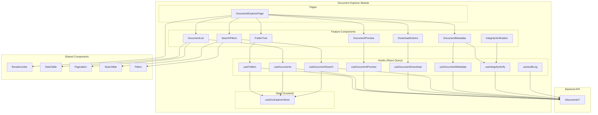

# Design Document: Document Explorer

## Overview

The Document Explorer is a frontend module for the admin portal that provides hierarchical navigation, search, preview, and download capabilities for all platform-generated documents. It integrates with an existing backend API to aggregate documents from multiple platform sources (reports, forms, certifications, incidents, safety evidence) into a unified browsing experience organized by configurable folder structures.

The module targets audit users who need to locate, verify, and download documents for regulatory compliance processes. It enforces role-based access control and tenant isolation consistent with the existing platform security model.

### Key Design Decisions

1. **Server-driven folder structure**: The virtual folder hierarchy is computed server-side based on document metadata and the user's selected organization mode. The frontend renders whatever structure the API returns rather than computing it locally.

2. **Lazy loading with pagination**: Folder contents are fetched on-demand as the user navigates. Documents within folders are paginated (50 per page) to handle large datasets.

3. **Side-panel preview**: Document preview uses a resizable side panel (not a modal) to allow context retention during audit workflows.

4. **Zustand for UI state, React Query for server state**: Navigation state (current path, selected documents, organization mode) lives in Zustand. All API data goes through React Query with appropriate cache invalidation.

5. **Reuse existing shared components**: Breadcrumbs, DataTable, Pagination, SearchBar, and Filters components are reused where possible, extended only when necessary.

## Architecture



### Route Structure

```
/documents                    → Root folder view
/documents?path=/Reports      → Navigate to specific folder
/documents?path=/Reports/SiteA/2024/03  → Deep navigation
```

The path is maintained as a query parameter to enable shareable URLs and browser history navigation. The route is protected with a `RoleGuard` using a new `documents.view` permission.

## Components and Interfaces

### Page Component

**`DocumentExplorerPage`** (`src/pages/documents/DocumentExplorerPage.tsx`)
- Entry point, lazy-loaded via router
- Composes: Breadcrumbs, SearchFilters, FolderTree/DocumentList, DocumentPreview side panel
- Layout: left panel (folder tree on desktop) + main content + right panel (preview)

### Feature Components

| Component | Location | Responsibility |
|-----------|----------|----------------|
| `FolderTree` | `src/features/document-explorer/FolderTree.tsx` | Renders folder hierarchy in sidebar, handles folder click navigation |
| `DocumentList` | `src/features/document-explorer/DocumentList.tsx` | Paginated table of documents in current folder using DataTable |
| `DocumentPreview` | `src/features/document-explorer/DocumentPreview.tsx` | Side panel rendering PDF/image preview via `<iframe>` or `` |
| `SearchFilters` | `src/features/document-explorer/SearchFilters.tsx` | Search input + filter dropdowns (type, date range, site) |
| `DownloadActions` | `src/features/document-explorer/DownloadActions.tsx` | Download button (single/batch), progress indicator, size validation |
| `DocumentMetadata` | `src/features/document-explorer/DocumentMetadata.tsx` | Detail panel showing full metadata + SHA-256 hash |
| `IntegrityVerification` | `src/features/document-explorer/IntegrityVerification.tsx` | Button + result display for hash verification |
| `FolderOrganizationSelector` | `src/features/document-explorer/FolderOrganizationSelector.tsx` | Dropdown to switch between `{Category}/{Site}/{Year}/{Month}` and `{Category}/{Year}/{Month}/{Site}` |
| `EmptyState` | `src/features/document-explorer/EmptyState.tsx` | Empty folder / no search results messaging |
| `DownloadProgressBar` | `src/features/document-explorer/DownloadProgressBar.tsx` | Download progress with percentage and ETA |

### Hooks

| Hook | File | Purpose |
|------|------|---------|
| `useFolders` | `hooks/useFolders.ts` | Fetch folder contents at a given path |
| `useDocuments` | `hooks/useDocuments.ts` | Fetch paginated documents for current folder |
| `useDocumentPreview` | `hooks/useDocumentPreview.ts` | Fetch preview URL (presigned S3 URL) for a document |
| `useDocumentDownload` | `hooks/useDocumentDownload.ts` | Initiate single/batch download, track progress |
| `useDocumentSearch` | `hooks/useDocumentSearch.ts` | Global search with debounce (500ms) |
| `useDocumentMetadata` | `hooks/useDocumentMetadata.ts` | Fetch full metadata for a document |
| `useIntegrityVerify` | `hooks/useIntegrityVerify.ts` | Trigger and poll integrity verification |
| `useAuditLog` | `hooks/useAuditLog.ts` | Log download events (called on successful download) |
| `useOrganizationMode` | `hooks/useOrganizationMode.ts` | Get/set folder organization preference |

### Zustand Store

**`useDocExplorerStore`** (`src/features/document-explorer/store.ts`)

```typescript
interface DocExplorerState {
  // Navigation
  currentPath: string[];
  navigateTo: (path: string[]) => void;
  navigateUp: () => void;

  // Selection
  selectedDocumentIds: Set<string>;
  toggleDocumentSelection: (id: string) => void;
  selectAll: (ids: string[]) => void;
  clearSelection: () => void;

  // Preview
  previewDocumentId: string | null;
  openPreview: (id: string) => void;
  closePreview: () => void;

  // Search & Filters
  searchTerm: string;
  setSearchTerm: (term: string) => void;
  filters: DocumentFilters;
  setFilters: (filters: Partial<DocumentFilters>) => void;
  clearFilters: () => void;
  isSearchActive: boolean;

  // Download
  activeDownload: DownloadProgress | null;
  setDownloadProgress: (progress: DownloadProgress | null) => void;

  // Organization
  organizationMode: OrganizationMode;
  setOrganizationMode: (mode: OrganizationMode) => void;
}
```

## Data Models

### TypeScript Types (`src/features/document-explorer/types.ts`)

```typescript
// === Enums and Literals ===

export type DocumentCategory =
  | 'reports'
  | 'forms'
  | 'certifications'
  | 'incidents'
  | 'safety_evidence';

export type OrganizationMode =
  | 'category_site_year_month'    // {Category}/{Site Name}/{Year}/{Month}
  | 'category_year_month_site';   // {Category}/{Year}/{Month}/{Site Name}

export type PreviewableFormat = 'application/pdf' | 'image/jpeg' | 'image/png';

// === Core Models ===

export interface FolderNode {
  id: string;
  name: string;
  path: string[];           // Full path segments from root
  childFolderCount: number;
  documentCount: number;
  lastUpdated: string;      // ISO 8601 with timezone
}

export interface DocumentSummary {
  id: string;
  name: string;
  category: DocumentCategory;
  mimeType: string;
  fileSize: number;         // bytes
  createdAt: string;        // ISO 8601 with timezone
  siteName: string;
  siteId: string;
  folderPath: string[];
}

export interface DocumentDetail extends DocumentSummary {
  creatorUserId: string;
  creatorUserName: string;
  tenantId: string;
  sha256Hash: string;
  downloadCount: number;
  lastDownloadedAt: string | null;
}

export interface DocumentMetadataResponse {
  document: DocumentDetail;
  integrityStatus: 'verified' | 'mismatch' | 'pending' | 'unavailable';
  lastVerifiedAt: string | null;
}

// === API Response Types ===

export interface FolderContentsResponse {
  currentPath: string[];
  folders: FolderNode[];
  documents: DocumentSummary[];
  totalDocuments: number;
  page: number;
  pageSize: number;
  totalPages: number;
}

export interface DocumentSearchResponse {
  results: (DocumentSummary & { matchFolderPath: string[] })[];
  total: number;
  page: number;
  pageSize: number;
}

export interface DownloadInitResponse {
  downloadId: string;
  downloadUrl: string;       // Presigned S3 URL
  expiresAt: string;
  totalSize: number;
  fileCount: number;
}

export interface BatchDownloadStatusResponse {
  downloadId: string;
  status: 'preparing' | 'ready' | 'failed' | 'expired';
  progress: number;          // 0-100
  downloadUrl?: string;
  errorMessage?: string;
  skippedDocuments?: { id: string; name: string; reason: string }[];
}

export interface IntegrityVerificationResponse {
  documentId: string;
  storedHash: string;
  computedHash: string;
  match: boolean;
  verifiedAt: string;
}

// === Filter Types ===

export interface DocumentFilters {
  category: DocumentCategory | null;
  dateFrom: string | null;    // ISO date
  dateTo: string | null;      // ISO date
  siteId: string | null;
}

// === Download Progress ===

export interface DownloadProgress {
  downloadId: string;
  status: 'initiating' | 'downloading' | 'packaging' | 'complete' | 'failed' | 'timeout';
  bytesDownloaded: number;
  totalBytes: number;
  startedAt: number;          // timestamp ms
  estimatedRemainingMs: number | null;
  errorMessage?: string;
}

// === Audit Log ===

export interface AuditLogEntry {
  eventType: 'download_single' | 'download_batch';
  documentIds: string[];
  userId: string;
  timestamp: string;          // ISO 8601 with timezone
}
```

### API Endpoints

All endpoints are prefixed with `/documents` and require Cognito authentication. Tenant isolation and role-based filtering are enforced server-side.

| Method | Path | Description | Request | Response |
|--------|------|-------------|---------|----------|
| GET | `/documents/folders` | List folder contents | `?path=Reports/SiteA&page=1&page_size=50&org_mode=category_site_year_month` | `FolderContentsResponse` |
| GET | `/documents/search` | Global search | `?q=safety&category=reports&date_from=2024-01-01&date_to=2024-12-31&site_id=xxx&page=1` | `DocumentSearchResponse` |
| GET | `/documents/{id}/metadata` | Full document metadata | — | `DocumentMetadataResponse` |
| GET | `/documents/{id}/preview` | Get presigned preview URL | — | `{ previewUrl: string, expiresAt: string }` |
| POST | `/documents/download` | Initiate download (single or batch) | `{ documentIds: string[] }` | `DownloadInitResponse` |
| GET | `/documents/download/{downloadId}/status` | Poll batch download status | — | `BatchDownloadStatusResponse` |
| POST | `/documents/{id}/verify-integrity` | Trigger integrity verification | — | `IntegrityVerificationResponse` |
| PUT | `/documents/preferences/organization-mode` | Set organization preference | `{ mode: OrganizationMode }` | `{ mode: OrganizationMode }` |
| GET | `/documents/preferences/organization-mode` | Get organization preference | — | `{ mode: OrganizationMode }` |

### Zod Schemas (`src/features/document-explorer/schemas.ts`)

```typescript
import { z } from 'zod';

export const documentCategorySchema = z.enum([
  'reports', 'forms', 'certifications', 'incidents', 'safety_evidence',
]);

export const organizationModeSchema = z.enum([
  'category_site_year_month',
  'category_year_month_site',
]);

export const documentFiltersSchema = z.object({
  category: documentCategorySchema.nullable(),
  dateFrom: z.string().nullable(),
  dateTo: z.string().nullable(),
  siteId: z.string().nullable(),
});

export const downloadRequestSchema = z.object({
  documentIds: z.array(z.string().uuid()).min(1).max(50),
});

export const folderNodeSchema = z.object({
  id: z.string(),
  name: z.string(),
  path: z.array(z.string()),
  childFolderCount: z.number().int().min(0),
  documentCount: z.number().int().min(0),
  lastUpdated: z.string(),
});

export const documentSummarySchema = z.object({
  id: z.string().uuid(),
  name: z.string(),
  category: documentCategorySchema,
  mimeType: z.string(),
  fileSize: z.number().int().positive(),
  createdAt: z.string(),
  siteName: z.string(),
  siteId: z.string(),
  folderPath: z.array(z.string()),
});

export const folderContentsResponseSchema = z.object({
  currentPath: z.array(z.string()),
  folders: z.array(folderNodeSchema),
  documents: z.array(documentSummarySchema),
  totalDocuments: z.number().int().min(0),
  page: z.number().int().positive(),
  pageSize: z.number().int().positive(),
  totalPages: z.number().int().min(0),
});
```


## Correctness Properties

*A property is a characteristic or behavior that should hold true across all valid executions of a system — essentially, a formal statement about what the system should do. Properties serve as the bridge between human-readable specifications and machine-verifiable correctness guarantees.*

### Property 1: Folder contents are sorted alphabetically

*For any* array of folder nodes and document summaries returned for a folder, the displayed items SHALL be ordered alphabetically by name (case-insensitive), with folders appearing before documents.

**Validates: Requirements 1.2**

### Property 2: Breadcrumb path completeness

*For any* valid navigation path of depth 1 to 5, the breadcrumb generation function SHALL produce an ordered array of segments where each segment corresponds to an ancestor folder from root to the current folder, and the length of the breadcrumb array equals the path depth plus one (for root).

**Validates: Requirements 1.3**

### Property 3: Document list renders all required fields

*For any* valid DocumentSummary object, the list row rendering SHALL include the document name, document type (category), creation date, associated site name, and file size — none of these fields may be omitted from the rendered output.

**Validates: Requirements 2.1**

### Property 4: Default document sort is descending by creation date

*For any* array of documents displayed in a folder, the default sort order SHALL produce a sequence where each document's createdAt is greater than or equal to the createdAt of the next document in the list.

**Validates: Requirements 2.2**

### Property 5: Preview eligibility classification

*For any* document, the isPreviewable function SHALL return true if and only if the document's mimeType is one of 'application/pdf', 'image/jpeg', or 'image/png'. For all other mime types, it SHALL return false.

**Validates: Requirements 2.3, 2.4**

### Property 6: Batch download size validation

*For any* set of 1 to 50 selected documents, the download validation function SHALL allow the download if and only if the sum of all selected documents' fileSize values is less than or equal to 500 * 1024 * 1024 bytes (500 MB). It SHALL reject the download otherwise.

**Validates: Requirements 3.2, 3.5**

### Property 7: Download progress calculation

*For any* DownloadProgress state where totalBytes > 0 and bytesDownloaded >= 0 and bytesDownloaded <= totalBytes, the percentage calculation SHALL equal (bytesDownloaded / totalBytes) * 100, and the estimated remaining time SHALL be non-negative when the elapsed time is positive.

**Validates: Requirements 3.3**

### Property 8: Case-insensitive partial name matching

*For any* document name and any contiguous substring of that name (regardless of character case), the client-side search match function SHALL return true. For any string that is NOT a substring of the document name (ignoring case), it SHALL return false.

**Validates: Requirements 4.1**

### Property 9: Search trigger minimum length gate

*For any* search input string, the search SHALL be triggered if and only if the string's trimmed length is greater than or equal to 2. Strings with trimmed length less than 2 SHALL NOT trigger a search request.

**Validates: Requirements 4.2, 4.7**

### Property 10: Conjunctive filter intersection

*For any* set of documents and any combination of active filters (category, dateFrom, dateTo, siteId), the filtered result set SHALL contain only documents that satisfy ALL active filter criteria simultaneously. A null filter value means that criterion is not applied.

**Validates: Requirements 4.4**

### Property 11: Role-based access check

*For any* user role value, the document explorer access check SHALL return true if and only if the role is one of 'platform_admin', 'tenant_admin', 'site_admin', 'supervisor', or 'cso'. For all other role values, it SHALL return false.

**Validates: Requirements 5.1, 5.3**

### Property 12: Organization mode path computation

*For any* document with a valid category, siteName, and createdAt date, applying the organization mode 'category_site_year_month' SHALL produce the path `[category, siteName, year, month]`, and applying 'category_year_month_site' SHALL produce the path `[category, year, month, siteName]`, where year and month are derived from the document's createdAt.

**Validates: Requirements 6.6, 6.7**

### Property 13: Folder node displays count and timestamp

*For any* valid FolderNode object, the folder display rendering SHALL include both the documentCount value and the lastUpdated timestamp formatted in ISO 8601.

**Validates: Requirements 7.2**

### Property 14: Document metadata with partial availability

*For any* DocumentDetail object where some fields may be null, the metadata display SHALL render present (non-null) fields with their values and SHALL render null fields with an "unavailable" indicator. The set of rendered fields plus unavailable indicators SHALL cover all expected metadata fields (timestamp, creator, site, type, hash).

**Validates: Requirements 7.1, 7.4**

## Error Handling

### Network Errors

| Scenario | Behavior |
|----------|----------|
| Folder contents fetch fails | Display error banner within the content area with retry button. Breadcrumb navigation is preserved so user can navigate to parent folders. |
| Document list fetch fails | Display error message in document list area with retry button. |
| Search request fails | Display inline error below search bar. Previous results remain visible. |
| Download initiation fails | Toast notification with error message. Document selection is preserved for retry. |
| Download times out (>120s) | Cancel download, show timeout error with retry button. Selection preserved. |
| Preview fetch fails | Show "Preview unavailable" in the side panel with option to download instead. |
| Integrity verification fails | Show "Verification unavailable" message in metadata panel. |
| Organization mode save fails | Show toast error. Revert to previous mode in UI. |

### Error State Design Principles

1. **Never lose navigation context**: Errors in sub-operations (preview, download, search) should not affect the folder navigation state.
2. **Preserve user intent**: Failed downloads preserve document selection. Failed searches preserve the search term.
3. **Graceful degradation**: If metadata is partially unavailable, show what's available and mark missing fields.
4. **Retry-friendly**: All error states include a retry action that reissues the same request.

### HTTP Status Code Handling

| Status | Frontend Behavior |
|--------|-------------------|
| 401 | Redirect to login (handled by global interceptor) |
| 403 | Redirect to dashboard with "unauthorized" toast |
| 404 | Show "folder/document not found" and navigate to parent |
| 413 | Show "file too large" message (batch download exceeded) |
| 429 | Show "too many requests, try again shortly" with auto-retry after delay |
| 500+ | Show generic error with retry option |

## Testing Strategy

### Unit Tests (Vitest + Testing Library)

Unit tests cover specific examples, edge cases, and component rendering:

- **Component rendering**: Verify each component renders correctly with mock data
- **Empty states**: Test empty folder, no search results, no preview available
- **Error states**: Test error messages and retry buttons appear correctly
- **Navigation**: Test breadcrumb click, folder click, back navigation
- **Selection**: Test single/multi select, select all, clear selection
- **Download UI**: Test progress bar rendering, timeout handling, partial failure summary

### Property-Based Tests (fast-check)

Property-based tests verify universal properties across generated inputs. Each test runs a minimum of 100 iterations.

**Library**: `fast-check` (already in devDependencies)

**Configuration**:
- Minimum 100 iterations per property
- Each test tagged with property reference comment

**Tag format**: `// Feature: document-explorer, Property {N}: {title}`

Properties to implement:
1. Folder contents alphabetical sort
2. Breadcrumb path completeness
3. Document list field completeness
4. Default date descending sort
5. Preview eligibility classification
6. Batch download size validation
7. Download progress calculation
8. Case-insensitive partial matching
9. Search trigger minimum length
10. Conjunctive filter intersection
11. Role-based access check
12. Organization mode path computation
13. Folder node count/timestamp display
14. Metadata partial availability

### Integration Tests

Integration tests verify API interaction patterns with MSW (Mock Service Worker):

- Folder navigation flows (root → child → grandchild → breadcrumb back)
- Search with debounce behavior
- Download flow (initiate → poll status → complete)
- Filter combination with API query params
- Organization mode switch and persistence
- Error recovery flows

### Test File Structure

```
src/features/document-explorer/
├── __tests__/
│   ├── properties/
│   │   ├── sorting.property.test.ts
│   │   ├── breadcrumbs.property.test.ts
│   │   ├── preview.property.test.ts
│   │   ├── download.property.test.ts
│   │   ├── search.property.test.ts
│   │   ├── filters.property.test.ts
│   │   ├── access.property.test.ts
│   │   ├── organization.property.test.ts
│   │   └── metadata.property.test.ts
│   ├── DocumentExplorerPage.test.tsx
│   ├── FolderTree.test.tsx
│   ├── DocumentList.test.tsx
│   ├── DocumentPreview.test.tsx
│   ├── SearchFilters.test.tsx
│   ├── DownloadActions.test.tsx
│   └── DocumentMetadata.test.tsx
```
