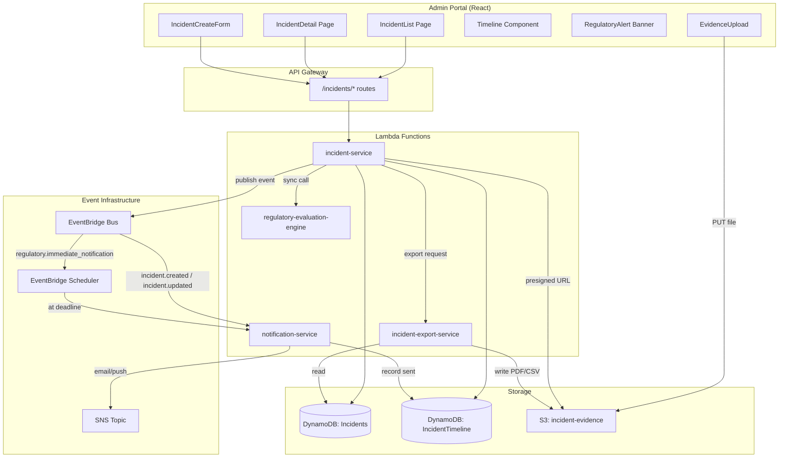
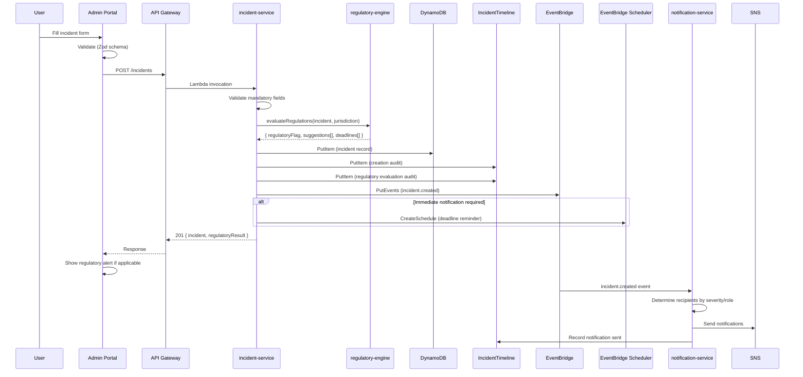
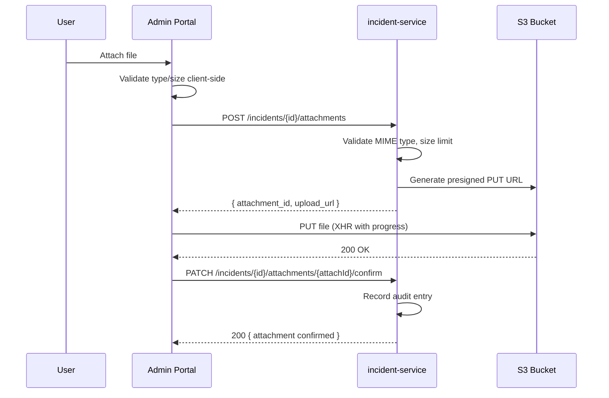

# Technical Design: Incident Reporting Module

## Overview

This design describes the Incident Reporting module for ClearSite — a full-stack feature enabling construction organizations to record, manage, and track safety incidents with regulatory compliance support for OSHA (US) and WorkSafeBC (British Columbia, Canada).

The module spans the entire stack: a new `incident-service` Lambda for backend CRUD and business logic, a synchronous `regulatory-evaluation-engine` Lambda for rule evaluation, EventBridge Scheduler for deadline-based notifications, S3 for evidence storage, and a React feature module in the admin portal.

### Key Design Decisions

1. **Cost-effective event-driven architecture** — Uses Lambda + EventBridge for workflow orchestration instead of Step Functions. Regulatory evaluation runs synchronously during incident creation/update. EventBridge Scheduler handles deadline-based notifications (72h WorkSafeBC, 8h/24h OSHA reminders).
2. **Single DynamoDB table for incidents** — Follows the existing single-table pattern with composite keys (PK/SK) and GSIs for access patterns like listing by site, by status, and by regulatory flag.
3. **Dedicated incident timeline table** — A separate append-only table (`IncidentTimeline`) ensures immutability of audit records. No update/delete operations are permitted on this table.
4. **Synchronous regulatory evaluation** — The Regulatory Engine is a pure function invoked synchronously during incident create/update. No external API calls, no async overhead — just rule evaluation against jurisdiction and boolean indicators.
5. **EventBridge Scheduler for deadlines** — When the Regulatory Engine identifies a time-sensitive obligation, an EventBridge one-time schedule is created to trigger reminder notifications at the appropriate deadline (8h, 24h, 72h).
6. **S3 presigned URLs for evidence** — Same pattern as certification uploads: POST metadata to API (returns presigned URL), then PUT file directly to S3.
7. **Collocated frontend feature module** — All incident components live under `src/features/incidents/` following the existing certifications pattern.

## Architecture



### Sequence: Incident Creation with Regulatory Evaluation



### Sequence: Evidence Upload



## Components and Interfaces

### Backend: New Lambda Functions

| Lambda | Path | Responsibility |
|--------|------|----------------|
| `incident-service` | `src/services/incidents/handler.ts` | CRUD operations, state transitions, comments, persons, attachments |
| `regulatory-evaluation-engine` | `src/services/incidents/regulatory-engine.ts` | Pure function: evaluates regulatory rules based on jurisdiction + indicators |
| `incident-export-service` | `src/services/incidents/export-handler.ts` | Generates CSV/PDF exports, OSHA Form 300/301 data |

### Backend: New Modules

| Module | Path | Responsibility |
|--------|------|----------------|
| `incident-repository.ts` | `src/services/incidents/incident-repository.ts` | DynamoDB operations for incidents |
| `timeline-repository.ts` | `src/services/incidents/timeline-repository.ts` | Append-only timeline operations |
| `state-machine.ts` | `src/services/incidents/state-machine.ts` | Validates state transitions |
| `validators.ts` | `src/services/incidents/validators.ts` | Zod schemas for all request payloads |
| `types.ts` | `src/services/incidents/types.ts` | TypeScript interfaces and enums |
| `deadline-scheduler.ts` | `src/services/incidents/deadline-scheduler.ts` | Creates/cancels EventBridge schedules |

### Frontend: New Components

| Component | Path | Responsibility |
|-----------|------|----------------|
| `IncidentListPage` | `src/features/incidents/IncidentListPage.tsx` | List view with filters, status badges, regulatory indicators |
| `IncidentDetailPage` | `src/features/incidents/IncidentDetailPage.tsx` | Full incident view with tabs (details, timeline, regulatory, evidence) |
| `IncidentCreateForm` | `src/features/incidents/IncidentCreateForm.tsx` | Multi-step creation form with regulatory indicators |
| `IncidentEditForm` | `src/features/incidents/IncidentEditForm.tsx` | Edit form for existing incidents |
| `TimelineView` | `src/features/incidents/TimelineView.tsx` | Chronological audit trail display |
| `RegulatoryAlertBanner` | `src/features/incidents/RegulatoryAlertBanner.tsx` | Fixed-position warning banner for immediate notifications |
| `EvidenceUpload` | `src/features/incidents/EvidenceUpload.tsx` | File upload with progress, validation, camera capture |
| `PersonsInvolvedPanel` | `src/features/incidents/PersonsInvolvedPanel.tsx` | Add/remove persons with role selection |
| `CommentsSection` | `src/features/incidents/CommentsSection.tsx` | Chronological comments with add form |
| `StateTransitionButton` | `src/features/incidents/StateTransitionButton.tsx` | Shows valid transitions, handles state changes |
| `RegulatoryDataForm` | `src/features/incidents/RegulatoryDataForm.tsx` | OSHA/WorkSafeBC specific data capture |
| `ExportPanel` | `src/features/incidents/ExportPanel.tsx` | Export options (CSV, PDF, OSHA log) |
| `LegalDisclaimer` | `src/features/incidents/LegalDisclaimer.tsx` | Regulatory disclaimer with session acknowledgment |

### Frontend: New Hooks

| Hook | Path | Responsibility |
|------|------|----------------|
| `useIncidents` | `src/features/incidents/hooks/useIncidents.ts` | List incidents with filters/pagination |
| `useIncident` | `src/features/incidents/hooks/useIncident.ts` | Single incident detail |
| `useCreateIncident` | `src/features/incidents/hooks/useCreateIncident.ts` | Create mutation |
| `useUpdateIncident` | `src/features/incidents/hooks/useUpdateIncident.ts` | Update mutation |
| `useIncidentTimeline` | `src/features/incidents/hooks/useIncidentTimeline.ts` | Timeline query |
| `useIncidentComments` | `src/features/incidents/hooks/useIncidentComments.ts` | Comments CRUD |
| `useEvidenceUpload` | `src/features/incidents/hooks/useEvidenceUpload.ts` | S3 upload with progress |
| `useStateTransition` | `src/features/incidents/hooks/useStateTransition.ts` | State change mutation |
| `useRegulatoryData` | `src/features/incidents/hooks/useRegulatoryData.ts` | Regulatory form data |

### API Routes (incident-service Lambda)

| Method | Path | Auth | Description |
|--------|------|------|-------------|
| POST | `/incidents` | Cognito | Create incident |
| GET | `/incidents` | Cognito | List incidents (filtered by role/site) |
| GET | `/incidents/{id}` | Cognito | Get incident detail |
| PATCH | `/incidents/{id}` | Cognito | Update incident fields |
| PATCH | `/incidents/{id}/state` | Cognito | Transition state |
| PATCH | `/incidents/{id}/severity` | Cognito | Change severity |
| PATCH | `/incidents/{id}/regulatory-flag` | Cognito | Change regulatory flag |
| PATCH | `/incidents/{id}/external-status` | Cognito | Change external report status |
| POST | `/incidents/{id}/comments` | Cognito | Add comment |
| GET | `/incidents/{id}/comments` | Cognito | List comments |
| POST | `/incidents/{id}/persons` | Cognito | Add involved person |
| DELETE | `/incidents/{id}/persons/{personId}` | Cognito | Remove involved person |
| POST | `/incidents/{id}/attachments` | Cognito | Initiate attachment upload |
| PATCH | `/incidents/{id}/attachments/{attachId}/confirm` | Cognito | Confirm upload complete |
| GET | `/incidents/{id}/timeline` | Cognito | Get audit timeline |
| POST | `/incidents/{id}/close` | Cognito | Close incident |
| POST | `/incidents/{id}/reopen` | Cognito | Reopen incident |
| POST | `/incidents/{id}/regulatory-data` | Cognito | Save OSHA/WorkSafeBC form data |
| GET | `/incidents/{id}/regulatory-data` | Cognito | Get regulatory form data |
| POST | `/incidents/export` | Cognito | Generate export (CSV/PDF) |
| GET | `/incidents/{id}/worksafebc-summary` | Cognito | WorkSafeBC emergency summary |
| POST | `/incidents/{id}/worksafebc-summary/export` | Cognito | Export WorkSafeBC PDF |
| GET | `/incidents/osha-300a` | Cognito | OSHA Form 300A annual summary |

## Data Models

### DynamoDB Table: Incidents

**Table Name:** `{prefix}Incidents`

**Key Schema:**
- PK: `TENANT#{tenant_id}`
- SK: `INCIDENT#{incident_id}`

**GSI1 (by site):**
- GSI1PK: `TENANT#{tenant_id}#SITE#{site_id}`
- GSI1SK: `{created_at}`

**GSI2 (by status):**
- GSI2PK: `TENANT#{tenant_id}#STATUS#{status}`
- GSI2SK: `{created_at}`

**GSI3 (by regulatory flag):**
- GSI3PK: `TENANT#{tenant_id}#REGFLAG#{regulatory_flag}`
- GSI3SK: `{created_at}`

```typescript
// src/services/incidents/types.ts

export enum IncidentType {
  INJURY = 'injury',
  ILLNESS = 'illness',
  NEAR_MISS = 'near_miss',
  UNSAFE_CONDITION = 'unsafe_condition',
  PROPERTY_DAMAGE = 'property_damage',
  ENVIRONMENTAL = 'environmental',
  FIRE_EXPLOSION = 'fire_explosion',
  STRUCTURAL_FAILURE = 'structural_failure',
  HAZARDOUS_SUBSTANCE = 'hazardous_substance',
  REGULATORY_NON_COMPLIANCE = 'regulatory_non_compliance',
  OTHER = 'other',
}

export enum OperationalSeverity {
  LOW = 'low',
  MEDIUM = 'medium',
  HIGH = 'high',
  CRITICAL = 'critical',
}

export enum RegulatoryFlag {
  INTERNAL_ONLY = 'internal_only',
  POTENTIALLY_REPORTABLE = 'potentially_reportable',
  IMMEDIATELY_REPORTABLE = 'immediately_reportable',
}

export enum IncidentStatus {
  OPEN = 'open',
  UNDER_REVIEW = 'under_review',
  REGULATORY_REVIEW = 'regulatory_review',
  ACTION_REQUIRED = 'action_required',
  RESOLVED = 'resolved',
  CLOSED = 'closed',
}

export enum ExternalReportStatus {
  NOT_REPORTABLE = 'not_reportable',
  POTENTIALLY_REPORTABLE = 'potentially_reportable',
  REPORTED_WORKSAFEBC = 'reported_worksafebc',
  REPORTED_OSHA = 'reported_osha',
  EXTERNAL_REPORT_PENDING = 'external_report_pending',
  EXTERNAL_REPORT_NOT_APPLICABLE = 'external_report_not_applicable',
}

export enum InvolvementType {
  INJURED_WORKER = 'injured_worker',
  WITNESS = 'witness',
  SUPERVISOR_PRESENT = 'supervisor_present',
  ASSOCIATED_CONTRACTOR = 'associated_contractor',
}

export enum OshaRecordability {
  FIRST_AID_ONLY = 'first_aid_only',
  MEDICAL_TREATMENT = 'medical_treatment',
  DAYS_AWAY = 'days_away',
  RESTRICTED_WORK = 'restricted_work',
  JOB_TRANSFER = 'job_transfer',
  FATALITY = 'fatality',
}

export enum OshaCaseOutcome {
  DEATH = 'death',
  DAYS_AWAY_FROM_WORK = 'days_away_from_work',
  RESTRICTED_WORK = 'restricted_work',
  JOB_TRANSFER = 'job_transfer',
  OTHER_RECORDABLE = 'other_recordable',
}

export interface RegulatoryIndicators {
  medical_treatment_beyond_first_aid: boolean;
  lost_time: boolean;
  hospitalization: boolean;
  fatality: boolean;
  amputation: boolean;
  loss_of_eye: boolean;
  structural_collapse: boolean;
  hazardous_substance_release: boolean;
  fire_or_explosion: boolean;
}

export interface IncidentRecord {
  incident_id: string;
  tenant_id: string;
  site_id: string;
  title: string;
  description: string;
  incident_type: IncidentType;
  other_type_description?: string;
  incident_datetime: string; // ISO 8601
  report_datetime: string;   // ISO 8601
  location: string;
  persons_involved_count: number;
  reporting_user_id: string;
  reporting_user_name: string;
  severity: OperationalSeverity;
  regulatory_flag: RegulatoryFlag;
  status: IncidentStatus;
  external_report_status: ExternalReportStatus;
  regulatory_indicators: RegulatoryIndicators;
  jurisdiction: string;
  osha_recordability?: OshaRecordability;
  resolution_notes?: string;
  closure_date?: string;
  closed_by?: string;
  reopen_justification?: string;
  created_at: string;
  updated_at: string;
}

export interface InvolvedPerson {
  person_id: string;
  incident_id: string;
  tenant_id: string;
  full_name: string;
  involvement_type: InvolvementType;
  organization: string;
  worker_id?: string; // Optional link to ClearSite worker
}

export interface IncidentAttachment {
  attachment_id: string;
  incident_id: string;
  tenant_id: string;
  file_name: string;
  mime_type: string;
  size_bytes: number;
  s3_key: string;
  uploaded_by: string;
  confirmed: boolean;
  created_at: string;
}

export interface IncidentComment {
  comment_id: string;
  incident_id: string;
  tenant_id: string;
  author_id: string;
  author_name: string;
  content: string;
  created_at: string;
}
```

### DynamoDB Table: IncidentTimeline (Append-Only)

**Table Name:** `{prefix}IncidentTimeline`

**Key Schema:**
- PK: `INCIDENT#{incident_id}`
- SK: `EVENT#{timestamp}#{event_id}`

```typescript
export enum TimelineEventType {
  CREATION = 'creation',
  SEVERITY_CHANGE = 'severity_change',
  STATE_CHANGE = 'state_change',
  REGULATORY_EVALUATION = 'regulatory_evaluation',
  REGULATORY_REVIEW_CONFIRMATION = 'regulatory_review_confirmation',
  EXTERNAL_STATUS_CHANGE = 'external_status_change',
  ATTACHMENT_ADDED = 'attachment_added',
  COMMENT_ADDED = 'comment_added',
  PERSON_ADDED = 'person_added',
  PERSON_REMOVED = 'person_removed',
  CLOSURE = 'closure',
  REOPENING = 'reopening',
  NOTIFICATION_SENT = 'notification_sent',
  FIELD_UPDATED = 'field_updated',
  REGULATORY_FLAG_CHANGE = 'regulatory_flag_change',
  RECORDABILITY_CHANGE = 'recordability_change',
}

export interface TimelineEvent {
  event_id: string;
  incident_id: string;
  tenant_id: string;
  event_type: TimelineEventType;
  actor_id: string;
  actor_name: string;
  data: Record<string, unknown>; // Change-specific data (previous/new values)
  timestamp: string; // ISO 8601 UTC
}
```

### DynamoDB Table: IncidentRegulatoryData

**Table Name:** `{prefix}IncidentRegulatoryData`

**Key Schema:**
- PK: `INCIDENT#{incident_id}`
- SK: `REGDATA#{type}` (type = "worksafebc_employer" | "osha_300" | "worksafebc_emergency")

```typescript
export interface WorkSafeBCEmployerReport {
  employer_name: string;
  employer_address: string;
  employer_phone: string;
  worksafebc_account_number: string;
  worker_name: string;
  worker_address: string;
  worker_date_of_birth: string;
  worker_occupation: string;
  worker_hire_date: string;
  incident_description: string;
  body_part_affected: string;
  nature_of_injury: string;
  days_shifts_lost: number;
  modified_work_proposal?: string;
  worker_earnings_data?: string;
  is_complete: boolean;
  last_updated: string;
}

export interface OshaRecordingData {
  case_identifier: string;
  worker_name: string;
  job_title: string;
  incident_date: string;
  location_within_site: string;
  injury_illness_description: string;
  case_outcome: OshaCaseOutcome;
  days_away_from_work: number;
  days_restricted_work: number;
  is_complete: boolean;
  last_updated: string;
}
```

### Regulatory Engine: Rule Evaluation

```typescript
// src/services/incidents/regulatory-engine.ts

export interface RegulatoryEvaluationInput {
  indicators: RegulatoryIndicators;
  jurisdiction: string;
  incident_datetime: string;
}

export interface RegulatoryEvaluationResult {
  regulatory_flag: RegulatoryFlag;
  suggestions: RegulatorySuggestion[];
  deadlines: RegulatoryDeadline[];
  applied_rules: string[];
}

export interface RegulatorySuggestion {
  authority: 'OSHA' | 'WorkSafeBC';
  action: string;
  urgency: 'immediate' | 'within_deadline' | 'informational';
  deadline_hours?: number;
  rule_reference: string;
}

export interface RegulatoryDeadline {
  authority: 'OSHA' | 'WorkSafeBC';
  deadline_hours: number;
  deadline_from: 'incident_time' | 'employer_knowledge';
  absolute_deadline: string; // ISO 8601 computed datetime
  description: string;
}
```

### State Machine: Valid Transitions

```typescript
// src/services/incidents/state-machine.ts

export const VALID_TRANSITIONS: Record<IncidentStatus, IncidentStatus[]> = {
  [IncidentStatus.OPEN]: [IncidentStatus.UNDER_REVIEW, IncidentStatus.REGULATORY_REVIEW],
  [IncidentStatus.UNDER_REVIEW]: [IncidentStatus.ACTION_REQUIRED, IncidentStatus.RESOLVED],
  [IncidentStatus.REGULATORY_REVIEW]: [IncidentStatus.ACTION_REQUIRED, IncidentStatus.RESOLVED],
  [IncidentStatus.ACTION_REQUIRED]: [IncidentStatus.RESOLVED],
  [IncidentStatus.RESOLVED]: [IncidentStatus.CLOSED],
  [IncidentStatus.CLOSED]: [IncidentStatus.OPEN], // Reopening
};

export function isValidTransition(from: IncidentStatus, to: IncidentStatus): boolean {
  return VALID_TRANSITIONS[from]?.includes(to) ?? false;
}

export function getValidTransitions(from: IncidentStatus): IncidentStatus[] {
  return VALID_TRANSITIONS[from] ?? [];
}
```

### Frontend Validation Schemas

```typescript
// src/features/incidents/schemas.ts
import { z } from 'zod';

export const ALLOWED_EVIDENCE_TYPES = [
  'image/jpeg', 'image/png', 'image/heic',
  'video/mp4', 'video/quicktime',
  'application/pdf',
] as const;

export const MAX_FILE_SIZE = 50 * 1024 * 1024; // 50 MB
export const MAX_VIDEO_DURATION_SECONDS = 60;

export const incidentCreateSchema = z.object({
  title: z.string().min(1, 'Title is required').max(200, 'Title must not exceed 200 characters'),
  description: z.string().min(1, 'Description is required').max(5000, 'Description must not exceed 5000 characters'),
  incident_type: z.nativeEnum(IncidentType),
  other_type_description: z.string().min(10).max(500).optional(),
  incident_datetime: z.string().min(1, 'Incident date/time is required'),
  site_id: z.string().min(1, 'Site is required'),
  location: z.string().min(1, 'Location is required'),
  persons_involved_count: z.number().int().min(0, 'Must be zero or greater'),
  severity: z.nativeEnum(OperationalSeverity),
  jurisdiction: z.string().optional(), // Required only if site has no configured jurisdiction
  regulatory_indicators: z.object({
    medical_treatment_beyond_first_aid: z.boolean().default(false),
    lost_time: z.boolean().default(false),
    hospitalization: z.boolean().default(false),
    fatality: z.boolean().default(false),
    amputation: z.boolean().default(false),
    loss_of_eye: z.boolean().default(false),
    structural_collapse: z.boolean().default(false),
    hazardous_substance_release: z.boolean().default(false),
    fire_or_explosion: z.boolean().default(false),
  }),
}).refine(
  (data) => data.incident_type !== IncidentType.OTHER || (data.other_type_description && data.other_type_description.length >= 10),
  { message: 'Custom type description must be at least 10 characters', path: ['other_type_description'] }
);

export const commentSchema = z.object({
  content: z.string().min(1, 'Comment cannot be empty').max(5000, 'Comment must not exceed 5000 characters'),
});

export const closureSchema = z.object({
  resolution_notes: z.string().min(20, 'Resolution notes must be at least 20 characters'),
});

export const reopenSchema = z.object({
  justification: z.string().min(20, 'Reopening justification must be at least 20 characters'),
});
```


## Correctness Properties

*A property is a characteristic or behavior that should hold true across all valid executions of a system — essentially, a formal statement about what the system should do. Properties serve as the bridge between human-readable specifications and machine-verifiable correctness guarantees.*

### Property 1: Incident creation produces correct initial state

*For any* valid set of mandatory incident fields, creating an incident SHALL produce a record with status "open", a valid UUID v4 as incident_id, and a creation timestamp in ISO 8601 UTC format.

**Validates: Requirements 1.1**

### Property 2: Missing mandatory fields are rejected with field identification

*For any* incident creation payload that is missing at least one mandatory field (title, description, incident_type, incident_datetime, report_datetime, site_id, severity, persons_involved_count, regulatory_indicators), the createIncidentSchema SHALL reject the payload and the error SHALL identify the missing field(s).

**Validates: Requirements 1.3, 3.1**

### Property 3: "Other" incident type requires description of minimum length

*For any* incident creation payload where incident_type is "other", the createIncidentSchema SHALL accept the payload if and only if other_type_description is present and has length >= 10 characters. Payloads with type "other" and missing or short description SHALL be rejected.

**Validates: Requirements 2.3**

### Property 4: Regulatory indicators default to false when omitted

*For any* partial regulatory indicators object (with some fields omitted), parsing through regulatoryIndicatorsSchema SHALL produce an object where all omitted fields have the value `false`.

**Validates: Requirements 3.3**

### Property 5: State transition validity is determined by the transition map

*For any* pair of incident statuses (from, to), `isValidTransition(from, to)` SHALL return true if and only if the pair is in the defined VALID_TRANSITIONS map. Additionally, `getValidTransitions(from)` SHALL return exactly the set of allowed target states for the given source state.

**Validates: Requirements 5.2, 5.4**

### Property 6: Regulatory engine OSHA rules

*For any* incident with jurisdiction "us_state": (a) if fatality is true, the result SHALL contain a rule with deadline_hours=8 and suggested_flag="immediately_reportable"; (b) if hospitalization, amputation, or loss_of_eye is true, the result SHALL contain a rule with deadline_hours=24; (c) if medical_treatment_beyond_first_aid or lost_time is true, osha_recordable SHALL be true.

**Validates: Requirements 6.1, 6.2, 6.5**

### Property 7: Regulatory engine WorkSafeBC rules

*For any* incident with jurisdiction "british_columbia": (a) if fatality, structural_collapse, hazardous_substance_release, or fire_or_explosion is true, the result SHALL contain a rule with deadline_hours=0 (immediate) and suggested_flag="immediately_reportable"; (b) if medical_treatment_beyond_first_aid or lost_time is true, the result SHALL contain a rule with deadline_hours=72.

**Validates: Requirements 6.3, 6.4**

### Property 8: Attachment validation accepts valid files and rejects invalid ones

*For any* file metadata: (a) the createAttachmentSchema SHALL accept the file if and only if its mime_type is in the allowed list AND size_bytes <= 50 MB; (b) for video MIME types, the schema SHALL additionally reject if duration_seconds > 60.

**Validates: Requirements 12.1, 12.2, 12.3, 12.5**

### Property 9: Empty or whitespace-only comments are rejected

*For any* string composed entirely of whitespace (including empty string), the addCommentSchema SHALL reject it. For any non-empty trimmed string of length 1-5000, the schema SHALL accept it.

**Validates: Requirements 14.4**

### Property 10: Closure requires resolution notes of minimum length

*For any* string, the closeIncidentSchema SHALL accept it if and only if its trimmed length is >= 20 characters. Strings shorter than 20 characters (after trimming) SHALL be rejected.

**Validates: Requirements 19.1, 19.2**

### Property 11: Reopen requires justification of minimum length

*For any* string, the reopenIncidentSchema SHALL accept it if and only if its trimmed length is >= 20 characters. Strings shorter than 20 characters (after trimming) SHALL be rejected.

**Validates: Requirements 20.1, 20.3**

### Property 12: Role-based incident visibility filtering

*For any* list of incidents across multiple sites and any user with a given role and assigned_sites: (a) tenant_admin and cso SHALL see all incidents in their tenant; (b) site_admin and supervisor SHALL see only incidents for their assigned sites; (c) users with role "worker" or "gate_operator" SHALL see no incidents.

**Validates: Requirements 21.5**

### Property 13: Regulatory engine produces no rules when no indicators are active

*For any* jurisdiction, when all regulatory indicators are false, the evaluateRegulatory function SHALL return suggested_flag="internal_only", an empty deadlines array, and osha_recordable=false.

**Validates: Requirements 6.1, 6.2, 6.3, 6.4, 6.5**

### Property 14: Deadline computation correctness

*For any* valid ISO 8601 reference time and any positive number of hours, computeDeadline SHALL return a timestamp exactly that many hours after the reference time.

**Validates: Requirements 6.1, 6.2, 6.3**

## Error Handling

### API Errors

| Scenario | HTTP Code | Error Code | Handling |
|----------|-----------|------------|----------|
| Missing mandatory fields | 400 | BAD_REQUEST | Return Zod validation errors with field-level messages |
| Invalid state transition | 422 | UNPROCESSABLE_ENTITY | Return current state and list of valid transitions |
| Incident not found | 404 | NOT_FOUND | "Incident not found" |
| Insufficient permissions | 403 | FORBIDDEN | "You do not have permission to perform this action" |
| Tenant isolation violation | 403 | FORBIDDEN | "Access denied" (no resource existence leak) |
| Attachment too large | 400 | BAD_REQUEST | "File must not exceed 50 MB" |
| Invalid MIME type | 400 | BAD_REQUEST | "File type must be one of: ..." |
| Video too long | 400 | BAD_REQUEST | "Video duration must not exceed 60 seconds" |
| Closure without resolution notes | 400 | BAD_REQUEST | "Resolution notes must be at least 20 characters" |
| Reopen without justification | 400 | BAD_REQUEST | "Reopening justification must be at least 20 characters" |
| Close from non-Resolved state | 422 | UNPROCESSABLE_ENTITY | "Cannot close incident: must be in Resolved state" |
| Reopen from non-Closed state | 422 | UNPROCESSABLE_ENTITY | "Cannot reopen incident: must be in Closed state" |
| S3 signed URL generation fails | 500 | INTERNAL_ERROR | "Failed to generate upload URL" |
| DynamoDB write fails | 500 | INTERNAL_ERROR | "An unexpected error occurred" |

### Frontend Error Handling

| Scenario | Handling |
|----------|----------|
| GET incidents list fails | Show `ErrorDisplay` with "Retry" button |
| POST incident fails (4xx) | Display validation errors inline in form; form stays open |
| POST incident fails (5xx) | Display generic "Server error, please try again" toast |
| PATCH state transition fails (422) | Show toast with valid transitions from error response |
| S3 PUT fails (first attempt) | Retry once automatically |
| S3 PUT fails (retry) | Show error toast: "File upload failed. Please try again." |
| Export generation fails | Show error toast with retry option |
| Comment submission fails | Show inline error, preserve comment text |

### Optimistic Updates

- State transitions use optimistic updates with rollback on error
- Comments are appended optimistically; rolled back if POST fails
- `onMutate` snapshots query cache; `onError` restores snapshot; `onSettled` invalidates query

## Testing Strategy

### Property-Based Tests (Vitest + fast-check)

The project uses Vitest as its test runner. Property-based tests use [fast-check](https://github.com/dubzzz/fast-check) for input generation. Each property from the Correctness Properties section maps to a single `fc.assert(fc.property(...))` test with a minimum of 100 iterations.

**Tag format:** `// Feature: incident-reporting, Property {N}: {title}`

**Properties to implement:**

| Property | Target Function/Module | Test File |
|----------|----------------------|-----------|
| 1 | Incident creation logic | `incidentCreation.property.test.ts` |
| 2 | `createIncidentSchema` | `validation.property.test.ts` |
| 3 | `createIncidentSchema` (Other type refinement) | `validation.property.test.ts` |
| 4 | `regulatoryIndicatorsSchema` | `validation.property.test.ts` |
| 5 | `isValidTransition` / `getValidTransitions` | `stateMachine.property.test.ts` |
| 6 | `evaluateRegulatory` (OSHA rules) | `regulatoryEngine.property.test.ts` |
| 7 | `evaluateRegulatory` (WorkSafeBC rules) | `regulatoryEngine.property.test.ts` |
| 8 | `createAttachmentSchema` | `validation.property.test.ts` |
| 9 | `addCommentSchema` | `validation.property.test.ts` |
| 10 | `closeIncidentSchema` | `validation.property.test.ts` |
| 11 | `reopenIncidentSchema` | `validation.property.test.ts` |
| 12 | Incident visibility filter logic | `rbacFiltering.property.test.ts` |
| 13 | `evaluateRegulatory` (no indicators) | `regulatoryEngine.property.test.ts` |
| 14 | `computeDeadline` | `regulatoryEngine.property.test.ts` |

### Unit Tests (Vitest)

Example-based tests for specific scenarios:

**Backend:**
- `handler.test.ts` — Route matching, auth enforcement, CORS preflight
- `incident.test.ts` — CRUD operations with mocked DynamoDB
- `regulatory-engine.test.ts` — Specific rule scenarios (e.g., fatality in BC, near-miss in US)
- `attachments.test.ts` — S3 signed URL generation, confirm flow
- `export.test.ts` — CSV generation with known data, PDF structure
- `schemas.test.ts` — Edge cases (boundary lengths, special characters)

**Frontend:**
- `IncidentListPage.test.tsx` — Loading, error, empty states; filter interactions
- `IncidentCreateForm.test.tsx` — Form submission, validation display, responsive layout
- `TimelinePanel.test.tsx` — Chronological ordering, event type rendering
- `RegulatoryEvalPanel.test.tsx` — Disclaimer display, deadline rendering
- `AttachmentPanel.test.tsx` — Upload progress, file type rejection UI
- `StateBadge.test.tsx` — Correct color per state
- `SeverityBadge.test.tsx` — Correct color per severity
- `ClosureDialog.test.tsx` — Min length validation, submission
- `ReopenDialog.test.tsx` — Min length validation, submission

### Integration Tests

End-to-end flows with mocked API (MSW):
- Full creation flow: form → POST → regulatory eval → navigate to detail
- State transition flow: Open → Under Review → Resolved → Closed
- Attachment upload flow: select file → POST metadata → PUT S3 → confirm
- Export flow: select filters → GET export → download file
- Closure flow: click Close → enter notes → POST → status update
- Reopen flow: click Reopen → enter justification → POST → status update
- RBAC enforcement: verify 403 for unauthorized actions

### Test File Structure

```
packages/backend/src/services/incidents/
├── __tests__/
│   ├── regulatoryEngine.property.test.ts    # Properties 6, 7, 13, 14
│   ├── stateMachine.property.test.ts        # Property 5
│   ├── validation.property.test.ts          # Properties 2, 3, 4, 8, 9, 10, 11
│   ├── incidentCreation.property.test.ts    # Property 1
│   ├── rbacFiltering.property.test.ts       # Property 12
│   ├── handler.test.ts                      # Unit + integration tests
│   ├── incident.test.ts                     # Unit tests
│   ├── regulatory-engine.test.ts            # Example-based tests
│   ├── attachments.test.ts                  # Unit tests
│   └── export.test.ts                       # Unit tests

packages/admin-portal/src/features/incidents/
├── __tests__/
│   ├── IncidentListPage.test.tsx
│   ├── IncidentCreateForm.test.tsx
│   ├── IncidentDetailPage.test.tsx
│   ├── TimelinePanel.test.tsx
│   ├── RegulatoryEvalPanel.test.tsx
│   ├── AttachmentPanel.test.tsx
│   ├── ClosureDialog.test.tsx
│   └── ReopenDialog.test.tsx
```
