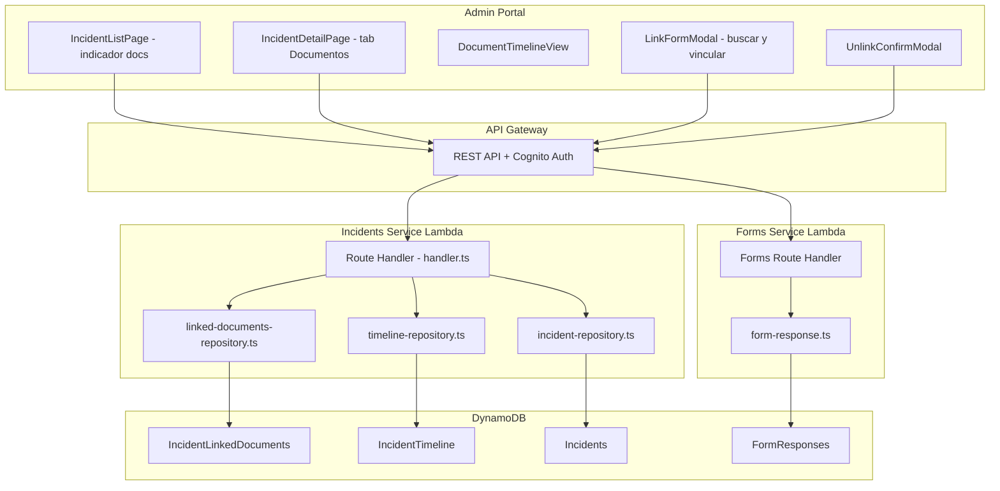
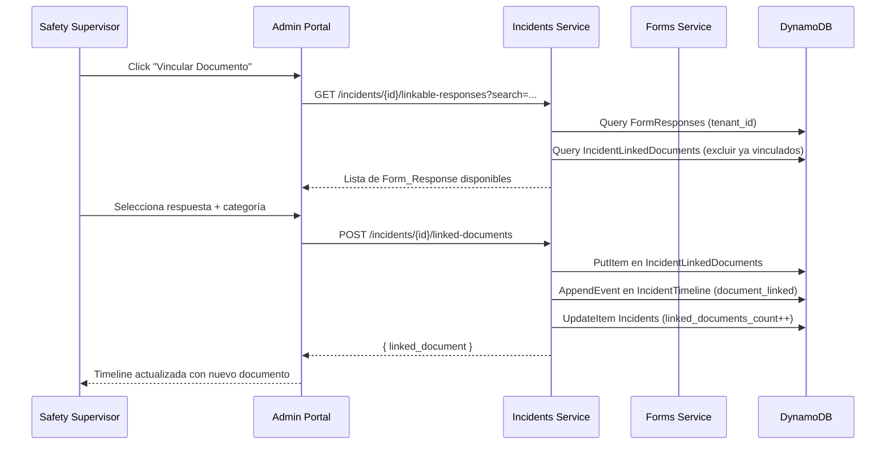

# Diseño Técnico: Línea de Tiempo de Incidentes

## Overview

Este módulo extiende el sistema existente de incidentes de ClearSite para permitir vincular respuestas de formularios dinámicos (investigaciones, acciones correctivas, inspecciones, etc.) a un incidente y visualizar esos vínculos en una línea de tiempo cronológica integrada con el audit trail existente.

El diseño se basa en la infraestructura existente: la tabla `IncidentTimeline` en DynamoDB (append-only), el servicio Lambda de incidentes, y el componente `TimelineView` del admin portal. Se añade una nueva tabla `IncidentLinkedDocuments` para almacenar los vínculos, nuevos endpoints REST en el handler de incidentes existente, y un nuevo sub-tab de "Documentos" en la vista de detalle del incidente.

### Decisiones Clave de Diseño

1. **Extensión del servicio existente** — Los nuevos endpoints se agregan al handler Lambda de incidentes (`src/services/incidents/handler.ts`) en lugar de crear un servicio separado, porque comparten el mismo dominio, tenant isolation, y control de acceso.
2. **Tabla separada para vínculos** — Se usa una tabla DynamoDB dedicada `IncidentLinkedDocuments` en lugar de incrustar vínculos en el registro del incidente, para soportar consultas eficientes y evitar el límite de 400KB por item.
3. **Audit trail inmutable** — Las acciones de vincular/desvincular generan eventos en la tabla `IncidentTimeline` existente (append-only), garantizando trazabilidad completa incluso cuando un documento es desvinculado.
4. **Soft delete para desvinculación** — Los registros de `IncidentLinkedDocuments` se marcan con `unlinked_at` en lugar de eliminarse físicamente, preservando la integridad referencial con los audit records.
5. **Búsqueda federada** — La búsqueda de formularios para vincular consulta la tabla de respuestas del servicio de Forms existente, filtrando por `tenant_id` del usuario.
6. **Vista combinada front-end** — La línea de tiempo combinada (audit trail + documentos) se construye en el frontend mezclando los dos streams cronológicamente, evitando cambios al schema de la tabla `IncidentTimeline`.
7. **Conteo denormalizado** — El conteo de documentos vinculados se almacena como atributo `linked_documents_count` en el registro del incidente para evitar queries adicionales en la vista de lista.

## Architecture



### Flujo de Vinculación



## Components and Interfaces

### Backend: Nuevos Archivos

| Archivo | Responsabilidad |
|---------|----------------|
| `src/services/incidents/linked-documents-repository.ts` | CRUD para tabla `IncidentLinkedDocuments` |
| `src/services/incidents/linked-documents-validators.ts` | Schemas Zod para payloads de vinculación/desvinculación |

### Backend: Archivos Modificados

| Archivo | Cambio |
|---------|--------|
| `src/services/incidents/handler.ts` | Nuevas rutas para linked documents |
| `src/services/incidents/types.ts` | Nuevos tipos e interfaces |
| `src/services/incidents/incident-repository.ts` | Helper para incrementar/decrementar `linked_documents_count` |

### Backend: Nuevos Endpoints

| Método | Ruta | Auth | Roles Permitidos | Descripción |
|--------|------|------|-----------------|-------------|
| POST | `/incidents/{id}/linked-documents` | Cognito | tenant_admin, site_admin, supervisor, cso | Crear vínculo entre incidente y form response |
| GET | `/incidents/{id}/linked-documents` | Cognito | Todos con acceso al incidente | Listar documentos vinculados (con filtros) |
| DELETE | `/incidents/{id}/linked-documents/{linkId}` | Cognito | tenant_admin, cso | Desvincular documento (soft delete) |
| GET | `/incidents/{id}/linkable-responses` | Cognito | tenant_admin, site_admin, supervisor, cso | Buscar form responses disponibles para vincular |

### Frontend: Nuevos Componentes

| Componente | Ruta | Responsabilidad |
|-----------|------|----------------|
| `DocumentTimelineView` | `src/features/incidents/DocumentTimelineView.tsx` | Vista de línea de tiempo de documentos vinculados con filtros por categoría |
| `CombinedTimelineView` | `src/features/incidents/CombinedTimelineView.tsx` | Vista combinada: audit trail + documentos vinculados en flujo cronológico unificado |
| `LinkFormModal` | `src/features/incidents/LinkFormModal.tsx` | Modal de búsqueda y vinculación de formularios con selector de categoría |
| `UnlinkConfirmModal` | `src/features/incidents/UnlinkConfirmModal.tsx` | Modal de confirmación de desvinculación con campo de justificación |
| `LinkedDocumentCard` | `src/features/incidents/LinkedDocumentCard.tsx` | Card individual para un documento vinculado en la timeline |
| `CategoryFilter` | `src/features/incidents/CategoryFilter.tsx` | Componente de filtro multi-select por categoría de documento |
| `LinkedDocsBadge` | `src/features/incidents/LinkedDocsBadge.tsx` | Badge numérico para indicador en lista de incidentes |

### Frontend: Nuevos Hooks

| Hook | Responsabilidad |
|------|----------------|
| `useLinkedDocuments` | Fetch documentos vinculados con filtros de categoría |
| `useLinkDocument` | Mutación POST para crear vínculo |
| `useUnlinkDocument` | Mutación DELETE para desvincular |
| `useLinkableResponses` | Búsqueda de form responses disponibles con paginación |

### Frontend: Archivos Modificados

| Archivo | Cambio |
|---------|--------|
| `IncidentDetailPage.tsx` | Nuevo tab "Documentos" con toggle vista combinada/solo docs |
| `IncidentListPage.tsx` | Renderizar `LinkedDocsBadge` con conteo de documentos |
| `types.ts` | Nuevos tipos para linked documents y categorías |

### Interface: Linked Document Repository

```typescript
interface LinkedDocumentInput {
  incident_id: string;
  tenant_id: string;
  response_id: string;
  form_id: string;
  document_category: DocumentCategory;
  custom_category_description?: string;
  context_note?: string;
  linked_by: string;
  linked_by_name: string;
}

interface LinkedDocumentRecord extends LinkedDocumentInput {
  link_id: string;
  linked_at: string;          // ISO 8601 UTC
  unlinked_at?: string;       // ISO 8601 UTC (soft delete)
  unlinked_by?: string;
  unlink_justification?: string;
}

interface LinkableResponseResult {
  response_id: string;
  form_id: string;
  form_name: string;
  folio: string;
  submitted_at: string;
  submitted_by_name: string;
}
```

## Data Models

### DynamoDB: IncidentLinkedDocuments

**Table Name:** `{env}-IncidentLinkedDocuments`
**Partition Key:** `PK` (String) — `INCIDENT#{incident_id}`
**Sort Key:** `SK` (String) — `LINK#{linked_at}#{link_id}`
**GSI-1:** `tenant-response-index` — PK: `tenant_id`, SK: `response_id` (para verificar duplicados cross-incident)

```typescript
interface LinkedDocumentItem {
  // Keys
  PK: string;                          // INCIDENT#{incident_id}
  SK: string;                          // LINK#{linked_at}#{link_id}

  // Core fields
  link_id: string;                     // UUID v4
  incident_id: string;
  tenant_id: string;
  response_id: string;
  form_id: string;

  // Categorización
  document_category: DocumentCategory;
  custom_category_description?: string; // Requerido si categoría es "otro"
  context_note?: string;               // Nota opcional, max 500 chars

  // Metadata de vinculación
  linked_by: string;                   // user_id
  linked_by_name: string;             // email o nombre
  linked_at: string;                   // ISO 8601 UTC

  // Soft delete (desvinculación)
  unlinked_at?: string;                // ISO 8601 UTC
  unlinked_by?: string;                // user_id
  unlinked_by_name?: string;
  unlink_justification?: string;       // min 10 chars

  // Datos denormalizados del form response (para display sin join)
  form_name: string;
  folio: string;
  response_submitted_at: string;
  response_submitted_by: string;
}

type DocumentCategory =
  | 'investigacion'
  | 'accion_correctiva'
  | 'inspeccion'
  | 'declaracion_testigo'
  | 'reporte_seguimiento'
  | 'otro';
```

### Modificación a Tabla Incidents

Se añade un campo denormalizado al registro existente del incidente:

```typescript
// Añadido a IncidentRecord existente
interface IncidentRecord {
  // ... campos existentes ...
  linked_documents_count?: number;  // Default 0, incrementado/decrementado en vinculación/desvinculación
}
```

### Timeline Events (nuevos tipos)

Se extiende el enum `TimelineEventType` existente:

```typescript
// Añadidos al enum TimelineEventType en types.ts
DOCUMENT_LINKED = 'document_linked',
DOCUMENT_UNLINKED = 'document_unlinked',
```

**Event data para `document_linked`:**
```typescript
{
  link_id: string;
  response_id: string;
  form_id: string;
  form_name: string;
  folio: string;
  document_category: DocumentCategory;
}
```

**Event data para `document_unlinked`:**
```typescript
{
  link_id: string;
  response_id: string;
  form_name: string;
  folio: string;
  justification: string;
}
```

### Zod Validation Schemas (Backend)

```typescript
// src/services/incidents/linked-documents-validators.ts

import { z } from 'zod';

export const documentCategorySchema = z.enum([
  'investigacion',
  'accion_correctiva',
  'inspeccion',
  'declaracion_testigo',
  'reporte_seguimiento',
  'otro',
]);

export const createLinkSchema = z.object({
  response_id: z.string().uuid(),
  form_id: z.string().uuid(),
  document_category: documentCategorySchema,
  custom_category_description: z.string().min(5).max(100).optional(),
  context_note: z.string().max(500).optional(),
}).refine(
  (data) => {
    if (data.document_category === 'otro') {
      return !!data.custom_category_description;
    }
    return true;
  },
  { message: 'custom_category_description is required when category is "otro"', path: ['custom_category_description'] }
);

export const unlinkSchema = z.object({
  justification: z.string().min(10, 'Justification must be at least 10 characters'),
});

export const searchResponsesSchema = z.object({
  search: z.string().max(200).optional(),
  date_from: z.string().datetime().optional(),
  date_to: z.string().datetime().optional(),
  page: z.coerce.number().int().min(1).default(1),
  page_size: z.coerce.number().int().min(1).max(20).default(20),
});

export const filterLinkedDocsSchema = z.object({
  categories: z.string().optional(), // comma-separated categories
});
```

### Frontend Types

```typescript
// Añadidos a src/features/incidents/types.ts

export type DocumentCategory =
  | 'investigacion'
  | 'accion_correctiva'
  | 'inspeccion'
  | 'declaracion_testigo'
  | 'reporte_seguimiento'
  | 'otro';

export interface LinkedDocument {
  link_id: string;
  incident_id: string;
  response_id: string;
  form_id: string;
  document_category: DocumentCategory;
  custom_category_description?: string;
  context_note?: string;
  linked_by: string;
  linked_by_name: string;
  linked_at: string;
  form_name: string;
  folio: string;
  response_submitted_at: string;
  response_submitted_by: string;
}

export interface LinkableResponse {
  response_id: string;
  form_id: string;
  form_name: string;
  folio: string;
  submitted_at: string;
  submitted_by_name: string;
}

export interface CreateLinkRequest {
  response_id: string;
  form_id: string;
  document_category: DocumentCategory;
  custom_category_description?: string;
  context_note?: string;
}

export interface UnlinkRequest {
  justification: string;
}

export interface LinkedDocumentsResponse {
  linked_documents: LinkedDocument[];
  total_count: number;
}

export interface LinkableResponsesResponse {
  responses: LinkableResponse[];
  total_count: number;
  page: number;
  page_size: number;
}
```

### Constantes de Categoría (Frontend)

```typescript
export const DOCUMENT_CATEGORY_LABELS: Record<DocumentCategory, string> = {
  investigacion: 'Investigación',
  accion_correctiva: 'Acción Correctiva',
  inspeccion: 'Inspección',
  declaracion_testigo: 'Declaración de Testigo',
  reporte_seguimiento: 'Reporte de Seguimiento',
  otro: 'Otro',
};

export const DOCUMENT_CATEGORY_COLORS: Record<DocumentCategory, string> = {
  investigacion: 'purple',
  accion_correctiva: 'danger',
  inspeccion: 'info',
  declaracion_testigo: 'warning',
  reporte_seguimiento: 'success',
  otro: 'default',
};
```


## Correctness Properties

*Una propiedad es una característica o comportamiento que debe mantenerse verdadero a través de todas las ejecuciones válidas de un sistema — esencialmente, una declaración formal sobre lo que el sistema debería hacer. Las propiedades sirven como puente entre especificaciones legibles por humanos y garantías de corrección verificables por máquinas.*

### Property 1: Aislamiento de tenant en respuestas disponibles

*Para cualquier* usuario autenticado con un `tenant_id`, la lista de Form_Response disponibles para vincular SHALL contener únicamente respuestas donde `response.tenant_id === user.tenant_id`. Ninguna respuesta de otro tenant SHALL aparecer en los resultados.

**Validates: Requirements 1.1**

### Property 2: Validación de creación de vínculo

*Para cualquier* payload de creación de vínculo:
- Si `document_category` es "otro" y `custom_category_description` tiene menos de 5 o más de 100 caracteres, la validación SHALL rechazar el payload.
- Si `document_category` es "otro" y `custom_category_description` está ausente, la validación SHALL rechazar el payload.
- Si `context_note` tiene más de 500 caracteres, la validación SHALL rechazar el payload.
- Si `document_category` no está presente, la validación SHALL rechazar el payload.
- Para cualquier combinación válida (categoría presente, descripción válida cuando es "otro", nota ≤ 500), la validación SHALL aceptar el payload.

**Validates: Requirements 1.5, 2.2, 2.3**

### Property 3: Prevención de vínculos duplicados

*Para cualquier* par (incident_id, response_id), si ya existe un Linked_Document activo (no desvinculado) con ese par, entonces un intento de crear un nuevo vínculo con el mismo par SHALL ser rechazado. Si no existe un vínculo activo, la operación SHALL ser aceptada.

**Validates: Requirements 1.4**

### Property 4: Completitud del registro de vínculo

*Para cualquier* operación de vinculación exitosa con inputs válidos, el registro Linked_Document resultante SHALL contener: `link_id` (UUID), `incident_id`, `response_id`, `form_id`, `document_category`, `linked_by` (user_id del creador), `linked_by_name`, y `linked_at` (timestamp UTC). Todos estos campos SHALL ser no-vacíos.

**Validates: Requirements 1.2**

### Property 5: Creación de audit record para vinculación y desvinculación

*Para cualquier* operación de vinculación exitosa, SHALL existir un evento en la timeline con `event_type = "document_linked"`, el `actor_id` del usuario, `response_id` vinculado, y timestamp UTC. *Para cualquier* operación de desvinculación exitosa, SHALL existir un evento con `event_type = "document_unlinked"`, `actor_id`, `response_id`, justificación, y timestamp UTC.

**Validates: Requirements 1.3, 5.2**

### Property 6: Orden cronológico descendente de la línea de tiempo

*Para cualquier* arreglo de documentos vinculados activos para un incidente, al presentarlos en la vista de timeline, el orden SHALL ser descendente por `response_submitted_at`. Para todo par consecutivo (a, b) en la lista, `a.response_submitted_at >= b.response_submitted_at`.

**Validates: Requirements 3.1**

### Property 7: Filtrado por categoría multi-select

*Para cualquier* arreglo de documentos vinculados y cualquier subconjunto no-vacío de categorías seleccionadas como filtro, el resultado filtrado SHALL contener exactamente aquellos documentos cuya `document_category` pertenece al subconjunto seleccionado. El conteo total de resultados SHALL igualar la cantidad de documentos que cumplen el filtro.

**Validates: Requirements 4.1, 4.2, 4.3, 4.4**

### Property 8: Documentos desvinculados excluidos de la vista activa

*Para cualquier* conjunto de registros LinkedDocument donde algunos tienen `unlinked_at` definido, la vista de línea de tiempo activa SHALL mostrar únicamente aquellos donde `unlinked_at` es undefined/null. Ningún documento desvinculado SHALL aparecer en la vista de documentos vinculados.

**Validates: Requirements 5.3**

### Property 9: Justificación mínima para desvinculación

*Para cualquier* string de justificación con menos de 10 caracteres, la operación de desvinculación SHALL ser rechazada por el validador. *Para cualquier* string con 10 o más caracteres, la validación de justificación SHALL pasar.

**Validates: Requirements 5.1**

### Property 10: Búsqueda por coincidencia parcial

*Para cualquier* término de búsqueda `t` y conjunto de Form_Response, los resultados SHALL incluir una respuesta si y solo si `t` aparece como subcadena (case-insensitive) en al menos uno de: nombre del formulario, folio de la respuesta, o nombre del usuario que completó la respuesta.

**Validates: Requirements 6.1**

### Property 11: Filtro por rango de fechas

*Para cualquier* rango de fechas [date_from, date_to] y conjunto de Form_Response, los resultados SHALL contener exactamente aquellas respuestas donde `submitted_at >= date_from` AND `submitted_at <= date_to`.

**Validates: Requirements 6.2**

### Property 12: Paginación con máximo 20 elementos por página

*Para cualquier* conjunto de resultados de búsqueda con N elementos y un `page_size` de 20, cada página SHALL contener como máximo 20 elementos. El número total de páginas SHALL ser `ceil(N / 20)`. La página final SHALL contener `N mod 20` elementos (o 20 si N es divisible por 20).

**Validates: Requirements 6.4**

### Property 13: Merge cronológico de vista combinada

*Para cualquier* par de arreglos (eventos de audit trail, documentos vinculados), la vista combinada SHALL producir un arreglo ordenado cronológicamente donde cada par consecutivo (a, b) cumple `a.timestamp >= b.timestamp` (orden descendente). La longitud del resultado SHALL ser la suma de ambas longitudes de entrada.

**Validates: Requirements 7.1**

### Property 14: Control de acceso basado en roles

*Para cualquier* usuario con un rol dado:
- La creación de vínculos SHALL ser permitida si y solo si el rol es uno de [tenant_admin, site_admin, supervisor, cso].
- La desvinculación SHALL ser permitida si y solo si el rol es uno de [tenant_admin, cso].
- Cualquier intento por un rol no autorizado SHALL resultar en HTTP 403.

**Validates: Requirements 8.1, 8.2, 8.4**

## Error Handling

### Respuestas de Error del API

| Escenario | HTTP Code | Respuesta | Recuperación |
|-----------|-----------|-----------|-------------|
| Form response no encontrada | 404 | `{ error: "Form response not found" }` | Usuario busca otro formulario |
| Incidente no encontrado | 404 | `{ error: "Incident not found" }` | — |
| Vínculo duplicado | 409 | `{ error: "This form response is already linked to this incident" }` | Usuario es informado |
| Categoría "otro" sin descripción | 400 | `{ error: "custom_category_description is required when category is otro" }` | Usuario completa el campo |
| Descripción fuera de rango (5-100) | 400 | `{ error: "custom_category_description must be 5-100 characters" }` | Usuario ajusta texto |
| Nota de contexto > 500 chars | 400 | `{ error: "context_note must not exceed 500 characters" }` | Usuario acorta nota |
| Justificación < 10 chars | 400 | `{ error: "justification must be at least 10 characters" }` | Usuario completa justificación |
| Sin permisos para vincular | 403 | `{ error: "You do not have permission to perform this action" }` | — |
| Sin permisos para desvincular | 403 | `{ error: "You do not have permission to perform this action" }` | — |
| response_id no es UUID válido | 400 | `{ error: "Invalid response_id format" }` | — |
| Error interno DynamoDB | 500 | `{ error: "An unexpected error occurred" }` | Retry automático o manual |

### Manejo de Errores en Frontend

| Escenario | Comportamiento |
|-----------|---------------|
| Error al cargar documentos vinculados | Mostrar `ErrorDisplay` con botón de retry |
| Error al crear vínculo | Toast de error con mensaje, modal permanece abierta |
| Error al desvincular | Toast de error, modal permanece abierta |
| Error de búsqueda de formularios | Mostrar mensaje inline en el modal de búsqueda |
| Error de red (timeout) | Toast con "Connection error, please try again" |
| Vínculo duplicado (409) | Toast informativo "Este documento ya está vinculado a este incidente" |

### Garantías Transaccionales

- **Atomicidad de vinculación**: Se escriben tres operaciones (PutItem en LinkedDocuments, AppendEvent en Timeline, UpdateItem en Incidents para el conteo). Si alguna falla después de la primera, se usa un mecanismo de compensación: el endpoint retorna error y un proceso de reconciliación corrige inconsistencias.
- **Inmutabilidad del audit trail**: Los eventos de timeline NUNCA se eliminan ni modifican. La tabla no expone operaciones de update/delete.
- **Soft delete**: La desvinculación marca `unlinked_at` pero no elimina el registro, preservando integridad referencial.

## Testing Strategy

### Property-Based Tests (Vitest + fast-check)

El proyecto usa Vitest como test runner con [fast-check](https://github.com/dubzzz/fast-check) para property-based testing. Cada propiedad de la sección de Correctness Properties se mapea a un test `fc.assert(fc.property(...))` con mínimo 100 iteraciones.

**Tag format:** `// Feature: incident-timeline, Property {N}: {título}`

**Propiedades a implementar:**

| Propiedad | Función/Módulo Objetivo | Archivo de Test |
|-----------|------------------------|-----------------|
| 1 | Filtrado de responses por tenant_id | `tests/properties/incident-timeline/tenant-isolation.property.test.ts` |
| 2 | `createLinkSchema` validation | `tests/properties/incident-timeline/link-validation.property.test.ts` |
| 3 | Verificación de duplicados en repository | `tests/properties/incident-timeline/duplicate-prevention.property.test.ts` |
| 4 | Record completeness en `createLinkedDocument` | `tests/properties/incident-timeline/record-completeness.property.test.ts` |
| 5 | Audit event creation | `tests/properties/incident-timeline/audit-records.property.test.ts` |
| 6 | Sort descendente por submitted_at | `tests/properties/incident-timeline/timeline-sort.property.test.ts` |
| 7 | Filtro multi-categoría | `tests/properties/incident-timeline/category-filter.property.test.ts` |
| 8 | Exclusión de documentos desvinculados | `tests/properties/incident-timeline/unlinked-exclusion.property.test.ts` |
| 9 | `unlinkSchema` validation (min 10 chars) | `tests/properties/incident-timeline/unlink-validation.property.test.ts` |
| 10 | Lógica de búsqueda parcial | `tests/properties/incident-timeline/search-matching.property.test.ts` |
| 11 | Filtro por rango de fechas | `tests/properties/incident-timeline/date-range-filter.property.test.ts` |
| 12 | Lógica de paginación | `tests/properties/incident-timeline/pagination.property.test.ts` |
| 13 | Merge cronológico de vista combinada | `tests/properties/incident-timeline/combined-timeline-merge.property.test.ts` |
| 14 | Lógica RBAC (roles autorizados) | `tests/properties/incident-timeline/rbac.property.test.ts` |

### Unit Tests (Vitest)

| Área | Tests |
|------|-------|
| Validators | Schema rejects invalid inputs (examples concretos) |
| Repository | DynamoDB operations con mocks |
| Handler routing | Correct route dispatch para cada endpoint |
| Frontend components | Renderizado correcto de `LinkedDocumentCard`, `CategoryFilter`, `LinkedDocsBadge` |
| Frontend hooks | Correcta invalidación de queries después de mutaciones |

### Integration Tests

| Área | Tests |
|------|-------|
| API endpoints | Full request/response cycle con DynamoDB local |
| RBAC enforcement | Verificar 403 para roles no autorizados en cada endpoint |
| Cascade count update | Verificar que `linked_documents_count` se incrementa/decrementa correctamente |
| Cross-service query | Verificar que la búsqueda de Form_Response funciona cross-service |

### Configuración de Test

```typescript
// Ejemplo de estructura de test property-based
// tests/properties/incident-timeline/category-filter.property.test.ts

import { describe, it } from 'vitest';
import fc from 'fast-check';

// Feature: incident-timeline, Property 7: Filtrado por categoría multi-select
describe('Property 7: Category multi-select filtering', () => {
  it('should return only documents matching selected categories', () => {
    fc.assert(
      fc.property(
        // generators...
        fc.array(linkedDocumentArb, { minLength: 0, maxLength: 50 }),
        fc.subarray(['investigacion', 'accion_correctiva', 'inspeccion', 'declaracion_testigo', 'reporte_seguimiento', 'otro'] as const, { minLength: 1 }),
        (documents, selectedCategories) => {
          const filtered = filterByCategories(documents, selectedCategories);
          // All results must match a selected category
          return filtered.every(doc => selectedCategories.includes(doc.document_category))
            // All matching documents must be included
            && documents.filter(d => selectedCategories.includes(d.document_category)).length === filtered.length;
        }
      ),
      { numRuns: 100 }
    );
  });
});
```
