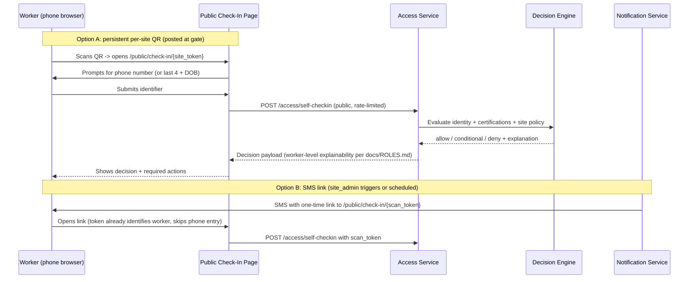
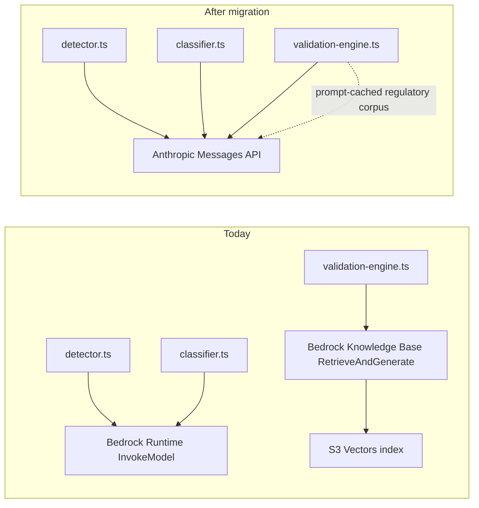

# Design Document: Production Readiness Audit

## Overview

This spec fixes eleven confirmed defects/investigations found by live-testing the deployed `dev` environment plus a competitive benchmark against SiteDocs, HammerTech, Procore, Raken, and SafetyCulture, and scopes two net-new-capability follow-up specs: worker self-service check-in (the product's own documented "killer workflow," which currently does not exist in any form) and migrating all AI inference off AWS Bedrock onto the direct Anthropic Claude API (an explicit Product Owner architecture decision). Every fix below is scoped to be minimal and targeted, following the same pattern `admin-portal-audit-fixes`/`-v2` already established for this codebase: fix the specific defect, don't refactor around it.

The defining lesson from `verification-notes.md` (an independent re-test of `admin-portal-audit-fixes`) is that **source changes to `packages/backend` do not take effect until `pnpm build:backend && pnpm deploy:dev` actually runs**, and two of that spec's seven bugs were marked complete while still reproducing live, purely because of this. This design treats "redeploy + re-verify live" as a first-class step for every fix, not an afterthought.

## Root Cause Summary

| # | Symptom (live-verified) | Root cause | Confidence |
|---|---|---|---|
| 1 | Landing Page contact form always fails; Admin Portal API calls suspected broken too when deployed | NOT a backend bug — confirmed by direct `curl` against the live API Gateway succeeding (`201`). Neither frontend package's build step (`landing-page.yml`/`admin-portal.yml`) ever sets `VITE_API_URL`, and CloudFront (`hosting-stack.ts`) has no `/api/*` behavior, so a production build has no working way to reach the API regardless of which package | High for Landing Page (curl-confirmed both sides); High-but-not-live-verified for Admin Portal (source-confirmed, not tested against the real deployed CloudFront URL) |
| 2 | `GET /report-validation/reports` → 400 on every load | `useReports.ts` sends `sort_by=created_at\|latest_validation_date`; `listReportsQuerySchema` only accepts `sort_by=upload_date\|validation_date` | High — confirmed by direct source diff |
| 2b | Reports pagination (page 2+) | Frontend sends `page`/`page_size`; backend `paginationQuerySchema` expects `limit`/`cursor` | High — confirmed by direct source diff |
| 3 | `/sites/{id}` blank title, N/A stats | `handleGetSite` returns `{ site: rawDynamoItem }`; `SiteProfile.tsx` reads `data.name` (list-shape), not `data.site.name` | High — confirmed by direct source diff |
| 3b | Compliance/Workers/Contractor always N/A even for populated sites | `handleGetSite`/`handleListSites` never compute these fields; a working per-site calculation exists in `handleComplianceSummary`'s `bySite` loop but isn't reused | High — confirmed by direct source diff |
| 4 | `/admin` shows 0 users | Cognito `ListUsersCommand` `Filter` targets `custom:tenant_id`, a custom attribute; Cognito's Filter param only supports a fixed set of standard attributes | Medium — needs live Cognito error/log to confirm throw-vs-empty-match |
| 5 | Dashboard trend chart empty; Certifications-by-type shows "Unknown" | Unconfirmed — needs network response inspection | Low — flagged for investigation, not diagnosed |
| 6 | Sites/Contractors list join columns blank; dev data is duplicate junk | List endpoints don't join worker/compliance counts; `dev` DB polluted by test runs | High for the blank columns; data hygiene is operational, not a code bug |
| 7 | No worker self-service check-in exists | Never built — confirmed absent from `router.tsx` and `docs/API-ROUTES.md` (every access route requires Cognito auth) | High — confirmed by route inventory |
| 8 | "Formularios" module is Spanish, rest of app is English | No i18n system; that module's strings were authored in Spanish and never localized | High — confirmed by direct visual/source inspection |

## Fix Design by Requirement

### Requirement 1 — Frontend-to-API connectivity (both packages)

**This is no longer a "maybe stale deploy" question — it's confirmed by direct `curl` that the API works and the frontends have no way to reach it.** Two complementary fixes, do both:

**Fix A — build-time `VITE_API_URL` injection.** In `.github/workflows/landing-page.yml` and `.github/workflows/admin-portal.yml`, add a step before `pnpm --filter <pkg> build` that sets `VITE_API_URL` as an environment variable to the real API Gateway invoke URL for the target environment. Since this repo's CI workflows currently only `lint`+`build` (they don't deploy), and the actual AWS deploy is a manual `cdk deploy --all` run locally per the README, this also means: whoever runs the real production build locally needs a correct, real `VITE_API_URL` in their shell/`.env` — not `/api` (that only means something to the local `vite dev` proxy) and not empty. Prefer sourcing this value from a CDK stack output (`ComplianceApiStack`'s API Gateway URL) rather than hand-typing it in two places, so it can't drift.

**Fix B (recommended in addition to A, not instead of) — CloudFront `/api/*` behavior.** Add a second behavior to `AdminPortalCDN`/`LandingPageCDN` in `packages/backend/infra/lib/hosting-stack.ts` that forwards `/api/*` to an `HttpOrigin` pointing at the API Gateway's execute-api domain, mirroring what `vite.config.ts`'s dev-server proxy already does for local development. This makes the relative-path default (`/api`, already `admin-portal`'s fallback in `api-client.ts`) work correctly in every real environment too, and removes the need to keep a hand-maintained absolute URL in sync across environments/workflows at all.

**Fix C:** Update `packages/landing-page`'s contact form error handling to surface the actual fetch failure status/message distinction (502/503/504 = "temporary, please retry"; 400 = "check your input") instead of one generic "Something went wrong" string for every failure mode.

**Fix D:** Add a post-deploy smoke test (a small script or a CI step run after the manual/future-automated deploy) that `curl`s the real CloudFront URL's Landing Page `/leads` endpoint and at least one authenticated Admin Portal API call, failing loudly if either doesn't reach the backend — this is the frontend-deploy equivalent of the backend-deploy lesson `verification-notes.md` already taught this codebase once.

### Requirement 2 — Reports 400 + broken pagination

In `packages/admin-portal/src/features/report-validation/hooks/useReports.ts`:
- Change `sort_by` default and allowed values from `'created_at' | 'latest_validation_date'` to `'upload_date' | 'validation_date'` (matching `listReportsQuerySchema`), and update whatever UI sort-control options feed this hook to display/send the same values.
- Replace `page`/`page_size` query params with `limit`/`cursor`, matching `paginationQuerySchema`. This requires the `ReportListPage.tsx` pagination UI to move from page-number based to cursor-based (store the `cursor` returned by the previous response, keep a stack of cursors for "previous page" if that UX is needed — this is the same pattern already used correctly elsewhere in the codebase for cursor-paginated lists, e.g. contractors/forms; grep for existing `cursor`-based list hooks and mirror one rather than inventing a new pattern).
- Add a fast-follow property test (this repo already uses `fast-check` per `pnpm test:properties`) asserting the query params `useReports.ts` sends always validate against `listReportsQuerySchema` — this exact class of frontend/backend contract drift is what caused this bug and would have caught it before deploy.

### Requirement 3 — Site Profile

In `packages/backend/src/services/policy/handler.ts`:
- Extract the mapping logic currently inline in `handleListSites` (lines ~594-598: `{ id, name, address, timezone, ... }` from the raw DynamoDB item) into a shared `mapSiteRecord(item)` function.
- Change `handleGetSite` (line ~631) from `return createSuccessResponse(200, { site: result.Items[0] })` to `return createSuccessResponse(200, mapSiteRecord(result.Items[0]))` — flat shape, no `site` wrapper, matching what `SiteProfile.tsx` already reads.
- Extract the per-site compliance calculation from `handleComplianceSummary`'s `bySite` loop (`packages/backend/src/services/reporting/handler.ts`, ~lines 824-848) into a shared helper (e.g. `computeSiteCompliance(tenantId, siteId)` in a shared module both `policy` and `reporting` services can import, or duplicate the query if cross-service imports aren't set up in this monorepo's Lambda bundling — check how `enforcePermission`/`getTableName` are already shared across services and follow the same pattern). Call it from both `handleGetSite` and `handleListSites` to populate `activeWorkers`, `compliancePercent`, and `contractor`.
- Do not touch the `?? []` guards on `requiredCerts`/`recentActivity` or the `N/A` fallbacks already in `SiteProfile.tsx` (lines 87, 98, 109) — those are correct and already verified working.

### Requirement 4 — Users & Roles empty

In `packages/backend/src/services/identity/admin-users.ts`:
- Remove the `Filter: '"custom:tenant_id" = "${tenantId}"'` parameter from `ListUsersCommand` (line ~92) — it targets an unsupported attribute for Cognito's Filter syntax.
- Fetch the full paginated user list for the pool (already implemented via the `paginationToken` loop) and filter by `custom:tenant_id` in application code after mapping each `UserType`, using the same `getAttribute(attributes, 'custom:tenant_id')` helper pattern already used for `custom:role` at line ~5.
- At `dev`/current scale (single-digit to low-hundreds of users per pool) this is fine; if a future tenant's user count grows large enough for this to be a real cost/latency concern, that's a separate future optimization (e.g. a DynamoDB Users-by-tenant GSI synced via a Cognito post-confirmation trigger) — not in scope here.
- Live-verify: log in as the same `platform_admin` test user, confirm they now appear in their own tenant's Users & Roles list, then smoke-test "Invite User" end-to-end.

### Requirement 5 — Dashboard/Certifications charts

This requirement is explicitly scoped as **investigation + fix**, not a pre-diagnosed fix, because this audit did not capture the actual network responses for the trend/breakdown endpoints. Tasks.md breaks this into: (a) capture and inspect the real API response shape for whatever endpoint feeds "Compliance Trend (7 days)" and "Certifications by Type", (b) determine whether the backend or the chart component is at fault, (c) fix the identified side. Do not guess-fix both sides speculatively.

### Requirement 6 — List aggregation + data hygiene

- Sites/Contractors list join columns: extend `handleListSites`/`listContractors` to include a worker count and compliance percentage per row, reusing the `computeSiteCompliance` helper from Requirement 3 where applicable, and a straightforward `COUNT`-style query (same pattern already recommended in `verification-notes.md` for the contractors `total` field) for worker counts.
- Data hygiene: add a `pnpm --filter backend reset:dev-data` script (a small standalone script under `packages/backend/scripts/`) that deletes all `TENANT#*` items from the dev tables for a designated demo tenant and reseeds a small, clearly-labeled realistic dataset (e.g. 2-3 real-looking sites, 1-2 contractors, ~10 workers with varied certification states). Do not run this against `prod` — guard it with an explicit `ENVIRONMENT=dev` check that refuses to run otherwise.
- Worker name sanitization: in the worker create/update validation schema (identity service), trim leading/trailing whitespace and strip a single pair of wrapping straight/curly quote characters if present, before persisting `legal_name`/`preferred_name`. This is defensive input hygiene, not a security fix — do not conflate with XSS sanitization (React already escapes rendered text; this is purely a data-quality issue).

### Requirement 7 — Worker self-service check-in (new capability, separate breakout)

This is scoped as a design sketch here and a dedicated follow-up spec in `tasks.md`, not full inline implementation, because it touches every service layer (access, notification, decision-engine) and is comparable in size to `contractor-forms-qr` (63 tasks).

Key design constraints for the follow-up spec to resolve:
- **Public endpoint, no Cognito session** — reuse the `contractor-forms-qr` pattern of a public UUID token (`token_publico`) rather than inventing new public-auth infrastructure; this repo already has one proven, audited pattern for "public token resolves to a scoped action."
- **Rate limiting / abuse prevention** — `contractor-forms-qr`'s `rate-limiter` and `sanitizer` modules (`.kiro/specs/contractor-forms-qr/design.md`) already solve bot/abuse protection for a public unauthenticated endpoint; reuse rather than reinvent.
- **Explainability scoping** — `docs/ROLES.md`'s existing rule ("worker/gate_operator sees only reasons and required actions") already defines exactly what a self-checked-in worker should be shown; the decision payload returned to the public page must be filtered to that subset, not the full admin-grade explanation payload.
- **Client-side QR generation** — reuse the existing `qrcode` npm pattern from `contractor-forms-qr` rather than adding a new library.

### Requirement 11 — Safety AI has no upload entry point

**Step 1 — confirm scope before writing UI code:** grep the full `packages/admin-portal/src/app/router.tsx` route tree and any `Site`/`Worker` detail page components for an existing (but unlinked) upload/analyze action. This audit did not find one, but confirm before assuming none exists anywhere.

**Step 2 — if none exists, add one on `/safety-ai` itself:** a prominent "New Scan" / "Upload Photo" button opening a modal or dedicated page with: site selector (required — the `detection`/`scene-understanding` pipeline needs site context the same way Requirement 7's check-in fix does), file picker or camera capture (reuse the `Take Photo` component already built for `IncidentCreateForm`'s "Quick Photo Capture", per `bugfix.md` Unchanged Behavior 15.1), and a submit action that calls whatever endpoint already exists for triggering `detection`/`scene-understanding` (check `docs/API-ROUTES.md` for the existing route — this is likely already wired end-to-end on the backend, per Requirement 12's finding that `detector.ts`/`classifier.ts` already exist and work; only the frontend trigger is missing).

**Step 3 — show async progress and the result:** reuse the polling pattern already established in `ai-report-validation`'s `ValidationProgress` component (`.kiro/specs/ai-report-validation/design.md` §Requirement 10) rather than inventing a new async-UX pattern, since this is architecturally the same shape (submit → async AI processing → poll/display structured result).

### Requirement 12 — AI provider migration (Bedrock → direct Anthropic API)

**This requirement's only in-scope deliverable here is a new dedicated spec, not implementation** — see `tasks.md` Task 13. Key design decisions the new spec must resolve, captured here so they aren't lost:

- **Vision calls (`detection`, `scene-understanding`)** are a direct swap: both already send an image + prompt to a Claude model via Bedrock's `InvokeModel`; the equivalent Anthropic Messages API call (image content block + text prompt, using `@anthropic-ai/sdk`) is a same-shape replacement. Low risk, mechanical change once the API key plumbing (Secrets Manager → Lambda env) exists.
- **RAG (`report-validation`)** is the one genuinely architectural decision: Bedrock Knowledge Bases bundles retrieval (S3 Vectors) with generation. Moving off Bedrock means either reimplementing retrieval separately, or — the recommended default per Requirement 12.3 — dropping retrieval entirely in favor of prompt-caching the full regulatory corpus as static context on every validation call, which is simpler, has no vector-store infrastructure to maintain, and is architecturally a good fit if the corpus is small (this needs a token-count measurement first, done in the new spec, not assumed here).
- **Secrets management:** `ANTHROPIC_API_KEY` in AWS Secrets Manager, referenced by CDK and injected into `identityServiceFn`-equivalent Lambdas' environment at deploy time — the same pattern this codebase already uses for other environment configuration (per README's "Variables de Entorno" table, all currently AWS-native values; this adds the first non-AWS secret, so the new spec should also confirm the existing secrets-injection CDK pattern — if any exists — versus needing a new one for a raw API key vs. an AWS resource ARN/name).
- **`worksafebc-pdf-compliance-agent` (0/56 tasks, not started):** its `design.md` should be updated to target the direct API from the start, since it hasn't been built yet — cheaper to fix in design than to build on Bedrock and migrate later.

### Requirement 13 — Untested write flows and RBAC coverage

This is a checklist requirement, not a fix — there's nothing to design, only a defined list of manual (or scripted) test passes to run and record. Two dimensions:

1. **Write-flow pass** — for each flow listed in Requirement 13.1, log in as `platform_admin` (already the working test identity) and exercise it fully: create real records with clearly-labeled test data (following the existing "Test"-prefixed naming convention already present in `dev`, e.g. "QA Verify Worker" not "asdf"), confirm the record appears correctly in its list view afterward, and for the two async ones (Report Validation, the Formularios public QR flow) confirm the full async cycle completes and produces a real result, not just an "in progress" state.
2. **RBAC pass** — this needs one Cognito test user per role (`docs/ROLES.md` lists 7 roles; `platform_admin` is already covered). Creating those users requires `aws cognito-idp admin-create-user`/`admin-update-user-attributes` (documented in `docs/ROLES.md`'s own "Crear un Usuario de Prueba" section) — this audit's own tooling did not have AWS CLI access for user provisioning and could not do this step. For each new role: log in, screenshot the nav sidebar (confirm it matches `docs/ROLES.md`'s permission matrix for that role), attempt one disallowed action directly via a raw API call (not just checking the UI hides the button) and confirm `403`, and — for at least one role in each explainability tier (`worker`/`gate_operator`, `supervisor`, and one of `platform_admin`/`tenant_admin`/`site_admin`/`cso`) — view the same compliance decision and confirm the payload shown matches that tier's documented visibility rule.

Record results as a dated addendum to `verification-notes.md` (or a new sibling file if that one grows unwieldy), same convention as the rest of this spec — do not silently mark Requirement 13 `[x]` without recording what was actually exercised and what its result was, the same discipline Requirement 10 already established for redeploy verification.

## Testing Strategy

- Every P0/P1 fix (Requirements 1-4) gets a live re-test against redeployed `dev` before being marked complete, per Requirement 10.
- Requirement 1's fix additionally gets a live re-test against the ACTUAL deployed CloudFront URLs (not localhost), since that is precisely the gap this audit's own methodology had (only localhost dev servers were tested) that let this defect go undetected until direct `curl` testing surfaced it.
- Requirement 2's frontend/backend contract mismatch gets a property test asserting the two sides agree on query param shape, since this class of bug has now caused two separate incidents (Reports 403→400) in this codebase's history.
- Requirement 6's data hygiene script gets a dry-run confirmation step (print what would be deleted before deleting) given it operates on a shared environment.
- Requirement 11 is live-verified end-to-end (upload → async processing → finding displayed) using Requirement 6's reseeded demo data, and unblocks re-testing Requirement 9's finding-dependent competitive-parity items (9.3, 9.4).
- Requirement 12 is out of scope for direct testing in this spec — its own follow-up spec will define its test plan, including a before/after comparison of finding accuracy on a fixed set of sample photos to catch any regression from the model/provider swap.
- Requirement 7 is out of scope for direct testing in this spec — its own follow-up spec will define its test plan.
- Requirement 9's items are investigation-only in this spec (Task 11) — no code is written against them here until the Product Owner sign-off step completes.
