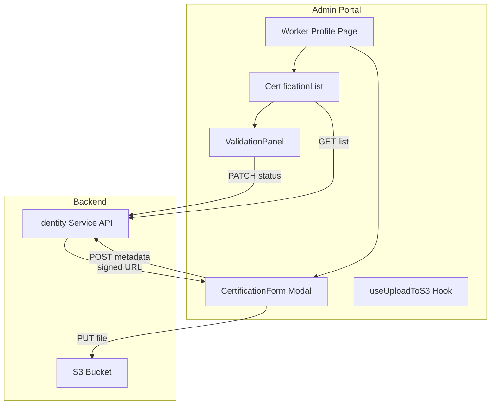
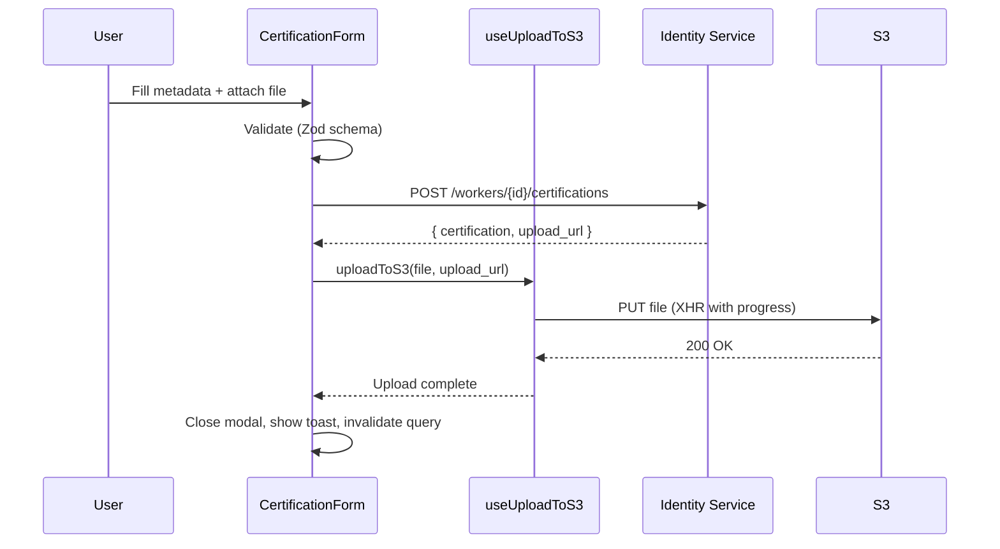

# Technical Design: Worker Certification Upload

## Overview

This feature adds a certification management UI to the Worker Profile Page in the Admin Portal. It enables administrators to view, upload, validate/reject, and re-upload worker certifications. The implementation follows the existing React + TanStack Query + Zustand architecture and communicates with the already-deployed Identity Service backend via REST API.

The upload flow uses a two-step pattern: POST metadata to the API (which returns a pre-signed S3 URL), then PUT the file directly to S3. This keeps large binary payloads off the API Gateway and leverages S3's native upload capabilities.

### Key Design Decisions

1. **Collocated feature module** — All certification components, hooks, types, and utilities live under `src/features/certifications/` to keep the feature self-contained while reusing shared UI primitives.
2. **TanStack Query for server state** — Certification list data is managed via `useApiQuery`; mutations use `useApiMutation` with query invalidation on success.
3. **XHR for S3 upload** — `XMLHttpRequest` is used instead of `fetch` for the S3 PUT to get native upload progress events (`onprogress`).
4. **Zod schemas shared with backend** — Frontend validation mirrors backend constraints (file types, size limits, date ordering) to provide instant feedback.
5. **RBAC-gated actions** — Validate/Reject buttons are conditionally rendered based on the `certifications.validate` permission via the existing `useRBAC` hook.

## Architecture



### Data Flow: Upload Sequence



## Components and Interfaces

### New Components

| Component | Path | Responsibility |
|-----------|------|----------------|
| `CertificationList` | `src/features/certifications/CertificationList.tsx` | Fetches and displays certifications table with status badges and expiry warnings |
| `CertificationForm` | `src/features/certifications/CertificationForm.tsx` | Modal form for creating/re-uploading certifications |
| `ValidationPanel` | `src/features/certifications/ValidationPanel.tsx` | Inline actions for validating/rejecting pending certs (RBAC-gated) |
| `ExpiryBadge` | `src/features/certifications/ExpiryBadge.tsx` | Renders green/amber/red badge based on expiry proximity |
| `UploadProgressBar` | `src/features/certifications/UploadProgressBar.tsx` | Displays upload percentage during S3 PUT |
| `CertificationSummary` | `src/features/certifications/CertificationSummary.tsx` | Summary counts of expiring/expired certs at top of list |

### New Hooks

| Hook | Path | Responsibility |
|------|------|----------------|
| `useCertifications` | `src/features/certifications/hooks/useCertifications.ts` | Wraps `useApiQuery` for GET /workers/{id}/certifications |
| `useCreateCertification` | `src/features/certifications/hooks/useCreateCertification.ts` | Wraps `useApiMutation` for POST + triggers S3 upload |
| `useUpdateCertification` | `src/features/certifications/hooks/useUpdateCertification.ts` | Wraps `useApiMutation` for PATCH (validate/reject/re-upload) |
| `useUploadToS3` | `src/features/certifications/hooks/useUploadToS3.ts` | Manages XHR upload to signed URL with progress tracking and abort |

### Existing Components Reused

- `Modal` — wraps CertificationForm
- `DataTable` — renders certification rows with sorting
- `Badge` — base for ExpiryBadge styling
- `Button` — all action buttons
- `Input`, `Select` — form fields
- `ErrorDisplay` — API error states

### Interface: `useUploadToS3`

```typescript
interface UseUploadToS3Return {
  upload: (file: File, signedUrl: string) => Promise<void>;
  progress: number;       // 0-100
  isUploading: boolean;
  error: string | null;
  abort: () => void;
}
```

### Interface: CertificationForm Props

```typescript
interface CertificationFormProps {
  workerId: string;
  open: boolean;
  onClose: () => void;
  /** Pre-fill for re-upload mode */
  existingCertification?: Certification;
}
```

## Data Models

### Frontend Certification Type

```typescript
// src/features/certifications/types.ts

export enum CertificationType {
  WHMIS_2015 = 'whmis_2015',
  FALL_PROTECTION = 'fall_protection',
  SITE_READY_BC = 'site_ready_bc',
  FIRST_AID = 'first_aid',
}

export enum CertificationStatus {
  PENDING = 'pending',
  VALIDATED = 'validated',
  REJECTED = 'rejected',
  EXPIRED = 'expired',
}

export interface Certification {
  certification_id: string;
  worker_id: string;
  tenant_id: string;
  certification_type: CertificationType;
  issuer: string;
  issue_date: string;       // ISO 8601
  expiry_date: string;      // ISO 8601
  document_key?: string;
  validation_status: CertificationStatus;
  validated_by?: string;
  validated_at?: string;
  rejection_reason?: string;
  created_at: string;
  updated_at: string;
}
```

### Zod Validation Schema (Form)

```typescript
// src/features/certifications/schemas.ts
import { z } from 'zod';

export const ALLOWED_MIME_TYPES = ['application/pdf', 'image/jpeg', 'image/png'] as const;
export const MAX_FILE_SIZE = 10 * 1024 * 1024; // 10 MB

export const certificationFormSchema = z.object({
  certification_type: z.nativeEnum(CertificationType),
  issuer: z.string().min(1, 'Issuer is required').max(200),
  issue_date: z.string().min(1, 'Issue date is required'),
  expiry_date: z.string().min(1, 'Expiry date is required'),
  document: z
    .instanceof(File)
    .refine((f) => ALLOWED_MIME_TYPES.includes(f.type as any), {
      message: 'File must be PDF, JPEG, or PNG',
    })
    .refine((f) => f.size <= MAX_FILE_SIZE, {
      message: 'File must not exceed 10 MB',
    }),
}).refine(
  (data) => new Date(data.expiry_date) > new Date(data.issue_date),
  { message: 'Expiry date must be after issue date', path: ['expiry_date'] }
);

export const rejectionReasonSchema = z.object({
  rejection_reason: z.string().min(10, 'Rejection reason must be at least 10 characters').max(500),
});
```

### API Request/Response Shapes

```typescript
// POST /workers/{id}/certifications — Request
interface CreateCertificationRequest {
  certification_type: CertificationType;
  issuer: string;
  issue_date: string;
  expiry_date: string;
  document_content_type: string;
  document_size: number;
  document_filename: string;
}

// POST /workers/{id}/certifications — Response
interface CreateCertificationResponse {
  certification: Certification;
  upload_url: string;
}

// PATCH /workers/{id}/certifications/{certId} — Request
interface UpdateCertificationRequest {
  validation_status?: CertificationStatus;
  rejection_reason?: string;
}

// GET /workers/{id}/certifications — Response
type ListCertificationsResponse = Certification[];
```

### Expiry Classification Logic

```typescript
export type ExpiryStatus = 'valid' | 'expiring' | 'expired';

export function classifyExpiry(expiryDate: string): ExpiryStatus {
  const now = new Date();
  const expiry = new Date(expiryDate);
  const daysUntilExpiry = Math.ceil((expiry.getTime() - now.getTime()) / (1000 * 60 * 60 * 24));

  if (daysUntilExpiry < 0) return 'expired';
  if (daysUntilExpiry <= 30) return 'expiring';
  return 'valid';
}
```

## Correctness Properties

*A property is a characteristic or behavior that should hold true across all valid executions of a system — essentially, a formal statement about what the system should do. Properties serve as the bridge between human-readable specifications and machine-verifiable correctness guarantees.*

### Property 1: Certification display completeness

*For any* valid Certification object, when rendered as a list row, the output SHALL contain the certification type, issuer, issue date, expiry date, and validation status.

**Validates: Requirements 1.2**

### Property 2: Default sort order invariant

*For any* list of certifications returned by the API, the Certification_List SHALL display them sorted by expiry_date in ascending order (earliest expiry first).

**Validates: Requirements 1.5**

### Property 3: Date ordering validation

*For any* pair of ISO 8601 date strings (issue_date, expiry_date), the certificationFormSchema SHALL reject the pair if and only if expiry_date is on or before issue_date. Conversely, when expiry_date is strictly after issue_date, this validation rule SHALL pass.

**Validates: Requirements 2.4**

### Property 4: Document file validation

*For any* file, the document validator SHALL accept it if and only if its MIME type is one of [application/pdf, image/jpeg, image/png] AND its size is less than or equal to 10 MB (10,485,760 bytes). Files failing either condition SHALL be rejected with an appropriate error message.

**Validates: Requirements 2.6, 2.7**

### Property 5: Expiry classification correctness

*For any* ISO 8601 date string representing an expiry date, `classifyExpiry` SHALL return:
- `'expired'` if the date is in the past (before today)
- `'expiring'` if the date is today or within 30 days from today
- `'valid'` if the date is more than 30 days in the future

**Validates: Requirements 4.1, 4.2, 4.3**

### Property 6: Expiry summary count consistency

*For any* array of Certification objects, the expiring count displayed in the summary SHALL equal the number of certifications whose `classifyExpiry` result is `'expiring'`, and the expired count SHALL equal the number whose result is `'expired'`.

**Validates: Requirements 4.4**

### Property 7: Action buttons determined by certification status

*For any* certification, the visible action buttons SHALL be determined solely by its `validation_status`:
- `'pending'` → "Validate" and "Reject" buttons visible
- `'rejected'` → "Re-upload" button visible
- `'validated'` or `'expired'` → no action buttons visible

**Validates: Requirements 3.1, 6.1**

### Property 8: RBAC permission gating

*For any* user role, the Validate and Reject action buttons SHALL be visible if and only if the role includes the `certifications.validate` permission. When the permission is absent, the buttons SHALL not render regardless of certification status.

**Validates: Requirements 3.7**

### Property 9: Rejection reason minimum length

*For any* string shorter than 10 characters, the rejection reason validation SHALL reject it. For any string of 10 or more characters (up to 500), it SHALL accept it.

**Validates: Requirements 3.4**

## Error Handling

### API Errors

| Scenario | Handling |
|----------|----------|
| GET certifications fails | Show `ErrorDisplay` with error message and "Retry" button that re-triggers the query |
| POST certification fails (4xx) | Display API error message inline in the form; modal stays open |
| POST certification fails (5xx) | Display generic "Server error, please try again" in form |
| PATCH status fails | Show toast notification with failure reason; revert optimistic update |
| S3 PUT fails (first attempt) | Retry once automatically |
| S3 PUT fails (retry) | Show error toast: "Document upload failed. Please try again." Modal stays open with file attached |

### Upload Abort

- On component unmount (tab close, navigation), call `xhr.abort()` to cancel in-flight upload
- The `useUploadToS3` hook registers a cleanup function via `useEffect` return
- Aborted uploads do not trigger retry logic

### Validation Errors

- Zod schema errors are mapped to inline field-level messages via React Hook Form's `zodResolver`
- Date ordering error appears below the expiry_date field
- File type/size errors appear below the file input
- Rejection reason error appears below the reason text input

### Optimistic Update Rollback

- `useUpdateCertification` snapshots the query cache before mutation via `onMutate`
- On error, the `onError` callback restores the snapshot and shows an error toast
- On settlement (`onSettled`), the query is invalidated to ensure consistency with the server

## Testing Strategy

### Property-Based Tests (Vitest + fast-check)

The project uses Vitest as its test runner. Property-based tests use [fast-check](https://github.com/dubzzz/fast-check) for input generation. Each property from the Correctness Properties section maps to a single `fc.assert(fc.property(...))` test with a minimum of 100 iterations.

**Tag format:** `// Feature: worker-certification-upload, Property {N}: {title}`

**Properties to implement:**

| Property | Target Function/Module | Test File |
|----------|----------------------|-----------|
| 1 | Certification row render | `renderCertRow.property.test.ts` |
| 2 | Sort logic | `sortCertifications.property.test.ts` |
| 3 | `certificationFormSchema` date refinement | `validation.property.test.ts` |
| 4 | `certificationFormSchema` file refinement | `validation.property.test.ts` |
| 5 | `classifyExpiry` | `classifyExpiry.property.test.ts` |
| 6 | Summary count computation | `classifyExpiry.property.test.ts` |
| 7 | Action button visibility logic | `actionButtons.property.test.ts` |
| 8 | RBAC gating logic | `actionButtons.property.test.ts` |
| 9 | `rejectionReasonSchema` | `validation.property.test.ts` |

### Unit Tests (Vitest + React Testing Library)

Example-based tests for specific scenarios:
- CertificationForm: renders all fields, opens in modal, pre-fills in re-upload mode
- CertificationList: loading skeleton, error state with retry, empty state
- ValidationPanel: shows reason input on Reject click, calls PATCH on Validate
- UploadProgressBar: renders correct percentage, disabled button during upload
- useUploadToS3: abort on unmount, retry on first failure, progress updates

### Integration Tests

End-to-end flows with mocked API:
- Full upload flow: form submit → POST → signed URL → PUT → success → modal close → list refresh
- Validation flow: click Validate → PATCH → optimistic update → cache invalidation
- Rejection flow: click Reject → enter reason → PATCH → update
- Re-upload flow: click Re-upload → pre-filled form → new upload → success

### Test File Structure

```
src/features/certifications/
├── __tests__/
│   ├── classifyExpiry.property.test.ts      # Properties 5, 6
│   ├── validation.property.test.ts          # Properties 3, 4, 9
│   ├── sortCertifications.property.test.ts  # Property 2
│   ├── actionButtons.property.test.ts       # Properties 7, 8
│   ├── renderCertRow.property.test.ts       # Property 1
│   ├── CertificationList.test.tsx           # Unit + example tests
│   ├── CertificationForm.test.tsx           # Unit + example tests
│   ├── ValidationPanel.test.tsx             # Unit + example tests
│   └── useUploadToS3.test.ts               # Unit + integration tests
```
