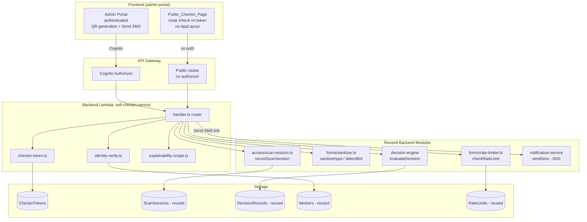

# Design Document

## Overview

This document describes the technical design for **worker self-service check-in** — the product's documented "killer workflow" (`ideas.txt`, §3): a construction worker arriving at a jobsite scans a persistent QR code posted at the gate (or opens a one-time SMS magic link), proves who they are without any staff member and without a Cognito session, and within a few seconds is told whether they may enter the site today, with an explanation scoped to what a worker is allowed to see per `docs/ROLES.md`.

This spec is a follow-up breakout from `production-readiness-audit` Requirement 7. That requirement deliberately scoped this as a design sketch plus a dedicated follow-up spec (this one) rather than inline implementation, because it touches every service layer (access, notification, decision-engine) and is comparable in size to `contractor-forms-qr`.

The core design principle is **reuse, not reinvention**. Three proven building blocks already exist in the codebase and are used here rather than duplicated:

1. **The public UUID-token pattern from `contractor-forms-qr`** — a non-guessable `token_publico` resolved via a `TOKEN#{token}` GSI, client-side QR generation with the `qrcode` npm library, a mobile-first public React view mounted without the authenticated layout, and the abuse-protection modules `rate-limiter.ts` (`checkRateLimit`) and `sanitizer.ts` (`sanitizeInput` / `sanitizeFormAnswers` / `detectBot`). See `.kiro/specs/contractor-forms-qr/design.md`.
2. **The Compliance Decision Engine** (`packages/backend/src/services/decision-engine/`), invoked through `evaluateDecision` with `DecisionType.SITE_ACCESS`, which already returns an `allowed` / `conditional` / `denied` `DecisionResponse` plus an audit-grade `ExplainabilityPayload`. The authenticated `access-service` already calls it exactly this way.
3. **The notification-service** (`packages/backend/src/services/notification/handler.ts`, SES + SNS via `sendSms`) for delivering SMS magic links.

The scope is a **new public, worker-facing surface**. It does **not** replace the existing staff-operated gate terminal (`/site-access`, `CheckIn.tsx`, `POST /site-access/check-in`). Both coexist (Requirement 8.3).

### Key Design Decisions

1. **Reuse the `contractor-forms-qr` public-token architecture wholesale.** Rather than invent new public-authentication infrastructure, the self-check-in tokens follow the same `TOKEN#{token}` GSI resolution shape, and the public endpoints are mapped in API Gateway **without** a Cognito authorizer, exactly like `GET|POST /public/forms/{token}`. This is the one audited "public token resolves to a scoped action" pattern the repo already has.
2. **Dedicated `self-checkin` module, not new endpoints on `access-service`.** The check-in domain is public (no auth), whereas every existing `access-service` route calls `authenticateRequest` at the top of the handler and rejects unauthenticated requests. Bolting public endpoints onto that handler would fight its auth model. Instead, a new `self-checkin` module hosts the public endpoints, and it **reuses** `access-service`'s `recordScanSession` and the decision-engine's `evaluateDecision` rather than reimplementing them. The two authenticated admin endpoints (generate QR token / send SMS link) also live in this module behind `authenticateRequest` + `enforcePermission`.
3. **Reuse the existing `ScanSessions` table for check-in events.** `access-service` already records every gate check-in as a `ScanSession` (`recordScanSession` in `scan-session.ts`) with GSIs by worker, site, and token. A self-service check-in is just another scan session with `scanner_type` `'qr'` or `'sms'`. We add an `origin_channel` attribute rather than a new table, so live-access and recent-check-in admin views pick up self-service check-ins automatically.
4. **Reuse the existing `DecisionRecords` table and immutable decision contract.** `evaluateDecision` already persists the full audit-grade `DecisionRecord` (including the complete `explainability_payload`). We do not change that. Role-scoping happens at the response boundary of the public endpoint, not in storage.
5. **Server-side explainability filtering.** Per `docs/ROLES.md`, a `worker` sees "only reasons and required actions." The full `ExplainabilityPayload` (rule references, evidence references, policy versions) is **never** transmitted to the public client — it is stripped in the Lambda before the response is serialized (Requirement 6.6).
6. **Client-side QR generation with the existing `qrcode` library.** Matching `contractor-forms-qr`, the QR image is generated in the admin-portal frontend from the public URL; the backend only returns the token and URL. No new library, no QR image storage.
7. **New tokens live in a dedicated `CheckinTokens` table.** Site tokens (persistent) and SMS magic-link tokens (single-use, short-lived) have different lifecycles from the 10-minute device-bound `AccessTokens` used by the staff flow, so they get their own table with the `TOKEN#{token}` GSI. The SMS single-use consumption semantics mirror the `access-service`'s existing `markTokenUsed` behavior for `SMS_MAGIC_LINK` tokens.
8. **Offline tolerance is explicitly OUT of scope (resolves Requirement 8.5 / parent Requirement 9.6).** A check-in decision depends on a live decision-engine evaluation against current certifications and site policy; an offline-cached "allow" would be a stale-compliance safety hazard. The public page therefore requires connectivity and shows a retryable error on network failure (Requirement 2.5) rather than queuing an offline submission. This is a deliberate, recorded decision, not a silent deferral.

---

## Architecture

### Component Diagram



### Sequence Diagram (extended from parent spec §Requirement 7)

The parent spec (`.kiro/specs/production-readiness-audit/design.md` §Requirement 7) provided the starting sequence diagram. The version below **extends** it: it adds the explicit token-resolution step, the reused rate-limiter/sanitizer gate on every public call, the role-scoped explainability filter, the deny-on-unavailable fallback, and the scan-session recording — all grounded in modules that already exist.

```mermaid
sequenceDiagram
    participant W as Worker (phone browser)
    participant Pub as Public_Checkin_Page
    participant SC as Self_Checkin_Service
    participant RL as rate-limiter.ts (reused)
    participant SAN as sanitizer.ts (reused)
    participant DE as Decision Engine (evaluateDecision)
    participant SS as scan-session.ts (reused)
    participant Notif as Notification Service (sendSms)

    Note over W,Pub: Option A — persistent per-site QR posted at the gate
    W->>Pub: Scans QR -> opens /check-in/{site_checkin_token}
    Pub->>SC: GET /public/check-in/{token}
    SC->>RL: checkRateLimit(token, ip)
    SC->>SC: Resolve token via TOKEN#{token} GSI (scoped to tenant+site)
    alt token unknown / expired / invalidated
        SC-->>Pub: 200 generic "no longer valid" (non-disclosive)
    else valid active token
        SC-->>Pub: 200 { site_name, requires_identity: true }
        Pub->>W: Prompt last 4 phone digits + date of birth
        W->>Pub: Submits identity challenge
        Pub->>SC: POST /public/check-in/{token}/verify (rate-limited)
        SC->>RL: checkRateLimit(token, ip)
        SC->>SAN: sanitizeInput + detectBot
        SC->>SC: Match exactly one Worker in token tenant
        alt zero or multiple matches
            SC-->>Pub: generic "could not verify your identity"
        else exactly one match
            SC->>DE: evaluateDecision(SITE_ACCESS, worker, site, tenant)
            alt engine error / unavailable
                DE-->>SC: error / throw
                SC->>SC: decision = denied,<br/>reason "system temporarily unable to evaluate"
            else engine returns decision
                DE-->>SC: DecisionResponse + audit ExplainabilityPayload (stored)
            end
            SC->>SS: recordScanSession(origin_channel = qr)
            SC->>SC: scope explainability to Worker_Explainability_View
            SC-->>Pub: 200 { decision, reasons, required_actions }
            Pub->>W: Show allow / conditional / deny + required actions
        end
    end

    Note over W,Notif: Option B — SMS magic link (site_admin triggers or scheduled)
    Notif->>W: SMS with one-time link /check-in/{sms_magic_link_token}
    W->>Pub: Opens link (token identifies the worker; skips challenge)
    Pub->>SC: POST /public/check-in/{token}/verify (no challenge)
    SC->>SC: Resolve single-use token, confirm not consumed
    SC->>DE: evaluateDecision(SITE_ACCESS, worker, site, tenant)
    SC->>SS: recordScanSession(origin_channel = sms)
    SC->>SC: mark SMS token consumed (single-use)
    SC-->>Pub: 200 { decision, reasons, required_actions }
```

---

## Components and Interfaces

### 1. Self Check-In Service Lambda Handler

**Location**: `packages/backend/src/services/self-checkin/handler.ts`

Follows the established handler pattern (routing by `httpMethod` + `resource`, `createSuccessResponse` / `badRequest` / `notFound` / `forbidden` from `shared/error-handler.ts`). Unlike `access-service`, this handler splits routes into an **authenticated** group (calls `authenticateRequest` + `enforcePermission`) and a **public** group (no `Authorization` header required, gated instead by `checkRateLimit` + `detectBot`).

#### Authenticated Endpoints (Cognito Authorizer)

| Method | Resource | Description | Permission |
|--------|----------|-------------|------------|
| POST | `/sites/{siteId}/checkin-token` | Generate (or return existing) the site's persistent check-in QR token | `access:manage_checkin_token` |
| POST | `/sites/{siteId}/checkin-token/regenerate` | Invalidate the old token and issue a new one | `access:manage_checkin_token` |
| POST | `/checkin/sms-link` | Send an SMS magic link to a specific worker for a specific site | `access:send_checkin_link` |

Authorization for these endpoints is restricted to `platform_admin`, `tenant_admin`, and `site_admin` per `docs/ROLES.md` (Requirements 1.5, 4.6). Both permissions are new entries in `rbac.ts`, assigned to those three roles only.

#### Public Endpoints (No Authorizer)

| Method | Resource | Description |
|--------|----------|-------------|
| GET | `/public/check-in/{token}` | Resolve a token → site name + whether an identity challenge is required |
| POST | `/public/check-in/{token}/verify` | Submit identity challenge (QR flow) OR proceed directly (SMS flow) → returns the role-scoped Access_Decision |

These map to API Gateway **without** an authorizer, mirroring the `/public/forms/{token}` family (Requirement 2.4).

### 2. Internal Modules

```
packages/backend/src/services/self-checkin/
├── handler.ts                # Router: authenticated + public route groups
├── types.ts                  # Domain interfaces & enums (CheckinToken, CheckinOrigin)
├── checkin-token.ts          # Site token + SMS token generation, TOKEN#{token} GSI resolution, regeneration/invalidation, single-use consumption
├── identity-verify.ts        # Phone-last-4 + DOB challenge; exactly-one-match rule; generic non-disclosive result
├── explainability-scope.ts   # Server-side filter -> Worker_Explainability_View
├── sms-link.ts               # Builds the magic-link URL and dispatches via notification-service (sendSms)
└── audit.ts                  # Immutable audit entry per attempt (reuses platform audit pattern)
```

**Reused modules imported directly (not copied):**

- `../forms/rate-limiter.ts` → `checkRateLimit(key, ipAddress)` (Requirements 3.4, 4.7, 7.1, 7.2)
- `../forms/sanitizer.ts` → `sanitizeInput`, `sanitizeFormAnswers`, `detectBot` (Requirements 3.2, 7.3, 7.4)
- `../decision-engine/evaluator.ts` → `evaluateDecision(request, tenantId, correlationId)` (Requirement 5.1)
- `../access/scan-session.ts` → `recordScanSession(session)` (Requirement 5.5)
- `../notification/handler.ts` → `dispatchNotification` / the underlying `channels/sms.ts` `sendSms` (Requirement 4.1)

### 3. RBAC Permissions

New permissions added to `rbac.ts`:

```typescript
| 'access:manage_checkin_token'  // generate/regenerate a site's persistent QR token
| 'access:send_checkin_link'     // send an SMS magic-link to a worker

// Assignment: platform_admin, tenant_admin, site_admin -> both permissions.
// supervisor, cso, gate_operator, worker -> neither.
```

Note the public endpoints intentionally require **no** permission (they are unauthenticated by design); their protection is the rate-limiter, sanitizer, bot detection, and non-guessable token — the same defense the `contractor-forms-qr` public endpoints rely on.

### 4. Frontend: Admin Portal (authenticated)

Reuses the existing QR-generation UX from `contractor-forms-qr`'s `FormDetail`. New surfaces:

- `features/site-checkin/SiteCheckinQrPanel.tsx` — shown on the Site detail page; calls `POST /sites/{siteId}/checkin-token`, renders the QR client-side with `qrcode.toDataURL(url, { width: 300 })`, offers PNG download at ≥300×300 (Requirement 1.6), and provides a "Regenerate" action (Requirement 1.4).
- `features/site-checkin/SendCheckinLinkButton.tsx` — on the Worker detail page; calls `POST /checkin/sms-link` and surfaces a delivery-failure result if the notification-service reports the SMS was not sent (Requirement 4.5).

TanStack Query hooks: `useSiteCheckinToken`, `useRegenerateCheckinToken`, `useSendCheckinSmsLink`.

### 5. Frontend: Public_Checkin_Page (unauthenticated)

**Route**: `/check-in/:token` — added to `packages/admin-portal/src/app/router.tsx` as a public route **outside** `AppLayout`, exactly like the existing `<Route path="/public/forms/:token" ... />` (which is lazy-loaded via `PublicFormPage`). Uses code-splitting to keep the bundle light.

**Components**:
- `features/public-checkin/PublicCheckinPage.tsx` — orchestrates the flow: resolve token → (challenge | skip) → decision.
- `features/public-checkin/IdentityChallengeForm.tsx` — last-4-phone + date-of-birth inputs (QR flow only).
- `features/public-checkin/DecisionResult.tsx` — renders `allowed` / `conditional` / `denied` with worker-appropriate reasons and required actions.

**Characteristics** (Requirement 2):
- Mobile-first, responsive from 320px with no horizontal scroll; targets iOS Safari and Android Chrome (latest 2 versions).
- 10-second request timeout; on network error shows a retryable message and preserves entered input (Requirement 2.5).
- No dependency on authentication; no Cognito session created at any point (Requirement 3.7).
- Authored in **English** (Requirement 8.4), even though the reused `contractor-forms-qr` public view is in Spanish.
- Includes the hidden honeypot field and captures `pageLoadTimestamp` so the backend `detectBot` check has its inputs (Requirement 7.4).

---

## Data Models

### Table: CheckinTokens (new)

**Name**: `{prefix}CheckinTokens`. Holds both persistent site tokens and single-use SMS magic-link tokens, distinguished by `token_kind`. Resolution by public token uses the `GSI1` `TOKEN#{token}` index — the same lookup shape `contractor-forms-qr` uses for `token_publico`.

| Attribute | Type | Description |
|-----------|------|-------------|
| PK | String | `TENANT#{tenant_id}` |
| SK | String | `CHECKIN_TOKEN#{token_id}` |
| GSI1PK | String | `TOKEN#{token}` (the public UUID v4 value) |
| GSI1SK | String | `CHECKIN_TOKEN#{token_id}` |
| GSI2PK | String | `SITE#{site_id}` (find the active token for a site) |
| GSI2SK | String | `CHECKIN_TOKEN#{token_kind}` |
| token_id | String | UUID v4 (internal id) |
| token | String | UUID v4 (public, non-guessable, encoded in QR / SMS link) |
| token_kind | String | `site_persistent` \| `sms_magic_link` |
| tenant_id | String | Owning tenant |
| site_id | String | Bound site |
| worker_id | String | Bound worker (SMS tokens only; null for site tokens) |
| status | String | `active` \| `invalidated` \| `consumed` |
| created_by | String | Cognito user id of the admin who created it |
| created_at | String | ISO 8601 UTC |
| expires_at | String | ISO 8601 UTC (SMS tokens only) |
| consumed_at | String | ISO 8601 UTC (SMS tokens, on single-use consumption) |
| ttl | Number | Epoch seconds (SMS tokens only; auto-cleanup) |

- **GSI1** (`TOKEN#{token}`): public resolution path for both kinds. A `status != 'active'` or expired token yields the generic "no longer valid" response — the item's existence is never disclosed (Requirements 2.3, 4.2, 7.5).
- **GSI2** (`SITE#{site_id}`): lets `POST /sites/{siteId}/checkin-token` return the existing active site token instead of silently creating a duplicate (Requirement 1.3), and lets regeneration flip the previous token to `invalidated` (Requirement 1.4).
- **Single-use consumption** for `sms_magic_link` sets `status = 'consumed'` + `consumed_at`, mirroring the `access-service`'s `markTokenUsed` semantics for `TokenType.SMS_MAGIC_LINK` (Requirement 4.4).

### Table: ScanSessions (reused — no schema change beyond one additive attribute)

Self-service check-ins are recorded through the **existing** `recordScanSession` (`access/scan-session.ts`). That function already writes worker, site, timestamp, `scanner_type`, `device_id`, `token_ref`, `decision_ref`, `result`, and the by-worker / by-site / by-token GSIs. We pass:

- `scanner_type`: `'qr'` for the QR flow, `'sms'` for the magic-link flow (both already accepted by the `ScanSession` type).
- an additive `origin_channel` attribute (`'self_qr'` \| `'self_sms'`) to distinguish self-service check-ins from staff-terminal check-ins in admin views (Requirement 5.5). This is additive and does not affect the existing staff flow (Requirement 8.3).
- `token_ref`: the `CheckinTokens.token_id`.
- `decision_ref`: the `DecisionRecords.decision_id` returned by `evaluateDecision`.

### Table: DecisionRecords (reused — unchanged)

`evaluateDecision` already persists the immutable `DecisionRecord` including the full JSON-serialized `explainability_payload`. This spec makes **no** changes to the decision-engine contract or storage (Requirement 5.6). The full audit-grade payload is retained in storage; only the public response is filtered.

### Table: RateLimits (reused — unchanged)

The reused `checkRateLimit` writes to the existing `RateLimits` table with `PK = RATELIMIT#...`, `SK = IP#{ip}`, atomic `ADD`, and TTL cleanup. Self-check-in uses composite keys so limits are scoped by both token and IP (Requirements 3.4, 7.1):

| Purpose | PK | SK |
|---------|----|----|
| Token resolution / identity verify per token+IP | `RATELIMIT#CHECKIN#{token}` | `IP#{ip}` |
| SMS-link issuance per worker+IP | `RATELIMIT#CHECKINSMS#{worker_id}` | `IP#{ip}` |

### Table: SelfCheckinAuditLog (new, follows the `FormAuditLog` pattern)

Records an immutable audit entry for every attempt — successful or rejected — including origin IP, origin channel, token reference, and outcome (Requirement 7.6). Modeled on `contractor-forms-qr`'s `FormAuditLog` (PK/SK + tenant GSI + 365-day `expiresAt` TTL, `RemovalPolicy.RETAIN`).

| Attribute | Type | Description |
|-----------|------|-------------|
| PK | String | `SITE#{site_id}` |
| SK | String | `AUDIT#{timestamp}#{short_uuid}` |
| GSI1PK | String | `TENANT#{tenant_id}` |
| GSI1SK | String | `AUDIT#{timestamp}` |
| action | String | `token_resolved` \| `identity_verified` \| `identity_failed` \| `decision_returned` \| `rate_limited` \| `bot_rejected` \| `sms_link_sent` \| `sms_link_failed` |
| origin_channel | String | `self_qr` \| `self_sms` |
| token_ref | String | `CheckinTokens.token_id` |
| outcome | String | `allowed` \| `conditional` \| `denied` \| `rejected` |
| ip_address | String | Origin IP |
| timestamp | String | ISO 8601 UTC |
| tenant_id | String | Owning tenant |
| expiresAt | Number | Epoch seconds (365 days) |

---

## CDK Definitions

### New tables in `data-stack.ts`

`CheckinTokens` (with `GSI1` on `TOKEN#{token}` and `GSI2` on `SITE#{site_id}`, PAY_PER_REQUEST, `ttl` attribute, point-in-time recovery in prod) and `SelfCheckinAuditLog` (tenant GSI, `expiresAt` TTL, `RemovalPolicy.RETAIN`), following the exact CDK shapes already defined for `FormsTable` and `FormAuditLogTable` in the `contractor-forms-qr` design.

### New Lambda in `api-stack.ts`

A `self-checkin-service` function (256 MB, 29s timeout) with the shared env, following the `formsServiceFn` definition. It needs IAM read/write on `CheckinTokens`, `ScanSessions`, `SelfCheckinAuditLog`, `RateLimits`, read on `Workers` / `Sites` / `Policies` / `DecisionRecords`, invoke/permission to trigger `evaluateDecision`'s data path, and SNS publish for SMS.

### New API Gateway routes

```typescript
const checkinIntegration = new apigateway.LambdaIntegration(this.selfCheckinServiceFn);

// Authenticated (Cognito) — token management lives under the existing /sites resource
const siteCheckinToken = siteId.addResource('checkin-token');
siteCheckinToken.addMethod('POST', checkinIntegration, authorizedMethodOptions);
siteCheckinToken.addResource('regenerate').addMethod('POST', checkinIntegration, authorizedMethodOptions);

const checkin = this.api.root.addResource('checkin');
checkin.addResource('sms-link').addMethod('POST', checkinIntegration, authorizedMethodOptions);

// Public (no authorizer) — mirrors /public/forms/{token}
const publicCheckin = this.api.root.getResource('public')!.addResource('check-in');
const publicCheckinToken = publicCheckin.addResource('{token}');
publicCheckinToken.addMethod('GET', checkinIntegration);            // no authorizer
publicCheckinToken.addResource('verify').addMethod('POST', checkinIntegration); // no authorizer
```

---

## API Contracts

### POST `/sites/{siteId}/checkin-token` (auth)

Returns the existing active site token, or creates one if none exists (Requirement 1.3).

```json
// 200
{
  "token": "3f2a...uuid-v4",
  "public_url": "https://{domain}/check-in/3f2a...uuid-v4",
  "created_at": "2025-01-15T18:22:00Z"
}
```

`403` if the requester lacks `access:manage_checkin_token`; `404` (non-disclosive) if the site does not exist or belongs to another tenant (Requirements 1.5, 1.7).

### POST `/checkin/sms-link` (auth)

```json
// request
{ "worker_id": "uuid", "site_id": "uuid" }

// 200 (SMS accepted by SNS)
{ "sent": true, "expires_at": "2025-01-15T20:22:00Z" }

// 502 (delivery failed — NOT reported as sent, Requirement 4.5)
{ "sent": false, "error": "SMS delivery failed" }
```

### GET `/public/check-in/{token}` (public)

```json
// 200 valid site token
{ "site_name": "Downtown Tower B", "requires_identity": true }

// 200 valid SMS token (already identifies the worker)
{ "site_name": "Downtown Tower B", "requires_identity": false }

// 200 unknown / expired / invalidated (uniform, non-disclosive — Req 2.3, 7.5)
{ "valid": false, "message": "This check-in link is no longer valid" }
```

### POST `/public/check-in/{token}/verify` (public)

```json
// request (QR flow)
{ "phone_last4": "1234", "date_of_birth": "1990-05-01", "page_load_ts": 1737000000000, "hp": "" }
// request (SMS flow) — no identity fields, token already identifies the worker
{ "page_load_ts": 1737000000000, "hp": "" }

// 200 identity not verified (generic, non-disclosive — Req 3.3)
{ "verified": false, "message": "We could not verify your identity" }

// 200 decision (role-scoped to Worker_Explainability_View — Req 6.1, 6.2)
{
  "verified": true,
  "decision": "conditional",
  "reasons": ["Your Fall Protection certification expired on 2024-12-01"],
  "required_actions": ["Renew your Fall Protection certification"]
}

// 429 rate limited (Req 7.2)
{ "code": "RATE_LIMITED", "message": "Too many attempts. Try again in 3 minutes.", "retry_after_seconds": 180 }
```

Note the decision response deliberately omits `rule_references`, `evidence_references`, `policy_version_used`, and `decision_id` (Requirement 6.2, 6.6).

---

## Token Resolution and Identity Verification

### Token resolution (`checkin-token.ts`)

`resolveToken(token)` queries `CheckinTokens.GSI1` on `TOKEN#{token}`. It returns a resolved token only when `status === 'active'` and (for SMS tokens) `expires_at` is in the future and `status !== 'consumed'`. Every other case returns a single uniform "not valid" outcome so response differences cannot be used to enumerate tokens (Requirements 2.3, 7.5). Resolution is always scoped to the token's bound `tenant_id` and `site_id`, so a token can never produce a decision against another site (Requirement 2.6).

### Identity verification (`identity-verify.ts`)

For the QR flow the worker submits **last 4 digits of their registered phone** + **date of birth**. Both inputs pass through `sanitizeInput` first (Requirement 3.2). Matching is scoped to the token's tenant and looks for **exactly one** `Worker` whose stored phone ends in those 4 digits and whose DOB matches. Zero matches **and** more-than-one match both yield the identical generic "We could not verify your identity" result — the response never reveals whether the phone digits, the DOB, or neither matched (Requirement 3.3).

`checkRateLimit('CHECKIN#{token}', ip)` gates verification attempts per token+IP (Requirement 3.4); when the limit trips, the page shows the remaining wait time (Requirements 3.5, 7.2).

For the SMS flow, the worker is already identified by the single-use token, so the challenge is skipped entirely (Requirement 3.6).

No Cognito session, token, or user account is ever created for the worker (Requirement 3.7).

---

## Decision-Engine Integration

`identity-verify` hands the resolved `worker_id`, the token's `site_id`, and `tenant_id` to the **existing** `evaluateDecision`, called exactly the way `access-service` calls it:

```typescript
const evalResult = await evaluateDecision(
  {
    decision_type: DecisionType.SITE_ACCESS,
    subject_type: 'worker',
    subject_id: workerId,
    site_id: siteId,
    context: { jurisdiction: 'BC', certifications: [] }, // engine fetches certs from DB
  },
  tenantId,
  correlationId
);
```

Result handling mirrors `access-service`'s existing logic (Requirements 5.2–5.4):

- On a normal result → return the engine's `decision` (`allowed` / `conditional` / `denied`) and `reasons`.
- On an engine **error** result (`evalResult.error`) → treat as `denied`, surface the engine's returned message.
- On the engine being **unavailable** or throwing → `denied` with reason `"system temporarily unable to evaluate"` (the deny-on-unavailable fallback, never allow-by-default).

Every attempt then records a `ScanSession` via `recordScanSession` (`decision_ref` = the engine's `decision_id`) and an audit entry (Requirements 5.5, 7.6). The engine's immutable `DecisionRecord` and full audit-grade `ExplainabilityPayload` are persisted by the engine itself, unchanged (Requirement 5.6).

---

## Server-Side Role-Scoped Explainability

`explainability-scope.ts` exposes `toWorkerView(response: DecisionResponse)`. Per the `docs/ROLES.md` rule that a `worker` / `gate_operator` sees "only reasons and required actions," it returns **only**:

- `decision`
- `reasons` (worker-appropriate language)
- `required_actions` — derived from the reasons (e.g., missing/expired certifications), the same way `access-service`'s `handleCheckIn` extracts `missingCerts` from decision reasons

It **strips** `rule_references`, `evidence_references`, `policy_version_references`/`policy_version_used`, `decision_id`, `rules_applied`, and the `explanation_level` marker (Requirement 6.2). Because this filtering runs in the Lambda before serialization, the full payload is never transmitted to the public client and cannot be recovered from the network response (Requirement 6.6). The stored `DecisionRecord` keeps the full payload for admin/audit consumers, who read it through the existing authenticated `GET /access/decisions/{id}` route.

Result presentation on the page (Requirement 6.3–6.5): `conditional` shows the specific required actions; `denied` shows worker-appropriate reasons without admin-grade detail; `allowed` shows a clear "you may enter" confirmation.

---

## Abuse Protection (all reused from `contractor-forms-qr`)

| Concern | Reused module | Applied to |
|---------|---------------|-----------|
| Rate limiting | `forms/rate-limiter.ts` → `checkRateLimit` | Token resolution, identity verification, decision retrieval, SMS-link issuance — keyed by IP and by token/worker (Requirements 7.1, 7.2) |
| Input sanitization | `forms/sanitizer.ts` → `sanitizeInput`, `sanitizeFormAnswers` | All worker-supplied input (phone digits, DOB) before matching or storage (Requirements 3.2, 7.3) |
| Bot protection | `forms/sanitizer.ts` → `detectBot` | Header validation (User-Agent, Origin/Referer), honeypot field, rapid-submission detection on the public endpoints (Requirement 7.4) |

Uniform, non-disclosive error responses for invalid tokens, failed identity verification, and non-existent sites ensure response differences cannot be used to enumerate tokens, workers, or sites (Requirement 7.5). Every attempt — allowed, denied, or rejected — writes a `SelfCheckinAuditLog` entry (Requirement 7.6).

When `checkRateLimit` returns `{ allowed: false, retryAfterSeconds }`, the endpoint responds `429` with `retry_after_seconds`; the page renders the remaining wait in minutes (Requirement 7.2).

---

## SMS Magic-Link Flow

`sms-link.ts` builds the public URL `https://{domain}/check-in/{sms_magic_link_token}` and dispatches it through the **existing** notification-service. It reuses the SMS channel (`channels/sms.ts` `sendSms`, SNS) that the notification-service already uses for `ACCESS_DECISION_*` templates. The token is a single-use UUID v4 bound to worker + site + tenant with an `expires_at` and TTL (Requirement 4.1, 4.2). On opening, the page skips the identity challenge (Requirement 4.3); on completing the attempt, the token is marked `consumed` so it cannot be reused (Requirement 4.4). If SNS reports a delivery failure, the admin endpoint returns `sent: false` and does **not** report the link as sent (Requirement 4.5). SMS-link issuance is rate-limited per worker and per IP to prevent SMS flooding (Requirement 4.7).

---

## Error Handling

| Scenario | HTTP | Code | Message |
|----------|------|------|---------|
| Token unknown / expired / invalidated (public) | 200 | — | "This check-in link is no longer valid" (uniform) |
| Identity not verified (public) | 200 | — | "We could not verify your identity" (uniform) |
| Rate limit exceeded (public) | 429 | RATE_LIMITED | "Too many attempts. Try again in {minutes} minutes." |
| Bot detected (public) | 429 | RATE_LIMITED | Same uniform message as rate limit (no bot-specific disclosure) |
| Decision engine error | 200 | — | decision `denied` + engine reason |
| Decision engine unavailable | 200 | — | decision `denied` + "system temporarily unable to evaluate" |
| Site not found / wrong tenant (auth token gen) | 404 | NOT_FOUND | "Site not found" (non-disclosive across tenants) |
| Missing permission (auth) | 403 | FORBIDDEN | "You do not have permission for this action" |
| SMS delivery failed (auth) | 502 | SMS_DELIVERY_FAILED | "SMS delivery failed" |

**Offline / network failure (public):** the page shows a retryable error and preserves entered input (Requirement 2.5). Offline submission queuing is explicitly out of scope — see Overview Decision 8 (resolves Requirement 8.5 / parent Requirement 9.6).

---

## Testing Strategy

### Unit Tests (Vitest)

- **Token resolution**: active/invalidated/expired/consumed states each map to the correct resolve outcome; site-token reuse (existing active token returned, not duplicated); regeneration invalidates the previous token.
- **Identity verification**: exactly-one-match succeeds; zero-match and multi-match both return the identical generic result (assert the response bytes are equal, proving non-disclosure).
- **Explainability scoping**: `toWorkerView` output contains only `decision` / `reasons` / `required_actions` and never contains `rule_references`, `evidence_references`, or any policy-version field (Requirement 6.6 regression guard).
- **Decision handling**: engine-error and engine-unavailable paths both yield `denied` with the correct reason (mirrors `access-service` behavior).
- **SMS single-use**: a consumed token cannot be reused.
- **Reused-module wiring**: `checkRateLimit`, `sanitizeInput`, and `detectBot` are invoked on the public paths (assert via spies), confirming reuse rather than reimplementation.

### Property-Based Tests (fast-check)

Uses `fast-check` (the framework already used by `contractor-forms-qr`), minimum 100 iterations, each property tagged `**Validates: Requirements X.Y**`. Candidate properties (final numbered list authored in the tasks/property step, not invented here):

- *For any* pair of failed identity challenges (any zero-match input, any multi-match input), the verify response body is byte-identical (non-disclosure — Requirement 3.3, 7.5).
- *For any* `DecisionResponse`, `toWorkerView` never emits a rule reference, evidence reference, or policy version (Requirement 6.2, 6.6).
- *For any* token whose `status` is not `active` (or SMS token past `expires_at`), `GET /public/check-in/{token}` returns the uniform "no longer valid" body (Requirement 2.3, 7.5).
- *For any* sequence of N public requests from one IP within the window, requests beyond the configured limit are rejected with `429` (Requirement 7.1, 7.2).

### Integration Tests

- Full QR flow: generate site token → resolve → identity challenge → decision → `ScanSession` recorded with `origin_channel = self_qr` and `decision_ref` set.
- Full SMS flow: send link → open (challenge skipped) → decision → token marked `consumed` → second open rejected.
- Deny-on-unavailable: engine throw yields `denied` and still records a scan session and audit entry.
- Coexistence: the staff `POST /site-access/check-in` flow is unchanged and still records its own scan sessions (Requirement 8.3).

### Frontend Tests

- Public_Checkin_Page responsive from 320px, no horizontal scroll; iOS Safari / Android Chrome layouts.
- Client-side QR encodes the correct public URL and downloads a PNG ≥ 300×300 (Requirement 1.6).
- Network-error path shows a retryable message and preserves entered input (Requirement 2.5).
- English copy throughout (Requirement 8.4).

---

## Reuse Summary (explicit)

| Reused asset | Source | Used for |
|--------------|--------|----------|
| Public UUID-token + `TOKEN#{token}` GSI pattern | `contractor-forms-qr` design; `Forms.GSI1` | `CheckinTokens.GSI1` resolution (Req 1.2, 8.1) |
| `qrcode` client-side generation | `contractor-forms-qr` `FormDetail` | `SiteCheckinQrPanel` (Req 1.6) |
| Public route outside `AppLayout` | `router.tsx` `/public/forms/:token` | `/check-in/:token` (Req 2.4) |
| `rate-limiter.ts` `checkRateLimit` | `services/forms/rate-limiter.ts` | All public endpoints + SMS issuance (Req 3.4, 4.7, 7.1, 7.2) |
| `sanitizer.ts` `sanitizeInput` / `detectBot` | `services/forms/sanitizer.ts` | Input hygiene + bot protection (Req 3.2, 7.3, 7.4) |
| `RateLimits` table | existing | Rate-limit counters (Req 7.1) |
| `FormAuditLog` table shape | `contractor-forms-qr` | `SelfCheckinAuditLog` (Req 7.6) |
| `evaluateDecision` + `DecisionRecords` + `ExplainabilityPayload` | `decision-engine` | Access decision + audit (Req 5.1–5.6) |
| `recordScanSession` + `ScanSessions` table | `access/scan-session.ts` | Check-in event recording (Req 5.5) |
| `markTokenUsed` single-use semantics | `access/token-manager.ts` | SMS single-use consumption (Req 4.4) |
| Deny-on-unavailable fallback | `access/handler.ts` | Engine-unavailable handling (Req 5.4) |
| notification-service `sendSms` (SNS) | `notification/` | SMS magic-link delivery (Req 4.1) |
| `docs/ROLES.md` explainability scoping | docs | `toWorkerView` filter (Req 6.1, 6.2) |
