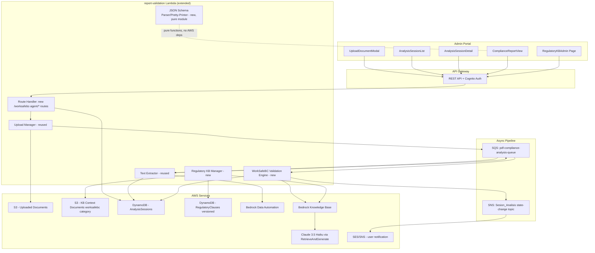
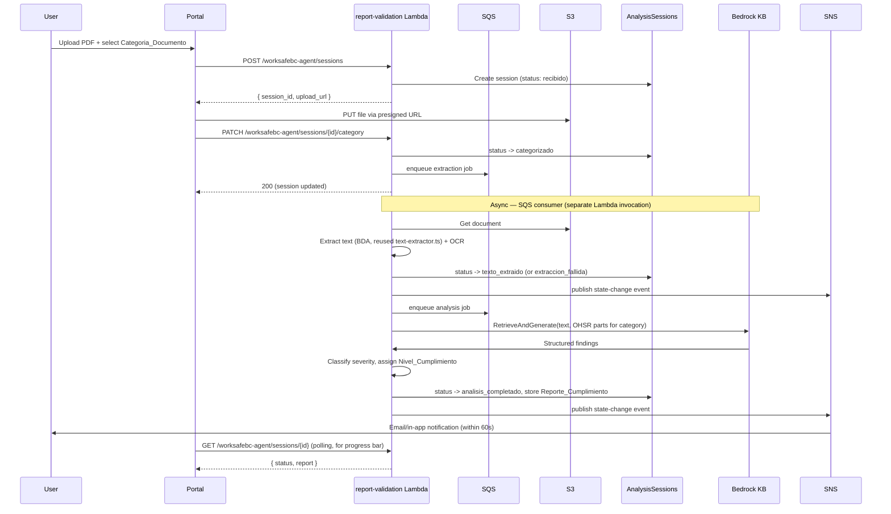

# Technical Design: WorkSafeBC PDF Compliance Agent

## Overview

This feature adds an AI-powered pipeline that lets users upload construction safety PDFs (safety plans, safe work procedures, risk assessments, contractor forms) and receive a structured compliance report against WorkSafeBC's Occupational Health and Safety Regulation (OHSR), with severity-classified findings, an overall compliance level, and audit-grade traceability.

### Key Design Decision: Extend `report-validation`, don't build a parallel service

The existing `packages/backend/src/services/report-validation/` service already implements almost the exact technical pipeline this feature needs, and was evidently built with this domain in mind:

- `text-extractor.ts` already performs PDF text extraction via **Bedrock Data Automation (BDA)**, including OCR for scanned pages.
- `kb-manager.ts` already manages a **Bedrock Knowledge Base** backed by S3, with `KBDocumentCategory` already including `'worksafebc'` as a first-class category, and already handles presigned upload + `StartIngestionJobCommand` sync.
- `validation-engine.ts` already runs **`RetrieveAndGenerateCommand`** against that Knowledge Base with Claude 3.5 Haiku to produce structured findings, and already has a `FindingSeverity` union and a deterministic score calculator.
- `upload-manager.ts` already implements the two-step presigned-URL upload pattern this feature's Requisito 1 describes.

Rebuilding these as a second, parallel Lambda service would duplicate ~2,500 lines of proven infrastructure and create two divergent BDA/Bedrock integration patterns to maintain. **This design extends `report-validation` with new routes, new tables, and new domain logic specific to WorkSafeBC**, rather than creating a new service. The parts of this spec that are genuinely new (not present in `report-validation` today) are:

1. A **versioned, clause-structured regulatory knowledge base** (Requisito 7) — today's KB is document-level (whole PDFs synced into a vector index); this feature needs an addressable `parte/sección/cláusula` model with effective-dated versions, which requires a new DynamoDB table in addition to (not instead of) the existing vector KB (the structured table is the source of truth for versioning/effective-dates and audit; the vector KB is re-synced from it for retrieval).
2. **Document categorization** (Categoria_Documento) driving which OHSR parts are queried (Requisito 3.2) — new routing logic.
3. **Severity → compliance-level assignment rules** specific to this domain (crítica/alta/media/baja → conforme/parcialmente_conforme/no_conforme) — different thresholds than `report-validation`'s generic numeric score.
4. **Asynchronous processing with an event bus and push notifications** (Requisito 6) — `report-validation` today is synchronous-then-polled; this feature explicitly requires SNS/SQS state-change events and delivery-retry semantics. This reuses the platform's existing SNS/SQS infrastructure (`ComplianceEventsStack`, already used by the AI safety pipeline) rather than inventing new infra.
5. A **standalone JSON schema, parser, and pretty-printer** for the Reporte_Cumplimiento with a byte-for-byte round-trip property (Requisito 8) — a new, self-contained module, independently testable.
6. **7-year retention** and cross-tenant access denial semantics for Sesion_Analisis history (Requisito 5).

### Reused as-is (no changes needed)

- BDA-based PDF text extraction (`text-extractor.ts`'s approach — page-level OCR confidence, structural block typing)
- Presigned S3 upload pattern (`upload-manager.ts`)
- Bedrock Knowledge Base + `RetrieveAndGenerateCommand` invocation pattern (`validation-engine.ts`)
- KB document sync via `StartIngestionJobCommand` (`kb-manager.ts`) — extended to be triggered by the new clause-versioning table rather than direct document upload
- Auth middleware, RBAC enforcement (`enforcePermission`), tenant isolation conventions used throughout the backend

## Architecture



### Analysis Pipeline Sequence



## Components and Interfaces

### Data Model (new DynamoDB tables)

**`AnalysisSessions`** (Sesion_Analisis)
```
PK: TENANT#{tenant_id}
SK: SESSION#{session_id}
GSI1PK: TENANT#{tenant_id}#SITE#{site_id}   (for site-scoped queries — Requisito 5.3)
GSI1SK: SESSION#{started_at}
GSI2PK: TENANT#{tenant_id}#DOCUMENT#{document_group_id}  (for re-analysis grouping — Requisito 5.5)
GSI2SK: SESSION#{started_at}

{
  session_id, tenant_id, site_id, document_group_id,  // document_group_id links re-analyses of the same source document
  document_key, document_name, document_size_bytes, document_page_count,
  category: 'plan_seguridad' | 'procedimiento_trabajo_seguro' | 'evaluacion_riesgo' | 'formulario_contratista' | 'otro' | null,
  status: 'recibido' | 'categorizado' | 'texto_extraido' | 'analizando' | 'analisis_completado'
        | 'extraccion_fallida' | 'analisis_fallido' | 'timeout',
  started_by, started_at, completed_at,
  extraction_metrics: { pages_processed, pages_ocr_applied, avg_confidence } | null,
  ai_model_version, regulatory_kb_version_id,
  report: ReporteCumplimiento | null,   // embedded — max 200 findings + 50 recommendations keeps this well under 400KB item limit
  previous_session_id: string | null,   // for re-analysis chains
  failure_reason: string | null,
  notification_delivered: boolean,
  retention_expires_at: string,          // now + 7 years, or longer per regulatory requirement
}
```
Rationale for embedding the report in the session item rather than a separate table: Requisito 4.2 caps findings at 200 and recommendations at 50, each individually length-capped — this bounds item size well within DynamoDB's 400KB limit, and every read pattern in the requirements (get session, list history) wants session+report together, so embedding avoids an extra read per request.

**`RegulatoryClauses`** (Base_Regulatoria_WorkSafeBC)
```
PK: PART#{part_number}
SK: VERSION#{version_id}#SECTION#{section}#CLAUSE#{clause}
GSI1PK: VERSION#{version_id}                 (list all clauses in a version)
GSI1SK: PART#{part_number}#SECTION#{section}#CLAUSE#{clause}

{
  part_number, section, clause, version_id, effective_date,
  regulation_text,          // max 10,000 chars
  applicability_categories,  // max 20, e.g. ['plan_seguridad', 'fall_protection']
  last_updated_at, published_by, change_summary,  // max 1000 chars
}
```

**`RegulatoryVersions`** (version metadata, one item per published version)
```
PK: WORKSAFEBC_KB
SK: VERSION#{version_id}   (version_id is a zero-padded sequential integer, e.g. "000001", for lexicographic ordering)
{ version_id, effective_date, published_by, published_at, change_summary, clause_count }
```
`GetActiveVersion(asOfDate)`: query `RegulatoryVersions` by `PK=WORKSAFEBC_KB`, `ScanIndexForward: false`, filter `effective_date <= asOfDate`, take first — this is Requisito 7.4's "most recent version whose effective date is <= now" rule.

### New API Routes (added to `report-validation`'s existing route handler, under a `/worksafebc-agent` prefix to avoid colliding with existing `/report-validation/reports` routes)

| Method | Path | Requisito |
|---|---|---|
| POST | `/worksafebc-agent/sessions` | 1.1-1.8 (upload, returns presigned URL) |
| PATCH | `/worksafebc-agent/sessions/{id}/category` | 1.5 (select Categoria_Documento, triggers pipeline) |
| GET | `/worksafebc-agent/sessions/{id}` | 5.1, 6.4 (poll status/progress, get report) |
| GET | `/worksafebc-agent/sessions` | 5.2, 5.3, 5.7 (paginated history, filtered, role-scoped) |
| POST | `/worksafebc-agent/sessions/{id}/reanalyze` | 5.5 (new session linked to same document_group_id) |
| GET | `/worksafebc-agent/sessions/{id}/report/export?format=pdf\|json` | 4.5 |
| POST | `/worksafebc-agent/regulatory-versions` | 7.3, 7.6, 7.8 (platform_admin publishes new KB version) |
| GET | `/worksafebc-agent/regulatory-versions` | 7.3 (list versions, for KB admin UI) |

### New pipeline Lambdas / SQS consumers

Two additional Lambda entry points reusing the same `report-validation` handler module (separate `handler` exports, same deployment package, distinct CDK `Function`s pointed at the same bundle with different `handler` string) so they share code without duplicating a service:

- `worksafebc-extraction-consumer` — SQS-triggered, consumes `pdf-compliance-analysis-queue` messages of type `extract`, calls the reused BDA extraction path, transitions session state, enqueues an `analyze` message.
- `worksafebc-analysis-consumer` — SQS-triggered, consumes `analyze` messages, calls the new `WorkSafeBCValidationEngine` (below), transitions session state, publishes SNS notification.

This mirrors how the existing AI safety pipeline already uses an SQS-driven async Lambda (per the platform's `ComplianceEventsStack` / `AI_PIPELINE_QUEUE_URL` — see README) — no new infrastructure pattern is introduced, just a new queue and two new consumer entry points.

### `WorkSafeBCValidationEngine` (new module, `worksafebc-validation-engine.ts`)

```typescript
interface AnalyzeInput {
  session_id: string; tenant_id: string; extracted_text: string;
  category: DocumentCategory; regulatory_version_id: string;
}
interface AnalyzeResult {
  findings: HallazgoCumplimiento[];       // type 'brecha' | 'conforme', max 200
  compliance_level: 'conforme' | 'parcialmente_conforme' | 'no_conforme' | 'no_evaluable';
  recommendations: string[];               // max 50, 1-3 per critical/alta 'brecha' finding
}

function selectApplicableParts(category: DocumentCategory): string[] // Requisito 3.2 — static mapping table, e.g. plan_seguridad -> [Part 4, Part 11, Part 20]
function classifySeverity(finding): 'critica' | 'alta' | 'media' | 'baja' // Requisito 3.5 — deterministic rules over the LLM's raw output, not left to the LLM
function assignComplianceLevel(findings): ComplianceLevel // Requisito 3.6, 4.9 — pure function: any 'brecha' with severity in {critica, alta} => 'no_conforme'... wait, re-check against 3.6 vs 4.9 wording below
```

**Important nuance to implement exactly as specified** — Requisito 3.6 and Requisito 4.9 define the compliance-level rule slightly differently in wording; both must produce the same result. Reconciled rule (implement this single function, used by both the analysis engine and report generation):
```
IF findings contains a 'brecha' with severity IN {critica, alta}  => 'no_conforme'
ELSE IF findings contains a 'brecha' with severity IN {media, baja} => 'parcialmente_conforme'
ELSE IF no 'brecha' findings at all AND no evaluable content (3.10) => 'no_evaluable'
ELSE => 'conforme'
```
Note this differs from 3.6's literal wording ("parcialmente_conforme" = "at least one high-severity gap but none critical") — re-read 3.6 and 4.9 together during implementation; 4.9 is the more complete/final rule (it's the one governing report generation) and should be treated as authoritative if the two ever appear to conflict. Flag this to the user/reviewer rather than silently picking one.

### JSON Schema, Parser, and Pretty-Printer (new, pure module — `report-schema.ts`, no AWS SDK dependency)

Implements Requisito 8 as a standalone, independently-testable module:
- `ReporteCumplimientoSchema` (zod schema, reusing the `zod` dependency already used elsewhere in the backend for validation)
- `parseReporteCumplimiento(json: string): Result<ReporteCumplimiento, SchemaError[]>` — Requisito 8.2/8.3/8.4
- `prettyPrintReporteCumplimiento(report: ReporteCumplimiento): string` — 2-space indent, alphabetically-sorted keys — Requisito 8.5
- Round-trip property (8.6): `parse(prettyPrint(x)) prettyPrint'd again === prettyPrint(x)` for all valid `x` — this is the flagship property-based test for this module (see Testing Strategy)

## Correctness Properties

1. **Upload acceptance/rejection is format- and size-bounded** — for any file, it is accepted iff it has a valid PDF header AND size ≤ 50MB AND pages ≤ 500; otherwise rejected with the specific violated constraint named. Validates 1.2, 1.3, 1.4.
2. **RBAC on upload** — for any role, upload succeeds iff role ∈ {platform_admin, site_admin, tenant_admin, supervisor, cso}. Validates 1.1, 1.7.
3. **Extraction never silently loses data** — for any PDF, either extraction succeeds (status → texto_extraido, structured blocks in original order) or the session reaches extraccion_fallida with a specific reason (>50% unprocessable pages, password-protected, or >500 pages) — no other terminal state is reachable from extraction. Validates 2.3, 2.5, 2.7, 2.8.
4. **Severity classification is a total, deterministic function** — every generated finding of type 'brecha' has exactly one of the 4 defined severities; the function never returns an undefined/other value. Validates 3.5.
5. **Compliance-level assignment is a pure function of findings** — same findings set always yields the same compliance_level, per the reconciled rule above. Validates 3.6, 4.9.
6. **Report bounds are enforced** — findings ≤ 200, recommendations ≤ 50 (1-3 per critical/alta brecha), summary ≤ 1000 chars, each finding description ≤ 500 chars, each recommendation ≤ 500 chars. Validates 4.2, 4.3.
7. **Tenant isolation on session access** — for any session and any requesting user, access succeeds iff the session's tenant_id matches the user's tenant_id; cross-tenant access returns 403/404 without confirming existence. Validates 5.6.
8. **Regulatory version resolution is deterministic** — for any analysis start time T, the version used is the one with the latest effective_date ≤ T; a session already in progress when a newer version publishes keeps using its original version. Validates 7.4, 7.5.
9. **KB upload validation rejects incomplete/out-of-order versions** — a version publish is rejected if its effective_date precedes the current latest version's effective_date, or any clause is missing part/section/clause/text. Validates 7.8.
10. **JSON round-trip is byte-identical** — for any valid ReporteCumplimiento, `prettyPrint(parse(prettyPrint(x)))` produces the exact same bytes as `prettyPrint(x)`. Validates 8.6.
11. **Parser rejects and precisely explains schema violations** — for malformed JSON, every violated field is reported with field name, violation kind (missing/wrong-type/out-of-range), and the offending value where applicable. Validates 8.3.

## Testing Strategy

- Reuse this project's established `fast-check` property-testing convention (seen throughout `ai-report-validation`, `contractor-forms-qr`, etc.) for the 11 properties above, especially #10 (round-trip) which is the highest-value property test in this spec — a classic parser/pretty-printer round-trip is exactly the kind of thing fast-check excels at catching edge cases in (special characters, deeply nested structures, boundary-length strings).
- Unit tests for `selectApplicableParts`, `classifySeverity`, `assignComplianceLevel`, `GetActiveVersion` as pure functions, independent of AWS mocking.
- E2E tests mirroring `platform-endpoint-tests`' established pattern (mocked API Gateway events, mocked AWS SDK clients) for all new routes, including RBAC-denial cases for worker/gate_operator.
- Integration test for the async pipeline: enqueue an extraction message, assert the analysis message is enqueued in turn, assert SNS publish happens on completion — using mocked SQS/SNS clients, not live infrastructure.
- Manual/exploratory verification against a real small sample PDF and at least one intentionally password-protected PDF and one intentionally >500-page PDF, to confirm the three distinct extraccion_fallida paths.

## Open Questions to Flag to the User Before Implementation

1. **3.6 vs 4.9 wording discrepancy** (see above) — recommend treating 4.9 as authoritative, but this should be confirmed with the user/product owner before Kiro implements it, since it affects what "parcialmente_conforme" means to end users.
2. **PDF export of the report** (4.5) — the platform doesn't currently have a PDF *generation* capability (only PDF *consumption*/extraction). This will need a new dependency (e.g., a headless PDF renderer) or a decision to generate a styled HTML report and print-to-PDF client-side instead. Recommend confirming approach before estimating this task.
3. **Notification channel** (6.3) — "email o notificación en la plataforma" — confirm whether SES (email) is already configured for this tenant/environment (README mentions SES is part of the architecture) or whether in-platform notification (bell icon, already visible in the Admin Portal header) is sufficient for v1.
